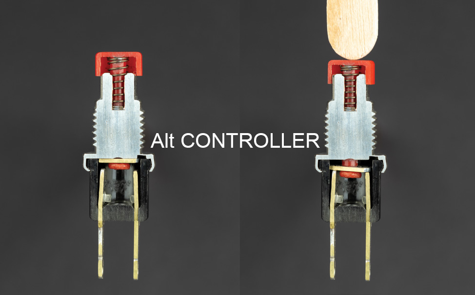
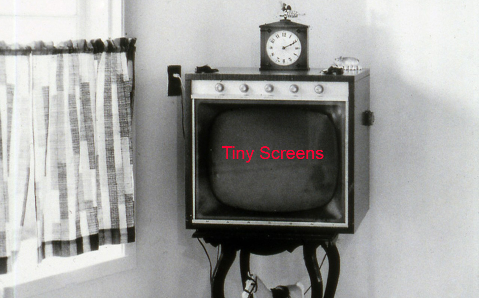
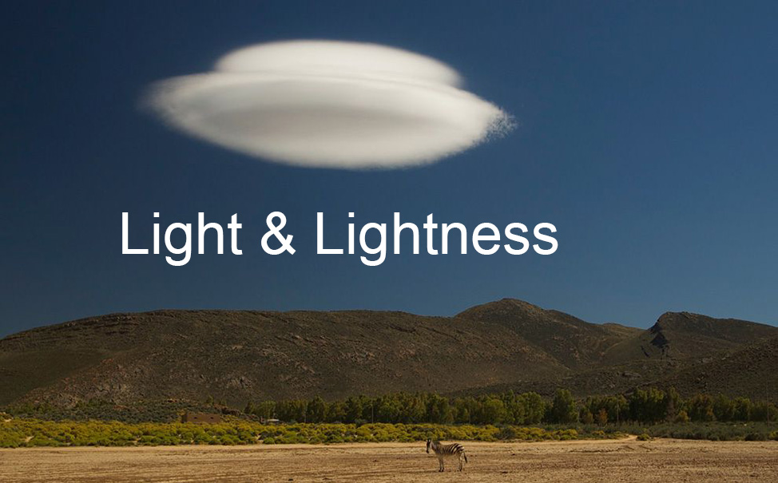

# PhysComp-f26-502

All technical and reference content for the course will be posted here.

## Projects

### [Alt Controller](projects/01-AltController/AltController.md)

---

### [Tiny Screens](projects/02-TinyScreens/TinyScreens.md)

---

### [Light and Lightness](projects/03-LightAndLightness/LightAndLightness.md)