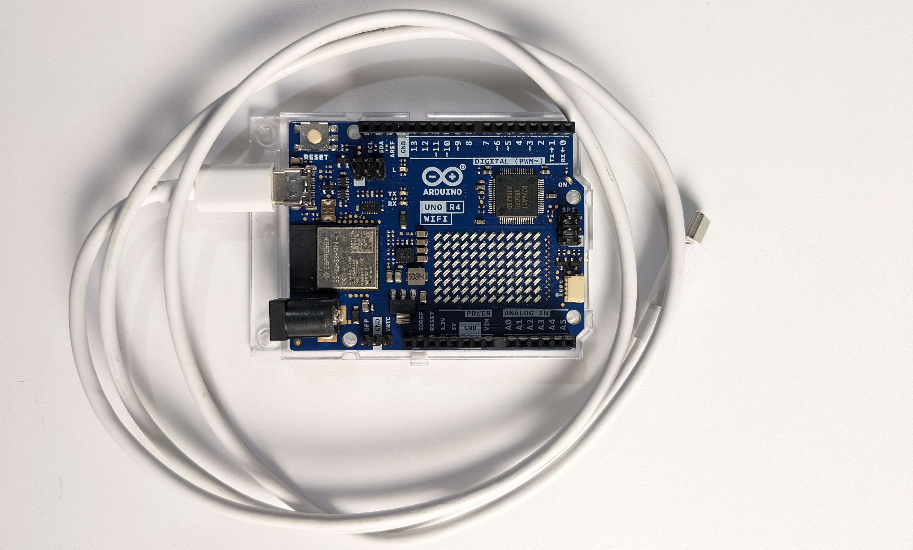
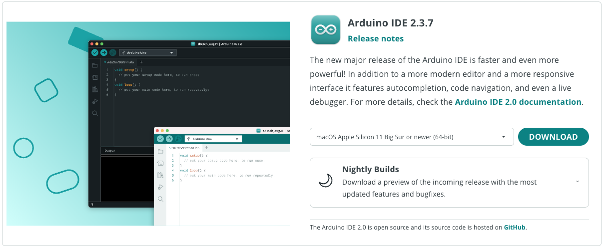
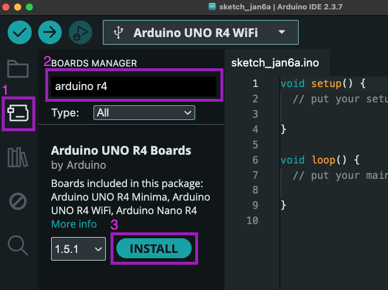
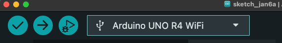

# Getting Started with Arduino R4 WiFi

## What You'll Need

- Arduino Uno R4 WiFi (from your kit)
- USB-C cable to connect to your computer
  - **Important:** Some USB-C cables are charging-only and cannot upload code. If you experience upload issues, try a different cable.

---

## Part 1: Software Setup

### Step 1: Download and Install Arduino IDE

The Arduino IDE is a free and open-source tool for writing code and uploading it to your board.

1. Download from [arduino.cc/en/software](https://www.arduino.cc/en/software/)
2. Select the correct OS version
3. Run the installer
4. Agree to any permissions or driver installations during setup

### Step 2: Install the R4 WiFi Board Package

The Arduino IDE supports thousands of microcontrollers. You need to install the specific package for the Uno R4 WiFi. **This only needs to be done once.**

1. Open the Arduino IDE
2. Click the **Boards Manager** icon (second from top in the left sidebar)
3. Search for `Arduino r4`
4. Install the **Arduino UNO R4 Boards** package
5. Wait for installation to complete

---

## Part 2: Connect and Test Your Board

### Step 1: Connect Your Arduino

1. Plug your Arduino into your computer using a USB-C cable
2. Agree to any additional driver installations if prompted
3. If the board package wasn't installed in Part 1, you'll be prompted to install it now

### Step 2: Select Your Board

1. Open the board dropdown menu at the top-left of the IDE
2. Select **Arduino Uno R4 WiFi**

### Step 3: Open the Blink Example

1. From the menu bar: **File > Examples > 01.Basics > Blink**
2. This simple program will blink the onboard LED

### Step 4: Upload the Code

1. Click the **Upload** button (right arrow icon at top-left)
2. Watch for the RX and TX LEDs flashing on the Arduino during upload
3. Wait for the **"Done uploading"** message at the bottom of the IDE
4. The onboard LED should now be blinking!

---

## Troubleshooting

**Upload errors?** Check the following:
- Correct board selected (Arduino Uno R4 WiFi)
- USB cable supports data transfer (try a different cable)
- Board package installed correctly
- Drivers installed properly
