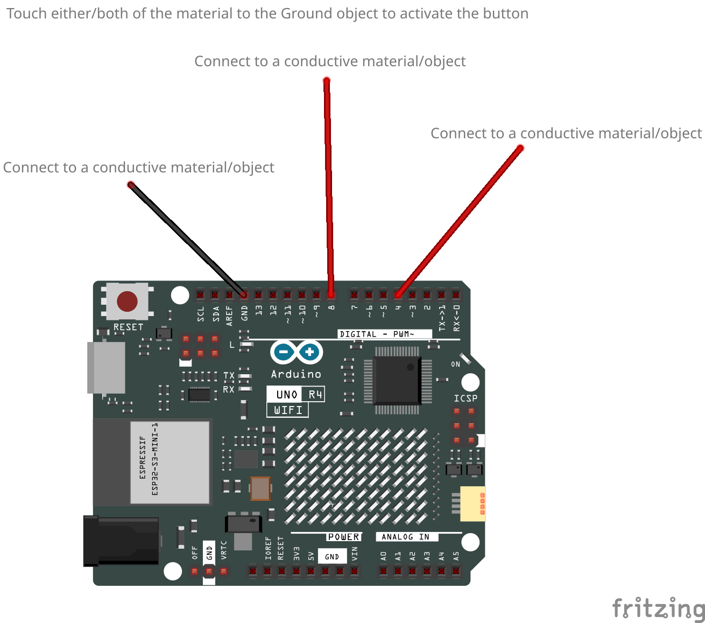
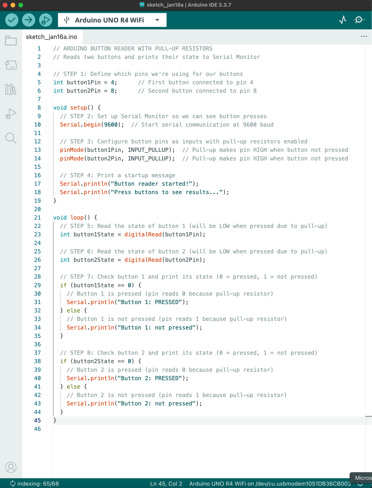

In this workshop you will learn about creating and reading digital inputs. You will be creating 2 custom digital inputs using wires and objects provided.

Create your first Alt Controller buttons and post your results to the workshop discussion board.

## Steps

### Hardware Setup
1. Cut 3 wires approximately 1 meter long each and strip the ends.
    - 2 Red Wires
    - 1 Black Wire
2. Connect the wires as shown in the diagram below.

3. Connect the wires to conductive objects or material

### Software Setup
1. Open the Arduino IDE and create a new sketch.
2. Copy the code shown here into your sketch.

