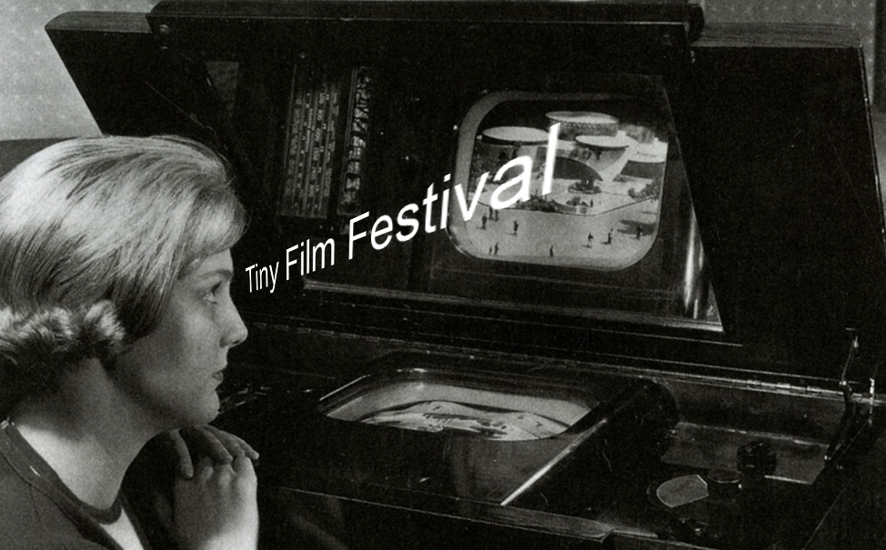

# Tiny Screens

## Project Overview

Create an interactive object or wearable that establishes a clear interaction for 1-3 people based around a preposition. Use either the Distance Sensor, a custom pressure sensor, or both as input. The Arduino's 12x8 LED matrix provides visual feedback.

A key skill when working with electronics is learning how to use generic components (sensors, LEDs, etc) and create specific experiences. This project will push you to transform simple inputs and outputs into a cohesive interactive narrative.

| | |
|---|---|
| **Keywords** | Interactive Animation, Preposition, Analog Sensing, Enclosures |
| **Format** | Individual |
| **Library** | [TinyFilmFestival](https://github.com/DigitalFuturesOCADU/TinyFilmFestival/) |
| **Resources** | [LED Matrix Editor](https://ledmatrix-editor.arduino.cc/), [Delay vs Millis](../01-AltController/DelayVsMillis.md) |

---

## Sections

- [Class Pages](#class-pages)
- [Interaction as Preposition](#interaction-as-preposition)
- [Hardware](#hardware)
- [Coding Concepts](#coding-concepts)
- [Lecture Slides](#lecture-slides)

---

## Class Pages

| Date | Topic |
|------|-------|
| February 6 | [Class 05 - Workshop 1](classes/class05-Feb06.md) |
| February 13 | [Class 06 - Workshop 2](classes/class06-Feb13.md) |
| February 27 | [Class 07 - Workshop 3](classes/class07-Feb27.md) |
| March 6 | [Class 08 - Project Exhibition] |

---

## Lecture Slides

| Class | Slides |
|-------|--------|
| Class 05 | *Link to slides* |
| Class 06 | *Link to slides* |
| Class 07 | *Link to slides* |
| Class 08 | *Link to slides* |

---

## Interaction as Preposition

You are creating a relationship between the visual information on the LED Matrix and a person or thing. Describe that relationship through a simple preposition.

### Recommended Prepositions

| Sensing Type | Prepositions |
|---|---|
| Distance Sensing | toward/away, between, above/below, through, past, before |
| Pressure Sensing | against, within, upon, into, beneath |
| Both | beside, around, with, among |

### Examples

- An object displaying agitated pixels when a hand hovers **ABOVE** it, calming when they step away
- A pouch showing pixels crawling **TOWARD** the center when squeezed
- A tabletop object tracking movement **THROUGH** its sensing zone

---

## Hardware

### Inputs (use one or both)

- **Distance Sensor (HC-SR04)** - Ultrasonic sensor, 2cm to 400cm range. Detects presence, proximity, and movement without contact.
- **Custom Pressure Sensor** - DIY sensor using conductive fabric, Velostat, or foam. Requires physical contact. Material choices affect engagement.

### Output

- **LED Matrix** - 12x8 red LEDs (on/off only). Control via [TinyFilmFestival Library](https://github.com/DigitalFuturesOCADU/TinyFilmFestival/). Create animations in [LED Matrix Editor](https://ledmatrix-editor.arduino.cc/).

---

## Coding Concepts

### Thresholds

Break sensor data into zones using [if/else](https://docs.arduino.cc/language-reference/en/structure/control-structure/if/) or [switch/case](https://docs.arduino.cc/language-reference/en/structure/control-structure/switchCase/). Define close/medium/far for distance, or light/medium/strong for pressure. Map these zones to your preposition.

### Remapping Data

Use [map()](https://docs.arduino.cc/language-reference/en/functions/math/map/) to relate sensor values directly to visual properties. Distance could control animation speed or pixel density. Pressure could control the number of active pixels.

### State Machines

Manage different phases of interaction (idle, sensing, responding) as distinct states. Each state can have its own animation and transition logic.

### Timing without delay()

Control timing without blocking sensor input. Avoid using delay(). See: [Delay vs Millis](../01-AltController/DelayVsMillis.md)

---

## Design Constraints

- Interaction **must** be defined by a preposition you choose
- Project must be interactive using Pressure, Distance, or Both
- All electronics and wiring enclosed: Free-standing, tabletop, or wearable
- Connected to a battery or your laptop
- LED Matrix covered with magnifier, diffuser, or both—no bare LEDs visible
- Animation must be "alive" at all times—never static, even when idle
- Write your own code (examples as starting point only)

## Do Not

- Create static displays or simple on/off indicators
- Make graphs or data visualizations of sensor values
- Replicate phone/tablet interfaces
- Embed screen in a stuffed animal
- Copy a Tamagotchi directly (inspiration is fine, replication is not)
- Leave wiring exposed

---

## Design Considerations

### Aliveness

Design idle animations, acknowledgment when sensing begins, and graceful recovery after interaction ends. The object should always communicate it is ready and responsive.

### Dialogue

What is the sequence of action and response? How does the object invite interaction, acknowledge input, respond, and invite the next action?

### Affordances

How does someone understand how to interact without instructions? Consider material, scale, sensor orientation, and how to make the sensing zone discoverable.

### Craft

The screen is very small. Link animation to material choices. Build robust connections for exhibition handling. Make material choices that reinforce your preposition.

### Exhibition

Each work will display its chosen preposition. Consider how someone can understand your work and interaction with a single word description.

---
