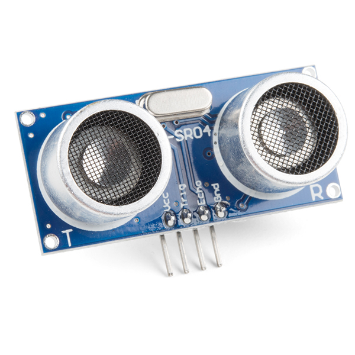
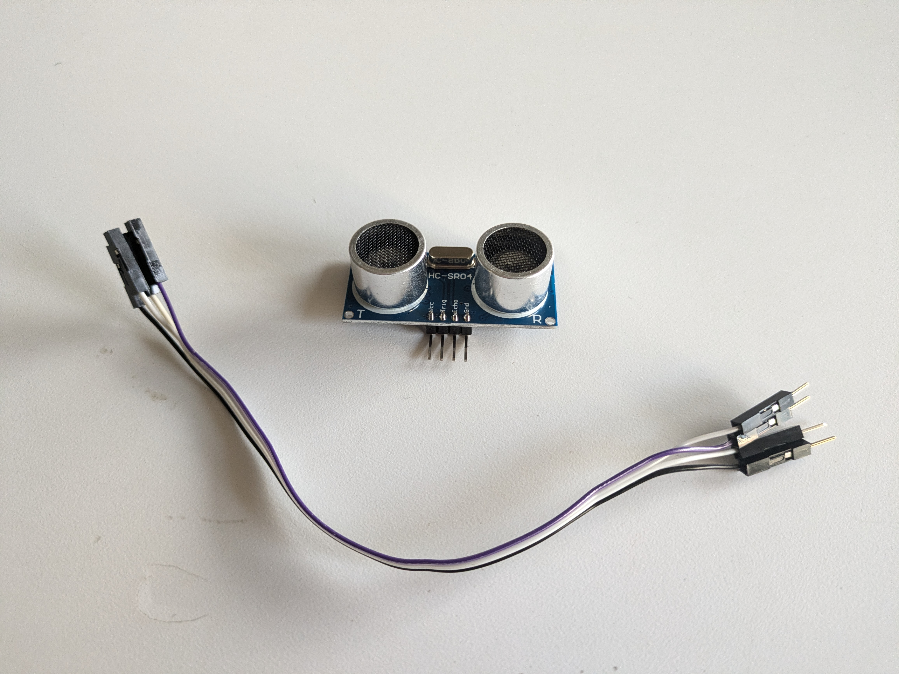
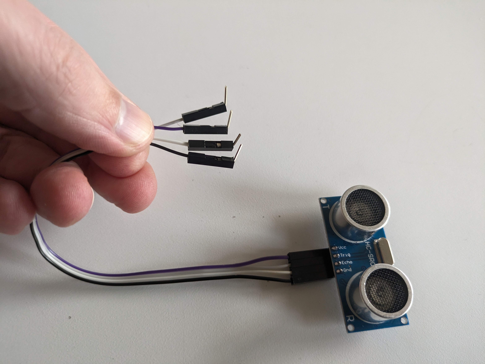
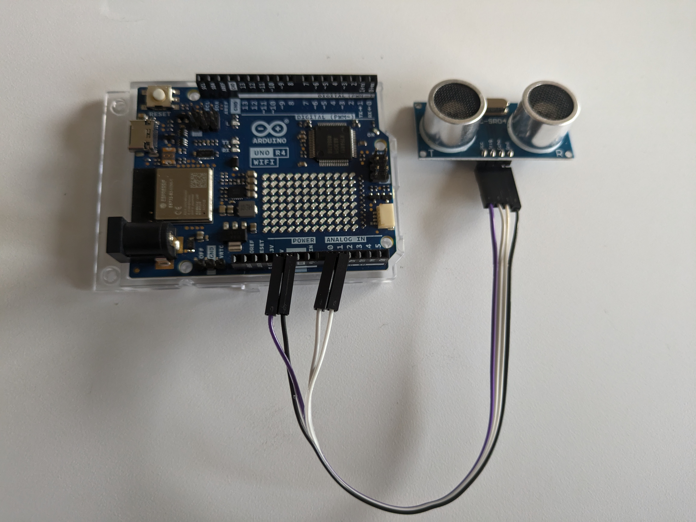

# Distance Sensor — HC-SR04 Setup Guide

[← Back to Tiny Screens](../TinyScreens.md)

---

## Table of Contents

- [What are Ultrasonic Distance Sensors?](#what-are-ultrasonic-distance-sensors)
- [How Do They Work?](#how-do-they-work)
- [How Do They Connect to Arduino?](#how-do-they-connect-to-arduino)
  - [The Sensor Has 4 Pins](#the-sensor-has-4-pins)
  - [Using / Modifying Jumper Wires](#using--modifying-jumper-wires)
- [How is the Data Read Within the Code?](#how-is-the-data-read-within-the-code)
  - [Data Type](#data-type)
  - [Reading Values + Timing](#reading-values--timing)
- [Examples](#examples)
- [Design Considerations](#design-considerations)

---

## What are Ultrasonic Distance Sensors?



The HC-SR04 is one of the most common sensors used with Arduino. It uses ultrasonic sound to measure the distance from the sensor to the nearest object — [kind of like a bat](https://www.nps.gov/subjects/bats/echolocation.htm).

---

## How Do They Work?

When a pulse is sent to the Trigger Pin, the sensor emits ultrasonic sound. When the sound hits an object it bounces back toward the sensor where its microphone listens for it. The time it takes between sending the sound and hearing the bounce is then converted into a distance value.


---

## How Do They Connect to Arduino?

### The Sensor Has 4 Pins

| Pin | Function | Connect To |
|-----|----------|------------|
| **VCC** | Power for the sensor | 5V |
| **Trig** | Sends the sound | Any Digital/Analog pin |
| **Echo** | Hears the sound | Any Digital/Analog pin |
| **GND** | Ground for the sensor | GND |

### Using / Modifying Jumper Wires

You can connect the sensor directly to your Arduino using 4 Pin → Socket jumpers from your kit. To create a lower profile, you can bend the pins on the end of the jumper wires 90 degrees.







To keep the wiring tidy, the Trigger and Echo pins are connected to pins **A0 (14)** and **A1 (15)**. All code examples assume these connections, but you can change them to any digital or analog pin.


---

## How is the Data Read Within the Code?

### Data Type

We are using the [HCSR04 Library by Martin Sosic](https://github.com/Martinsos/arduino-lib-hc-sr04). This library simplifies interaction with the sensor by providing the data type `UltraSonicDistanceSensor`. The library was installed as part of the TinyFilmFestival Library.

When creating the variable you define the Trigger Pin, Echo Pin, and Max Distance:

```cpp
UltraSonicDistanceSensor sensor(triggerPin, echoPin, maxDistanceCm);
```

- `triggerPin`, `echoPin` — the pins where the sensor is connected (in our example: **14**, **15**)
- `maxDistanceCm` — prevents error readings when no objects are present by setting a maximum value

For a sensor connected as shown above with a max distance of 50 cm:

```cpp
UltraSonicDistanceSensor sensor(14, 15, 50);
```

### Reading Values + Timing

The data is read from the sensor using `measureDistanceCm()`. This returns the distance to the nearest object in centimeters:

```cpp
float distance = sensor.measureDistanceCm();
```

> **Important:** The sensor requires time to send, bounce, and read the signal. Use a simple timer to control the reading speed. **DO NOT use `delay()`** — it will interfere with your animation timing. All code examples use a `millis()`-based timer instead.

---

## Examples

If you update the library to **version 1.1.5**, you will see a new set of examples under *Examples → TinyFilmFestival → Animation Control Distance* that use the distance sensor for animation control, similar to the pressure sensor examples.

[Example Descriptions on GitHub](https://github.com/DigitalFuturesOCADU/TinyFilmFestival/?tab=readme-ov-file#distance-sensor-examples)

---

## Design Considerations

- **Orientation** — The direction the sensor faces changes the type of interaction (hand approaching from above vs. from the side, etc.)
- **Material** — Because it uses sound, objects made of different materials are read with variable levels of accuracy (soft fabrics absorb sound; hard surfaces reflect it well)
- **Min / Max / Accuracy**
  - Minimum distance: **2 cm**
  - Maximum distance: **400 cm**
  - Accuracy: **3 mm**
