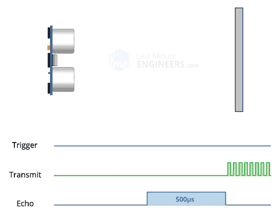
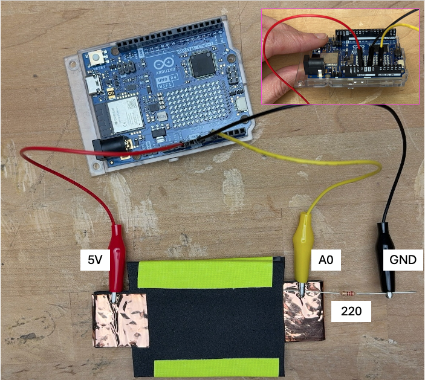

# Class 06 | February 13 | Workshop 2

[← Back to Tiny Screens](../TinyScreens.md)

## Overview

This is the second workshop for the [Tiny Screens](../TinyScreens.md) project. In [Class 05](class05-Feb06.md), you learned how to create visuals on the UNO R4 WiFi LED matrix using TinyFilmFestival output modes. In this class, you connect those visuals to **input**.

You will build two sensor-driven interactions:
- **Distance Sensor (HC-SR04)** → contactless input in centimeters
- **Custom Pressure Sensor (Velostat FSR)** → analog input from 0–1023

The core shift today: move from **time-driven visuals** to **sensor-driven visuals** while keeping your output alive and responsive.

This page is organized in three phases:
1. **Sensor Foundations** — understand what each sensor measures and verify it in Serial Monitor.
2. **Pattern Library (8 Files)** — choose step-by-step methods for map/threshold and canvas/animation.
3. **Submission** — document and share your two tested interactions.

### What We’ll Cover

1. [Today’s Goal in the Project Arc](#todays-goal-in-the-project-arc)
2. [TinyFilmFestival Strategy for Class 06](#tinyfilmfestival-strategy-for-class-06)
3. [Coding Strategy](#coding-strategy)
4. [Sensor Foundations](#sensor-foundations)
5. [Step-by-Step Method Library (8 Files)](#step-by-step-method-library-8-files)
6. [Putting It All Together](#putting-it-all-together)
7. [Submission](#submission)

## Resources

- [TinyFilmFestival Documentation](https://digitalfuturesocadu.github.io/TinyFilmFestival/docs/#home)
- [EasyUltrasonic Library](https://github.com/SpulberGeorge/EasyUltrasonic)
- [LED Matrix Editor](https://ledmatrix-editor.arduino.cc/)
- [Class 06 Code Patterns](class06-CodePatterns.md)
- [Class 05 Workshop 1 Notes](class05-Feb06.md)
- [Delay vs Millis](../../01-AltController/DelayVsMillis.md)
- [map() Reference](https://docs.arduino.cc/language-reference/en/functions/math/map/)
- [analogRead() Reference](https://docs.arduino.cc/language-reference/en/functions/analog-io/analogRead/)

---

## Today’s Goal in the Project Arc

From the [Tiny Screens project](../TinyScreens.md): your final piece must define an interaction using a preposition (toward, against, above, within, etc.), stay visually alive at all times, and connect physical input to purposeful visual output.

Today’s workshop is the first full step into that behavior:

- **Class 05:** learned output tools (Simple LED, Animation, Canvas)
- **Class 06:** connect distance and pressure input to those visuals
- **Class 07+:** combine both into a clearer interaction narrative and enclosure

By next class, you should have two working mini-interactions (one per sensor), each with:
- A one-sentence interaction description
- Pseudocode of your logic
- A tested sensor-to-screen behavior

---

## TinyFilmFestival Strategy for Class 06

TinyFilmFestival supports four drawing modes overall:

| Mode | Main Use | Key APIs |
|------|----------|----------|
| **Simple LED** | Individual LED on/off control | `ledWrite()`, `ledToggle()`, `ledClear()` |
| **Animation** | Pre-made frame playback | `screen.play()`, `screen.setSpeed()`, `screen.update()` |
| **Canvas** | Real-time drawing with code | `screen.beginDraw()`, drawing functions, `screen.endDraw()` |
| **Hybrid/Overlay** | Draw over animations | `beginOverlay()`, `endOverlay()` |


### What Changed Since Class 05

In Class 05, motion often came from time tools like `oscillateInt()`. In Class 06, the same visual parameters are now controlled by sensor data.

Example pattern:
- Class 05: `int x = oscillateInt(0, 11, 2000);`
- Class 06: `int x = map(distanceCM, 2, 100, 11, 0);`

---

## Coding Strategy

Before coding examples, use this workflow every loop:

1. **Read** sensor data
2. **Translate** value using `map()` or thresholds
3. **Draw** output using Animation or Canvas

Before you write your interaction code, go through these pages in order from [Class 06 Code Patterns](class06-CodePatterns.md). Don’t skip this step — each section introduces a concept you will immediately use in the workshop:

- [Planning Your Code](class06-CodePatterns.md#planning-your-code)  
    Introduces the **read → translate → draw** structure, naming strategy, and parameter thinking.  
    **Why it matters:** this prevents random trial-and-error code and gives you a clear logic path before you start.

- [Writing Functions](class06-CodePatterns.md#writing-functions)  
    Introduces splitting your sketch into small reusable functions (read, map/threshold, draw).  
    **Why it matters:** this keeps `loop()` readable, makes debugging faster, and helps you reuse the same structure for both sensors.

- [From Static to Dynamic](class06-CodePatterns.md#from-static-to-dynamic)  
    Introduces how to replace hard-coded or time-driven values with sensor-driven values.  
    **Why it matters:** this is the core shift from Class 05 output demos to Class 06 interactive behavior.

### Choose Translation Type

| Translation | Best For | Typical Code |
|-------------|----------|--------------|
| **Continuous** | Smooth control of size/position/speed | `map()` + `constrain()` |
| **Threshold** | Distinct zones or states | `if / else if / else` |

### Variable Naming Rule

Name values by meaning, not by type:

- Better: `distanceToFace`, `gripStrength`, `proximityZone`
- Avoid: `val`, `reading`, `data`

---

## Sensor Foundations

Before coding visuals, first confirm what each sensor measures and what value range it produces.

### Sensor 1: Distance (HC-SR04)



The HC-SR04 sends an ultrasonic pulse and measures echo time to return distance in centimeters.

**Basic values to know:**
- Typical working range: about 2–400 cm (use a smaller practical range in your project)
- Returned value: distance in centimeters (`float`)
- Closer object = smaller number, farther object = larger number

**Wiring:**

| HC-SR04 Pin | Arduino Pin |
|-------------|-------------|
| VCC | 5V |
| GND | GND |
| TRIG | A0 |
| ECHO | A1 |


Use `millis()` when reading values so the sketch samples at steady intervals without blocking. This keeps timing predictable and leaves room for responsive visuals later.

**Quick test (Serial only):**

```cpp
#include <EasyUltrasonic.h>

EasyUltrasonic ultrasonic;

int TRIG_PIN = A0;
int ECHO_PIN = A1;
int MIN_DISTANCE = 2;
int MAX_DISTANCE = 100;

int READ_INTERVAL = 50;          // Read every 50ms
unsigned long lastRead = 0;     // Stores last read time

void setup()
{
    Serial.begin(9600);          // Open Serial Monitor at 9600 baud
    ultrasonic.attach(TRIG_PIN, ECHO_PIN, MIN_DISTANCE, MAX_DISTANCE);
}

void loop()
{
    // Read sensor only when interval has passed (non-blocking timing)
    if (millis() - lastRead >= READ_INTERVAL)
    {
        lastRead = millis();

        float distanceCM = ultrasonic.getDistanceCM();  // Current distance value

        Serial.print("Distance (cm): ");               // Label for readability
        Serial.println(distanceCM);                     // Print measured value
    }
}
```

### Sensor 2: Pressure (Custom FSR)

Your custom FSR is a variable resistor made from conductive layers plus Velostat. `analogRead()` returns a raw value from 0–1023.

**Basic values to know:**
- Returned value: raw analog reading from 0–1023 (`int`)
- No pressure usually reads near your baseline value
- More pressure usually gives higher readings (after calibration)

**Build + Wiring (Voltage Divider):**

| Connection | Arduino Pin |
|------------|-------------|
| Conductive layer 1 | 5V |
| Conductive layer 2 | A0 + 220Ω resistor to GND |


**Construction steps (build before code):**
1. Make two conductive layers (copper tape or conductive material) that match your sensor shape.
2. Place Velostat between those conductive layers so they do not touch directly.
3. Add non-conductive outer layers for durability and to prevent accidental shorts.
4. Attach one conductive side to 5V.
5. Attach the other conductive side to `A0`, and add a 220Ω resistor from `A0` to GND.
6. Test in Serial Monitor before writing any screen behavior.

Step-by-step build walkthrough (slides): [Pressure Sensor Build Guide](https://ocaduniversity-my.sharepoint.com/:p:/g/personal/npuckett_ocadu_ca/IQDYsUiYlF8yRb__hAp87OaEAWPpRofjDa1qJFUw5RcqAOo?e=HIesQu)

Why this construction matters: poor layer separation or weak electrical contact causes unstable readings. If the copper tape pieces touch each other directly, it no longer works as a sensor.

Use `millis()` for pressure reads for the same reason as distance: regular sampling without freezing the sketch.

**Quick test (Serial only):**

```cpp
int FSR_PIN = A0;

int READ_INTERVAL = 50;          // Read every 50ms
unsigned long lastRead = 0;     // Stores last read time

void setup()
{
    Serial.begin(9600);          // Open Serial Monitor at 9600 baud
}

void loop()
{
    // Read sensor only when interval has passed (non-blocking timing)
    if (millis() - lastRead >= READ_INTERVAL)
    {
        lastRead = millis();

        int pressure = analogRead(FSR_PIN);             // Current pressure value

        Serial.print("Pressure: ");                    // Label for readability
        Serial.println(pressure);                       // Print measured value
    }
}
```




---

## Step-by-Step Method Library (8 Files)

These 8 files are not just examples to copy — they are **step-by-step methods** you can reuse and expand for your project.

How they connect to your other sections:
- **Sensor Foundations:** gives you trustworthy input values first
- **Coding Strategy:** each file follows the same `read → translate → draw` structure
- **Tiny Screens project goals:** each pattern helps you design a clearer preposition-based interaction that stays alive and responsive

Think of them as building blocks. Start with one method, get it working, then combine methods to build richer behavior.

### Distance Sensor Patterns

- [distance_map_canvas](class06-distance_map_canvas.md)
    - **What:** maps distance continuously to a simple canvas parameter.
    - **Why:** best first method for seeing smooth sensor-to-visual response.
    - **Method steps:**
        1. Read distance in cm.
        2. Map distance to one canvas parameter (position/size).
        3. Constrain the mapped value.
        4. Draw and update every loop.

- [distance_map_animation](class06-distance_map_animation.md)
    - **What:** maps distance continuously to animation behavior (e.g., speed/position).
    - **Why:** shows how the same input can control pre-made animation playback.
    - **Method steps:**
        1. Play one animation.
        2. Read distance continuously.
        3. Map distance to animation parameter(s) like speed or position.
        4. Call `screen.update()` every loop.

- [distance_threshold_canvas](class06-distance_threshold_canvas.md)
    - **What:** splits distance into zones and draws different canvas states.
    - **Why:** useful when interaction needs clear state changes, not just smooth motion.
    - **Method steps:**
        1. Define threshold boundaries.
        2. Read current distance.
        3. Decide zone with `if / else if / else`.
        4. Draw a different visual per zone.

- [distance_threshold_animation](class06-distance_threshold_animation.md)
    - **What:** uses distance zones to switch animation behavior.
    - **Why:** gives a stronger narrative structure (idle/near/close) for interactive pieces.
    - **Method steps:**
        1. Define distance zones.
        2. Read and classify current distance.
        3. Trigger animation/state changes only when zone changes.
        4. Keep playback running with `screen.update()`.

### Pressure Sensor Patterns

- [pressure_map_canvas](class06-pressure_map_canvas.md)
    - **What:** maps pressure continuously to a simple canvas parameter.
    - **Why:** fastest way to confirm your custom FSR can drive visual change smoothly.
    - **Method steps:**
        1. Read pressure with `analogRead()`.
        2. Map pressure to one canvas parameter.
        3. Constrain to safe drawing range.
        4. Draw continuously.

- [pressure_map_animation](class06-pressure_map_animation.md)
    - **What:** maps pressure continuously to animation behavior.
    - **Why:** good for translating force into expressive motion or pacing.
    - **Method steps:**
        1. Start one animation.
        2. Read pressure each loop.
        3. Map pressure to speed/position parameters.
        4. Update animation each frame.

- [pressure_threshold_canvas](class06-pressure_threshold_canvas.md)
    - **What:** uses pressure zones to draw different canvas outputs.
    - **Why:** useful for discrete responses like light/medium/firm press states.
    - **Method steps:**
        1. Define pressure thresholds from calibration.
        2. Read current pressure.
        3. Select zone/state with conditionals.
        4. Draw a distinct visual for each zone.

- [pressure_threshold_animation](class06-pressure_threshold_animation.md)
    - **What:** uses pressure thresholds to switch animation states.
    - **Why:** supports interaction storytelling by clearly separating behavioral phases.
    - **Method steps:**
        1. Define pressure zones.
        2. Read pressure and classify current zone.
        3. Switch animation/state only on zone change.
        4. Maintain continuous playback and responsiveness.

Suggested progression:
1. Start with `*_map_canvas` (one sensor → one visual parameter).
2. Move to `*_threshold_canvas` (clear states and transitions).
3. Advance to `*_map_animation` and `*_threshold_animation` once behavior is stable.

---

## Putting It All Together

You now have what you need to build two clear sensor-to-screen interactions for Workshop 2.

| Workshop Part | What to Do |
|--------------|------------|
| Part 1 — Distance Sensor | Run the distance Serial test, choose one distance method file, and build one interaction from it |
| Part 2 — Pressure Sensor | Run the pressure Serial test, choose one pressure method file, and build one interaction from it |
| Part 3 — Concept Link | Write your one-sentence interaction statement and pseudocode using `read → translate → draw` |

Use the method files as structured starting points, then adapt them to your chosen preposition and behavior goals in [Tiny Screens](../TinyScreens.md#interaction-as-preposition).

### Practical Tips

- Calibrate first in Serial Monitor before mapping or thresholds.
- Keep variable names descriptive (`distanceToFace`, `gripStrength`, `interactionZone`).
- Start with one parameter, then add complexity after behavior is stable.
- Prefer `millis()` timing instead of `delay()` so the interaction stays responsive.

---

## Submission

Post the following to the Discussion on Canvas. Workshop 2 submission is due by the end of class unless otherwise announced.

### Distance Sensor

- One-sentence interaction description
- Pseudocode (text or image)
- Image/video showing sensor input + screen response

### Pressure Sensor

- One-sentence interaction description
- Pseudocode (text or image)
- Image/video showing sensor input + screen response

---

## Checklist Before You Submit

- I tested **both** sensors with Serial Monitor
- I created one interaction per sensor
- My two visuals are meaningfully different
- My code follows read → translate → draw
- I used naming and structure from [Class 06 Code Patterns](class06-CodePatterns.md)
- My visual behavior supports my project preposition in [Tiny Screens](../TinyScreens.md#interaction-as-preposition)
