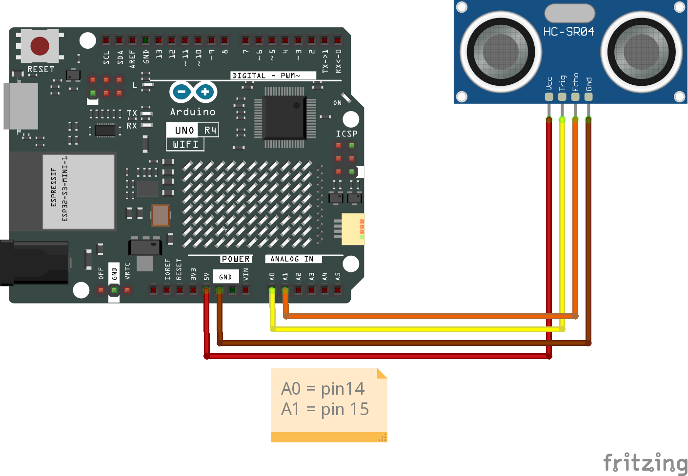
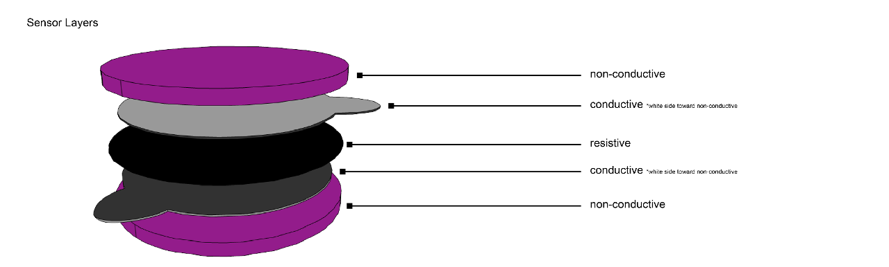

# Class 06 | February 13 | Workshop 2

[← Back to Tiny Screens](../TinyScreens.md)

## Overview

This is the second workshop for the [Tiny Screens](../TinyScreens.md) project. Where Class 05 focused on **output** — putting things on the LED matrix — this class focuses on **input**: reading sensor data and using it to drive what appears on screen.

You will work with two sensor types:
- **Distance data** from the HC-SR04 ultrasonic distance sensor
- **Analog data** from a custom force-sensing resistor (FSR) made from Velostat, copper tape, and other conductive materials

Today is about connecting sensors to animations — building the bridge between the physical world and the LED matrix.

### What We'll Cover

1. [Overview of Sensors](#overview-of-sensors) — how each sensor works, wiring, and data units
2. [Planning Your Code](#planning-your-code) — naming, the loop pattern, and connecting input to output
3. [Writing Functions](#writing-functions) — organizing your code into reusable blocks
4. [From Static to Dynamic](#from-static-to-dynamic) — the key shift from fixed values to sensor-driven ones
5. [Distance Sensor](#distance-sensor--hc-sr04) — setup, reading, thresholds, and mapping
6. [Pressure Sensor](#pressure-sensor--custom-fsr) — setup, reading, thresholds, and mapping
7. [Workshop](#putting-it-all-together) — what to do for today's submission

## Lecture Slides

*Link to slides*

## Resources

- [TinyFilmFestival Documentation](https://digitalfuturesocadu.github.io/TinyFilmFestival/docs/#home)
- [EasyUltrasonic Library](https://github.com/SpulberGeorge/EasyUltrasonic)
- [LED Matrix Editor](https://ledmatrix-editor.arduino.cc/)
- [Delay vs Millis](../../01-AltController/DelayVsMillis.md)
- [map() Reference](https://docs.arduino.cc/language-reference/en/functions/math/map/)
- [analogRead() Reference](https://docs.arduino.cc/language-reference/en/functions/analog-io/analogRead/)

---

## Overview of Sensors

Your Tiny Screens project uses one or both of these sensors as input. Each produces a different kind of data and suits a different kind of interaction.

| Sensor | Data Type | Range | Best For |
|--------|-----------|-------|----------|
| **HC-SR04 Distance Sensor** | Distance in cm | 2–400 cm (practical: 2–200 cm) | Contactless interaction — toward, away, above, through |
| **Custom FSR (Velostat)** | Analog value | 0–1023 (raw ADC) | Contact interaction — against, upon, into, beneath |

### Distance Sensor — How Does It Work?

The HC-SR04 sends an ultrasonic pulse (too high-pitched to hear) and measures how long it takes to bounce back. Each reading takes a small amount of time to send the pulse and listen for the echo. The library calculates the distance based on the speed of sound.

**Wiring:**

| HC-SR04 Pin | Arduino Pin | Notes |
|-------------|-------------|-------|
| VCC | 5V | Power |
| GND | GND | Ground |
| TRIG | A0 | Sends the pulse |
| ECHO | A1 | Receives the echo |

> To keep wiring tidy, the Trigger and Echo pins connect to **A0** and **A1**. All code examples assume these connections, but you can use any digital or analog pin.



**Units:** Distance is returned in **centimeters** (cm) by default. The library also supports inches.

#### Quick Serial Test — Distance

Copy/paste this to confirm the distance sensor is wired correctly. Open **Tools → Serial Monitor** at 9600 baud.

```cpp
#include <EasyUltrasonic.h>

EasyUltrasonic ultrasonic;

// --- Pin configuration ---
int TRIG_PIN = A0;
int ECHO_PIN = A1;

// --- Sensor range ---
int MIN_DISTANCE = 2;    // cm — closest reliable reading
int MAX_DISTANCE = 100;  // cm — farthest we care about

// --- Timing ---
int READ_INTERVAL = 50;  // ms between readings

float distanceCM = 0;

void setup()
{
    Serial.begin(9600);
    ultrasonic.attach(TRIG_PIN, ECHO_PIN, MIN_DISTANCE, MAX_DISTANCE);
}

void loop()
{
    // static means this variable keeps its value between loops (doesn't reset to 0)
    static unsigned long lastRead = 0;

    if (millis() - lastRead >= READ_INTERVAL)
    {
        lastRead = millis();

        distanceCM = ultrasonic.getDistanceCM();

        Serial.print("Distance (cm): ");
        Serial.println(distanceCM);
    }
}
```

### Pressure Sensor — How Does It Work?

A force-sensing resistor (FSR) changes its resistance based on how hard it is pressed. More pressure = lower resistance = higher analog reading. You are building **custom** FSRs using Velostat, copper tape, and conductive materials.



> **Why custom?** The focus on building your own pressure sensors is the ability to **customize their size, shape, and material** to cleanly integrate into your object. A store-bought FSR has a fixed form — yours can be any shape and size your design needs.

**Build Notes:**
- Put **non-conductive layers on the outside** so the sensor is safe to touch and does not short against other surfaces.
- It is crucial that the **5V side** and the **voltage divider side** cannot touch each other directly — keep the conductive layers separated by Velostat only.
- Connect to the Arduino using **alligator clip jumper wires** for quick, reliable contact.

**Wiring (Voltage Divider):**

| Connection | Arduino Pin | Notes |
|------------|-------------|-------|
| One conductive layer | Analog pin (e.g. A5) + 10kΩ pull-down to GND | Signal side |
| Other conductive layer | 5V | Power side |

> Connect one side of the Velostat sandwich to 5V, the other to an analog pin. Add a 10kΩ resistor between the analog pin and GND (a pull-down resistor). This creates a voltage divider that lets `analogRead()` measure the change in resistance.

**Units:** `analogRead()` returns a raw value between **0** (no pressure / open circuit) and **1023** (maximum pressure / lowest resistance). These are **not** in any physical unit — they represent the voltage at the analog pin as a 10-bit number.

**Which pins?** Only the **analog** pins (A0–A5 on the UNO R4) can read this sensor.

#### Quick Serial Test — Pressure

Copy/paste this to confirm the pressure sensor is wired correctly. Open **Tools → Serial Monitor** at 9600 baud.

```cpp
// --- Pin configuration ---
int FSR_PIN = A5;

// --- Timing ---
int READ_INTERVAL = 50;  // ms between readings

int pressure = 0;

void setup()
{
    Serial.begin(9600);
}

void loop()
{
    // static means this variable keeps its value between loops (doesn't reset to 0)
    static unsigned long lastRead = 0;

    if (millis() - lastRead >= READ_INTERVAL)
    {
        lastRead = millis();

        pressure = analogRead(FSR_PIN);

        Serial.print("Pressure: ");
        Serial.println(pressure);
    }
}
```

---

## Planning Your Code

Before writing code, plan in plain language. Think of your sketch as having three layers: **read** (get the sensor value), **translate** (decide what it means), and **draw** (update the screen). Naming things well at each layer makes everything easier.

### Input Language

When writing code, refer to data by **what it actually is** in your system rather than generic numbers. Good variable names describe the data's meaning:

**Distance Examples:**

```cpp
// ❌ Generic — what does "val" mean?
int val = ultrasonic.getDistanceCM();

// ✅ Descriptive — names say what the data IS
int distanceToHand = ultrasonic.getDistanceCM();    // "toward" concept
int proximityLevel = ultrasonic.getDistanceCM();    // "above" concept
int gapBetween = ultrasonic.getDistanceCM();        // "between" concept
```

**Pressure Examples:**

```cpp
// ❌ Generic
int reading = analogRead(A5);

// ✅ Descriptive
int gripStrength = analogRead(A5);     // "against" concept
int squeezeForce = analogRead(A5);     // "into" concept
int weightOnSurface = analogRead(A5);  // "upon" concept
```

### Output Language

The same approach applies to output. Describe what the screen *should do* before worrying about exact code:

```
Plain Language:                          Code:
─────────────────────────────────────    ──────────────────────────────────
"The circle grows as pressure            int diameter = map(squeezeForce,
 increases"                                  0, 1023, 1, 7);
                                         screen.circle(5, 3, diameter);

"The dot moves toward the edge           int dotX = map(distanceToHand,
 as I get closer"                            5, 100, 11, 0);
                                         screen.point(dotX, 4);
```

> **Tip:** Comments are free. Use them as your plain-language plan right in the code. Future-you will thank present-you.

### Parameters — The Bridge Between Input and Output

A **parameter** is any value in your output code that *could* change based on input. When you identify parameters, you find the connection points between sensors and the screen:

| Output Description | Fixed Code | Parameter | What Could Drive It |
|---|---|---|---|
| A dot at position x | `screen.point(5, 4)` | `5` (x position) | Distance sensor |
| A circle with diameter d | `screen.circle(5, 3, 4)` | `4` (diameter) | Pressure sensor |
| Animation at speed s | `screen.setSpeed(1.0)` | `1.0` (speed) | Either sensor |
| Rectangle with width w | `screen.rect(0, 0, 8, 8)` | `8` (width) | Either sensor |

### The Loop Pattern

Every pass through `loop()` does the same thing: **read** the sensor, **translate** the value, **draw** to the screen. There are two ways to translate:

**`map()` — Continuous:** The sensor smoothly controls a visual parameter (position, size, speed):

```cpp
void loop()
{
    // READ
    int distance = ultrasonic.getDistanceCM();

    // TRANSLATE — map sensor range to screen range
    int dotX = map(distance, 2, 100, 11, 0);
    dotX = constrain(dotX, 0, 11);

    // DRAW
    screen.beginDraw();
    screen.background(OFF);
    screen.stroke(ON);
    screen.point(dotX, 4);
    screen.endDraw();
}
```

**`if/else` — Threshold:** The sensor switches between distinct behaviors at a boundary:

```cpp
void loop()
{
    // READ
    int distance = ultrasonic.getDistanceCM();

    // TRANSLATE + DRAW — check threshold and respond
    if (distance < CLOSE_THRESHOLD)
    {
        screen.play(alert, LOOP);
    }
    else
    {
        screen.play(calm, LOOP);
    }

    screen.update();
}
```

#### Name Your Thresholds

Use **named variables** instead of raw numbers so your code explains the decision:

```cpp
// ❌ What does 15 mean? Hard to understand.
if (distanceToHand < 15)
{
    ...
}

// ✅ The variable name explains the decision
int personalSpace = 15;  // cm — closer than this feels "too close"
if (distanceToHand < personalSpace)
{
    ...
}
```

The same idea works for pressure:

```cpp
// ❌ Magic number
if (gripStrength > 200)
{
    ...
}

// ✅ Clear intent
int firmGrip = 200;  // analog reading when user grips firmly
if (gripStrength > firmGrip)
{
    ...
}
```

More thresholds create more zones. One threshold = two zones; two thresholds = three zones:

```
Distance:  0 cm ──────── 15 cm ──────── 40 cm ──────── 100+ cm
Zone:       [  CLOSE  ]   [  NEAR  ]     [   FAR    ]
```

## Writing Functions

A **function** is a named block of code that performs a specific task. You've already been using them — `setup()`, `loop()`, `analogRead()`, and `map()` are all functions. Now you'll write your own.

### Why Use Functions?

- **Organize** — Each step of your logic gets its own clearly labeled block
- **Reuse** — Write it once, call it anywhere
- **Readability** — `loop()` reads like a plain-language plan

### Structure of a Function

```cpp
returnType functionName(parameterType parameterName)
{
    // Code that does the work
    return value;  // Send a result back (if needed)
}
```

### Key Words

| Word | What it means |
|------|---------------|
| **Return type** | What kind of data the function sends back: `int`, `float`, `String`, `bool`, or `void` (nothing) |
| **Parameters** | Values you pass *into* the function — listed inside the parentheses |
| **`return`** | Sends a value back to wherever the function was called and exits the function |
| **Call** | Using the function by writing its name with parentheses: `readDistance()` |

### Types of Functions

| Type | Example | Use when... |
|------|---------|-------------|
| **Returns a value** | `int distanceToX(int dist)` | You need a calculation back |
| **Does something (void)** | `void drawDot(int x)` | You want to trigger an action, no result needed |
| **No parameters** | `int readDistance()` | The function gets its own data internally |
| **Multiple parameters** | `int clampValue(int val, int lo, int hi)` | You need to pass in several pieces of info |

### Example: Functions for Each Step

```cpp
// --- Sensor range ---
int MIN_DISTANCE = 2;
int MAX_DISTANCE = 100;

// --- Screen bounds ---
int SCREEN_MIN_X = 0;
int SCREEN_MAX_X = 11;

// ── STEP 1 FUNCTION: Get new data ──
// Returns an int, takes no parameters
int readDistance()
{
    return ultrasonic.getDistanceCM();
}

// ── STEP 2 FUNCTION: Map to output ──
// Returns an int, takes an int parameter
int distanceToX(int distance)
{
    int x = map(distance, MIN_DISTANCE, MAX_DISTANCE, SCREEN_MAX_X, SCREEN_MIN_X);
    return constrain(x, SCREEN_MIN_X, SCREEN_MAX_X);
}

// ── STEP 3 FUNCTION: Draw ──
// Returns nothing (void), takes an int parameter
void drawDot(int x)
{
    screen.beginDraw();
    screen.background(OFF);
    screen.stroke(ON);
    screen.point(x, 4);
    screen.endDraw();
}

// ── loop() reads like a plan ──
void loop()
{
    int distance = readDistance();       // Step 1: Get data
    int dotX = distanceToX(distance);   // Step 2: Map to output
    drawDot(dotX);                      // Step 3: Draw
}
```

> **Tip:** Notice how `loop()` now reads almost like plain English. Each function name describes *what* happens; the function body describes *how*.

---

## From Static to Dynamic

The key shift in this class is going from **fixed values** (hard-coded numbers) to **dynamic values** (driven by sensor input). Here's how to think through that transformation:

### Step 1: Start with a Class 05 Sketch

In Class 05, you wrote an [Animated Circle](class05-Feb06.md#example-animated-circle-with-expanding-diameter) that used `oscillateInt()` to grow and shrink the diameter on a timer:

```cpp
// Class 05 — Animated Circle with Expanding Diameter
int diameter = oscillateInt(1, 7, 2000); // Grows and shrinks over 2 seconds

screen.beginDraw();
screen.background(OFF);
screen.stroke(ON);
screen.noFill();
screen.circle(5, 3, diameter);
screen.endDraw();
```

### Step 2: Identify the Parameter

Which value could a sensor control instead of `oscillateInt()`?

```cpp
//                  ↓ this one — diameter
int diameter = oscillateInt(1, 7, 2000);
screen.circle(5, 3, diameter);
```

### Step 3: Replace with a Named Variable

Pull it out so it's easy to swap the source:

```cpp
int diameter = 4;   // fixed for now
screen.circle(5, 3, diameter);
```

### Step 4: Drive the Variable with Sensor Data

Replace the fixed value with a `map()` call that reads from a sensor:

```cpp
int pressure = analogRead(FSR_PIN);
int diameter = map(pressure, 50, 800, 1, 7);
diameter = constrain(diameter, 1, 7);
screen.circle(5, 3, diameter);
```

The circle that used to grow and shrink on a timer now grows and shrinks based on how hard you press.

### The Same Pattern Works Everywhere

Each Class 06 example below follows this same transformation — find the parameter, replace its source with sensor data:

| Class 05 (time-driven) | Class 06 (sensor-driven) | Example below |
|---|---|---|
| `oscillateInt(0, 11, 2000)` for dot position | `map(distance, ...)` for dot position | [Distance-Controlled Dot](#example-distance-mapped-to-canvas) |
| `oscillateInt(1, 7, 2000)` for circle diameter | `map(pressure, ...)` for circle diameter | [Pressure-Controlled Circle](#example-pressure-mapped-to-canvas) |
| `screen.setSpeed(1.0)` fixed speed | `map(sensor, ...)` for dynamic speed | [Distance Controls Speed](#example-distance-controls-animation-speed) / [Pressure Controls Speed](#example-pressure-controls-animation-speed) |
| `screen.play(anim, LOOP)` one animation | Threshold `if/else` picks which animation | [Distance Threshold](#example-distance-threshold--switch-animations) / [Pressure Threshold](#example-pressure-threshold--switch-animations) |

### Combining Sensor Data with Library Animation Tools

You don't have to choose one or the other. In Class 05, [Two Dots Moving in Opposite Directions](class05-Feb06.md#example-two-dots-moving-in-opposite-directions) used two `oscillateInt()` calls. Here, the distance sensor replaces one axis while `oscillateInt()` still handles the other:

```cpp
void loop()
{
    float distance = ultrasonic.getDistanceCM();

    // Sensor controls horizontal position
    int xPos = map(distance, 2, 100, 0, 11);
    xPos = constrain(xPos, 0, 11);

    // oscillateInt controls vertical bounce — independent of sensor
    int yPos = oscillateInt(1, 6, 1000);

    screen.beginDraw();
    screen.background(OFF);
    screen.stroke(ON);
    screen.point(xPos, yPos);
    screen.endDraw();
}
```


---

## Distance Sensor — HC-SR04

### Placement Considerations

The HC-SR04 has two cylindrical components on its face: one is the **emitter** (sends the ultrasonic pulse) and the other is the **microphone** (listens for the echo). **Both must be exposed and unobstructed** for the sensor to work. If either one is blocked by your enclosure, the sensor will return incorrect or zero readings.

Other things to keep in mind:
- **Orientation** — The direction the sensor faces defines the axis of interaction. Pointing up = hand-over detection; pointing forward = approach detection.
- **Material** — Hard, flat surfaces reflect sound best. Soft fabrics and angled surfaces absorb or deflect sound and reduce accuracy.
- **Range** — Minimum: **2 cm**, Maximum: **400 cm**, Accuracy: **3 mm**. In practice, keep your interaction zone within **2–100 cm** for reliable readings.

### Using Serial Monitor to Find Your Values

Before writing any screen code, use the [Quick Serial Test](#quick-serial-test--distance) to observe your sensor’s actual output. Move your hand (or object) through the interaction zone and note:

1. **The closest value** you reliably get — this is your practical minimum
2. **The farthest value** before readings become erratic — this is your practical maximum
3. **Threshold distances** where you want behavior to change — these become your named threshold variables

These real-world numbers go directly into your `map()` calls and `if` threshold comparisons. Don’t guess — **measure first, code second.**

### Example: Distance Threshold — Switch Animations

In Class 05, your sketch played a [single animation on a loop](class05-Feb06.md#example-play-animation-in-boomerang-mode-at-half-speed). Now a threshold divides the sensor range into zones, and each zone plays a different animation. The `lastMood` check prevents `screen.play()` from restarting on every pass through `loop()`:

```cpp
#include "TinyFilmFestival.h"
#include <EasyUltrasonic.h>
#include "calmAnim.h"
#include "alertAnim.h"

TinyScreen screen;
EasyUltrasonic ultrasonic;

Animation calm = animation;     // from calmAnim.h
Animation alert = animation;    // from alertAnim.h

// --- Pin configuration ---
int TRIG_PIN = A0;
int ECHO_PIN = A1;

// --- Sensor range ---
int MIN_DISTANCE = 2;    // cm
int MAX_DISTANCE = 100;  // cm

// --- Threshold (set from Serial Monitor) ---
int CLOSE_THRESHOLD = 20;  // cm — closer than this = "close"

// --- Track animation ---
String mood = "calm";
String lastMood = "";

void setup()
{
    Serial.begin(9600);
    screen.begin();
    ultrasonic.attach(TRIG_PIN, ECHO_PIN, MIN_DISTANCE, MAX_DISTANCE);
    screen.play(calm, LOOP);
}

void loop()
{
    float distance = ultrasonic.getDistanceCM();

    // Check threshold
    if (distance < CLOSE_THRESHOLD)
    {
        mood = "alert";
    }
    else
    {
        mood = "calm";
    }

    // Only switch animation when mood changes
    if (mood != lastMood)
    {
        if (mood == "alert")
        {
            screen.play(alert, LOOP);
            screen.setSpeed(2.0);
        }
        else
        {
            screen.play(calm, LOOP);
            screen.setSpeed(1.0);
        }
        lastMood = mood;
    }

    screen.update();
}
```

> **Tip:** You can add more zones — like a mid-range "curious" zone — by adding `else if` branches with more thresholds.

### Example: Distance Mapped to Canvas

In Class 05, the [Bouncing Dot](class05-Feb06.md#example-bouncing-dot-using-oscillateint) used `oscillateInt()` to move a dot back and forth on a timer. Here, `map()` replaces `oscillateInt()` — the dot's position is driven by the distance sensor instead of time:

```cpp
#include "TinyFilmFestival.h"
#include <EasyUltrasonic.h>

TinyScreen screen;
EasyUltrasonic ultrasonic;

// --- Pin configuration ---
int TRIG_PIN = A0;
int ECHO_PIN = A1;

// --- Sensor range (from Serial Monitor) ---
int MIN_DISTANCE = 2;    // cm
int MAX_DISTANCE = 100;  // cm

// --- Screen bounds ---
int SCREEN_MIN_X = 0;
int SCREEN_MAX_X = 11;

void setup()
{
    Serial.begin(9600);
    screen.begin();
    ultrasonic.attach(TRIG_PIN, ECHO_PIN, MIN_DISTANCE, MAX_DISTANCE);
}

void loop()
{
    float distance = ultrasonic.getDistanceCM();
    
    // Map distance to x position: close = right side, far = left side
    int dotX = map(distance, MIN_DISTANCE, MAX_DISTANCE, SCREEN_MAX_X, SCREEN_MIN_X);
    dotX = constrain(dotX, SCREEN_MIN_X, SCREEN_MAX_X);

    screen.beginDraw();
    screen.background(OFF);
    screen.stroke(ON);
    screen.point(dotX, 4);
    screen.endDraw();
}
```

> **Note:** `map()` does linear interpolation — it scales the input range to the output range proportionally. `constrain()` ensures the result stays within safe screen coordinates even if the sensor returns unexpected values.

### Example: Distance Controls Animation Speed

In Class 05, you set a fixed speed with `screen.setSpeed(1.0)`. Now `map()` connects the sensor to the speed parameter — closer means faster:

```cpp
#include "TinyFilmFestival.h"
#include <EasyUltrasonic.h>
#include "myAnimation.h"

TinyScreen screen;
EasyUltrasonic ultrasonic;
Animation anim = animation;

// --- Pin configuration ---
int TRIG_PIN = A0;
int ECHO_PIN = A1;

// --- Sensor range (from Serial Monitor) ---
int MIN_DISTANCE = 2;    // cm
int MAX_DISTANCE = 100;  // cm

// --- Speed range ---
int SPEED_MIN = 50;   // 50% speed when far
int SPEED_MAX = 300;  // 300% speed when close

void setup()
{
    Serial.begin(9600);
    screen.begin();
    ultrasonic.attach(TRIG_PIN, ECHO_PIN, MIN_DISTANCE, MAX_DISTANCE);
    screen.play(anim, LOOP);
}

void loop()
{
    float distance = ultrasonic.getDistanceCM();

    // Closer = faster, farther = slower
    int speedPercent = map(distance, MIN_DISTANCE, MAX_DISTANCE, SPEED_MAX, SPEED_MIN);
    float speed = speedPercent / 100.0;

    screen.setSpeed(speed);
    screen.update();
}
```

### Example: Distance Moves an Animation

In Class 05, your animations played at a fixed position on the matrix. Using `setPosition()`, you can shift a pre-made animation's location based on the distance sensor:

```cpp
#include "TinyFilmFestival.h"
#include <EasyUltrasonic.h>
#include "myAnimation.h"

TinyScreen screen;
EasyUltrasonic ultrasonic;
Animation anim = animation;

// --- Pin configuration ---
int TRIG_PIN = A0;
int ECHO_PIN = A1;

// --- Sensor range (from Serial Monitor) ---
int MIN_DISTANCE = 2;    // cm
int MAX_DISTANCE = 100;  // cm

// --- Position range ---
int POS_MIN = 0;
int POS_MAX = 8;

void setup()
{
    Serial.begin(9600);
    screen.begin();
    ultrasonic.attach(TRIG_PIN, ECHO_PIN, MIN_DISTANCE, MAX_DISTANCE);
    screen.play(anim, LOOP);
}

void loop()
{
    float distance = ultrasonic.getDistanceCM();

    // Map distance to horizontal position on the matrix
    int xPos = map(distance, MIN_DISTANCE, MAX_DISTANCE, POS_MIN, POS_MAX);
    xPos = constrain(xPos, POS_MIN, POS_MAX);

    screen.setPosition(xPos, 0);
    screen.update();
}
```

---

## Pressure Sensor — Custom FSR

### Using Serial Monitor to Find Your Values

Before writing screen code, use the [Quick Serial Test](#quick-serial-test--pressure) to observe your sensor's output. Press at different levels and note:

1. **The resting value** when nothing is pressing — this is your baseline minimum
2. **The maximum value** at your hardest press — this is your practical maximum
3. **Threshold values** where you want behavior to change — these become your named threshold variables

These numbers go directly into your `map()` calls and `if` comparisons. Every custom FSR is different — **always calibrate your own sensor.**

### Using a Baseline from `setup()`

Because every custom FSR has a slightly different resting value, you can read the sensor once during `setup()` and use that as your baseline. This way your thresholds are **relative** to the sensor's actual resting state rather than a hard-coded guess:

```cpp
int FSR_PIN = A5;
int baseline = 0;          // Will be set in setup()
int PRESS_OFFSET = 100;    // How far above baseline counts as "pressed"

void setup()
{
    Serial.begin(9600);
    baseline = analogRead(FSR_PIN);  // Read resting value once
    Serial.print("Baseline: ");
    Serial.println(baseline);
}

void loop()
{
    int pressure = analogRead(FSR_PIN);
    int adjusted = pressure - baseline;  // Relative to resting state

    if (adjusted > PRESS_OFFSET)
    {
        // Sensor is being pressed
    }
}
```

### Key Functions

| Function | Description |
|----------|-------------|
| `analogRead(pin)` | Read the analog value (0–1023) |
| `map(value, inMin, inMax, outMin, outMax)` | Remap a value to a new range |
| `constrain(value, min, max)` | Clamp a value to stay within a range |

### Example: Pressure Threshold — Switch Animations

In Class 05, your sketch played a [single animation on a loop](class05-Feb06.md#example-play-animation-in-boomerang-mode-at-half-speed). Now a threshold divides the pressure range into zones, and each zone plays a different animation. The `lastMood` check prevents `screen.play()` from restarting on every pass through `loop()`:

```cpp
#include "TinyFilmFestival.h"
#include "idleAnim.h"
#include "pressedAnim.h"

TinyScreen screen;

Animation idle = animation;     // from idleAnim.h
Animation pressed = animation;  // from pressedAnim.h

// --- Pin configuration ---
int FSR_PIN = A5;

// --- Threshold (set from Serial Monitor) ---
int PRESS_THRESHOLD = 200;  // Adjust based on your sensor!

// --- Track animation ---
String mood = "idle";
String lastMood = "";

void setup()
{
    Serial.begin(9600);
    screen.begin();
    screen.play(idle, LOOP);
}

void loop()
{
    int pressure = analogRead(FSR_PIN);

    // Check threshold
    if (pressure > PRESS_THRESHOLD)
    {
        mood = "pressed";
    }
    else
    {
        mood = "idle";
    }

    // Only switch animation when mood changes
    if (mood != lastMood)
    {
        if (mood == "pressed")
        {
            screen.play(pressed, LOOP);
        }
        else
        {
            screen.play(idle, LOOP);
        }
        lastMood = mood;
    }

    screen.update();
}
```

### Example: Pressure Mapped to Canvas

In Class 05, the [Animated Circle](class05-Feb06.md#example-animated-circle-with-expanding-diameter) used `oscillateInt()` to grow and shrink the diameter on a timer. Here, `map()` replaces `oscillateInt()` — the circle's size is driven by pressure instead of time:

```cpp
#include "TinyFilmFestival.h"

TinyScreen screen;

// --- Pin configuration ---
int FSR_PIN = A5;

// --- Calibration (adjust to YOUR sensor!) ---
int PRESSURE_MIN = 50;   // Your sensor's resting value
int PRESSURE_MAX = 800;  // Your sensor's max press value

// --- Output range ---
int DIAMETER_MIN = 1;
int DIAMETER_MAX = 7;

void setup()
{
    Serial.begin(9600);
    screen.begin();
}

void loop()
{
    int pressure = analogRead(FSR_PIN);

    // Map pressure to circle diameter
    int diameter = map(pressure, PRESSURE_MIN, PRESSURE_MAX, DIAMETER_MIN, DIAMETER_MAX);
    diameter = constrain(diameter, DIAMETER_MIN, DIAMETER_MAX);

    screen.beginDraw();
    screen.background(OFF);
    screen.stroke(ON);
    screen.noFill();
    screen.circle(5, 3, diameter); // Circle grows with pressure
    screen.endDraw();
}
```

### Example: Pressure Controls Number of Active Pixels

In Class 05, you used a [`for` loop](class05-Feb06.md#the-for-loop) to light up a row of LEDs all at once. Here, the same `for` loop draws a variable number of pixels — pressure controls how many light up, creating a visual meter:

```cpp
#include "TinyFilmFestival.h"

TinyScreen screen;

// --- Pin configuration ---
int FSR_PIN = A5;

// --- Calibration (from Serial Monitor) ---
int PRESSURE_MIN = 50;
int PRESSURE_MAX = 800;

// --- Output range ---
int MAX_PIXELS = 12;

void setup()
{
    Serial.begin(9600);
    screen.begin();
}

void loop()
{
    int pressure = analogRead(FSR_PIN);

    // Map pressure to number of lit pixels (0–12)
    int numPixels = map(pressure, PRESSURE_MIN, PRESSURE_MAX, 0, MAX_PIXELS);
    numPixels = constrain(numPixels, 0, MAX_PIXELS);

    screen.beginDraw();
    screen.background(OFF);
    screen.stroke(ON);

    // Draw a bar along the bottom row
    for (int x = 0; x < numPixels; x++)
    {
        screen.point(x, 7);
    }

    screen.endDraw();
}
```

### Example: Pressure Controls Animation Speed

Same idea as the [distance speed example](#example-distance-controls-animation-speed), but driven by pressure — harder press means faster playback:

```cpp
#include "TinyFilmFestival.h"
#include "myAnimation.h"

TinyScreen screen;
Animation anim = animation;

// --- Pin configuration ---
int FSR_PIN = A5;

// --- Calibration (from Serial Monitor) ---
int PRESSURE_MIN = 50;
int PRESSURE_MAX = 800;

// --- Speed range ---
int SPEED_MIN = 50;   // 50% speed at rest
int SPEED_MAX = 300;  // 300% speed at full press

void setup()
{
    Serial.begin(9600);
    screen.begin();
    screen.play(anim, LOOP);
}

void loop()
{
    int pressure = analogRead(FSR_PIN);

    // More pressure = faster animation
    int speedPercent = map(pressure, PRESSURE_MIN, PRESSURE_MAX, SPEED_MIN, SPEED_MAX);
    float speed = speedPercent / 100.0;

    screen.setSpeed(speed);
    screen.update();
}
```

### Design Considerations for Custom FSRs

When building your own pressure sensor, you can make it **any shape or size** your design needs. Keep these rules in mind:

**Layer Structure:**

```
┌──────────────────────────┐
│  Non-conductive outer    │  ← Tape, paper, fabric — protects the outside
├──────────────────────────┤
│  Copper tape (5V side)   │  ← Connects to 5V
├──────────────────────────┤
│       Velostat           │  ← Pressure-sensitive layer
├──────────────────────────┤
│  Copper tape (signal)    │  ← Connects to analog pin + pull-down resistor
├──────────────────────────┤
│  Non-conductive outer    │  ← Protects the outside
└──────────────────────────┘
```

**Key Rules:**

- **Outer layers must be non-conductive** — tape, paper, fabric, or any insulating material. This prevents shorts against other surfaces and makes the sensor safe to touch.
- **Copper tape layers must be separated by Velostat only** — they must never touch each other directly or you'll get a short circuit instead of a reading.
- **Offset the two wire connections** — place the 5V connection point and the signal connection point on **opposite sides or corners** of the sensor. This makes it physically harder for them to accidentally touch.
- **Shape is up to you** — cut the Velostat and copper tape to match your object. Circles, strips, large pads, small buttons — as long as the layers are in the right order, it will work.

---

## Putting It All Together

You now have the tools to connect sensors to the LED matrix. Each part of the workshop uses one sensor type with one output method:

| Workshop Part | What to Do |
|--------------|------------|
| Part 1 — Distance Sensor | Wire the HC-SR04, read values in Serial Monitor, create a `map()` or threshold example that drives the screen |
| Part 2 — Pressure Sensor | Build a custom FSR from Velostat/copper tape, read values in Serial Monitor, create a `map()` or threshold example that drives the screen |
| Part 3 — Concept Sketch | Choose your preposition and sketch (on paper or in comments) how your sensor data will connect to your screen output |

Use the examples above as starting points, but make the interaction your own. Think about your [preposition](../TinyScreens.md#interaction-as-preposition) — **how** the sensor data relates to the visual response is the core of your project.

### Tips

- **Calibrate first.** Use Serial Monitor to find your sensor's actual min/max values before using `map()`.
- **Name your variables well.** `distanceToHand` tells you more than `val`.
- **Start simple.** Get one sensor driving one parameter, then add complexity.
- **Use `constrain()`** after `map()` to prevent out-of-range screen coordinates.
- **Don't use `delay()` in `loop()`** — it blocks sensor reading. Use `millis()` if you need timing.

## Deliverable

Workshop 2 submission due at end of class. Submit via the Canvas link as a Discussion Post.
