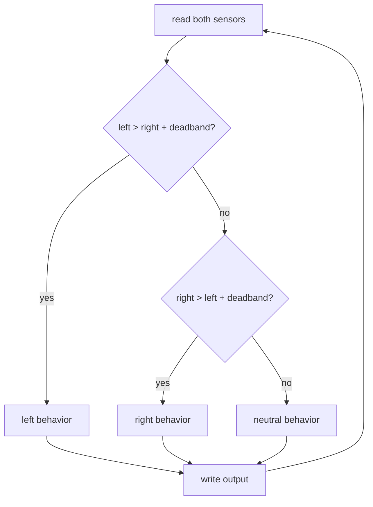

# Light Sensor — Photoresistor Reference

[← Back to Sensor + Servo Guide](../SensorServoGuide.md) · [← Back to Light & Lightness](../LightAndLightness.md)

---

A photoresistor (also called an LDR — Light Dependent Resistor) changes its resistance depending on how much light hits its surface. More light means lower resistance; less light means higher resistance. The Arduino reads this as a number between 0 and 1023. No library is needed — just `analogRead()`, the same function used for the pressure sensor in Project 2.

This guide covers how the sensor works, how to wire and read it, how to smooth noisy readings, and patterns for connecting sensor values to behavior.

---

## 1. How It Works

The photoresistor is made of a semiconductor material that becomes more conductive when exposed to light. As light increases, resistance drops and more current flows through the component. The Arduino cannot measure resistance directly — it measures voltage. So the photoresistor is wired in a **voltage divider** with a fixed 10kΩ resistor that converts the changing resistance into a changing voltage.

The circuit works like this: 5V flows in at the top. It passes through the photoresistor (variable resistance) and then through the fixed 10kΩ resistor to GND. The analog pin reads the voltage at the point between them — the junction of the two resistors. When the photoresistor's resistance is high (dim light), most of the voltage is dropped across it, so the junction reads low. When its resistance is low (bright light), less voltage is dropped across it, so the junction reads higher.

`analogRead()` samples that voltage and converts it to an integer from 0 to 1023. 0 corresponds to 0V (GND), 1023 corresponds to 5V.

### Wiring

| Component | Connection |
|-----------|------------|
| **Photoresistor — Leg 1** | 5V power rail |
| **Photoresistor — Leg 2** | Same row as the wire to A0 and one leg of the 10kΩ resistor |
| **10kΩ Resistor — other leg** | GND power rail |
| **Arduino 5V** | 5V power rail |
| **Arduino GND** | GND power rail |

### Wiring Diagram


---

## 2. Reading the Sensor

No library is needed. In your sketch, declare a pin variable and a value variable above `setup()`, then read the sensor in `loop()`:

```cpp
int lightPin   = A0;
int lightValue = 0;

void setup() {
  Serial.begin(9600);
}

void loop() {
  lightValue = analogRead(lightPin);

  Serial.print("Light: ");
  Serial.println(lightValue);
}
```

`analogRead(lightPin)` samples the voltage at A0 and returns an integer between 0 and 1023. The result is stored in `lightValue`, replacing the previous reading. `Serial.println()` sends it to the Serial Monitor so you can see what the sensor is actually doing in your environment.

### Understanding the Range

The sensor does not use the full 0–1023 range in most real environments. The range you actually see depends on the light sources present and where the sensor is positioned. Typical indoor observations:

- **Sensor fully covered** — 20–150, depending on how completely it is blocked
- **Ambient indoor light** — 300–700
- **Pointed toward a bright window or lamp** — 700–950
- **Direct flashlight** — 900–1023

These are approximations. The only way to know your actual range is to open the Serial Monitor and observe. Cover the sensor completely and note the lowest number. Then expose it to the brightest light in your environment and note the highest. Those two values are your working range.

This matters because `map()` and threshold comparisons only work well when you give them numbers that match what the sensor actually produces. Placeholder values like `0` and `1023` will make the mapping sluggish — the servo or output will only respond at the extremes of what the sensor can reach.

---

## 3. Smoothing — Rolling Average

The photoresistor has no minimum delay between readings — unlike the ultrasonic distance sensor, it does not need time to complete a measurement. This means `loop()` reads it thousands of times per second, and small fluctuations in light (fluorescent flicker, electrical noise, slight hand movement) show up as jitter in the output.

A **rolling average** reduces this. Instead of using the latest reading directly, you maintain a small array of recent readings and average them together. The average changes more slowly than any single reading, so fast noise is filtered out while real, gradual changes in light still come through.

```cpp
/*
 * rollingAverage()
 *
 * Call this every loop() with the latest raw sensor reading.
 * Returns the average of the last NUM_SAMPLES readings.
 * Larger NUM_SAMPLES = smoother output, slower response.
 *
 *   newReading — the latest value from analogRead()
 */
int rollingAverage(int newReading) {

  const int NUM_SAMPLES = 10;

  static int samples[NUM_SAMPLES];
  static int index  = 0;
  static int total  = 0;
  static bool filled = false;

  // Subtract the oldest reading from the running total
  total -= samples[index];

  // Store the new reading and add it to the total
  samples[index] = newReading;
  total += newReading;

  // Advance the index, wrapping back to 0 after the last slot
  index = (index + 1) % NUM_SAMPLES;

  // If the buffer is not yet full, average only the filled slots
  if (!filled && index == 0) filled = true;

  int count = filled ? NUM_SAMPLES : index;
  if (count == 0) return newReading;

  return total / count;
}
```

### How It Works

1. `samples[]` is an array of `NUM_SAMPLES` integers, all initialized to zero. `index` tracks which slot will be written next. `total` is a running sum that is updated incrementally rather than recalculated from scratch on every call.
2. On each call, the oldest value (the one at `index`, about to be overwritten) is subtracted from `total`. The new reading is written into that slot and added to `total`. Then `index` advances.
3. `index = (index + 1) % NUM_SAMPLES` is the modulo operator — it wraps `index` back to 0 after it reaches `NUM_SAMPLES - 1`, so the array acts as a circular buffer.
4. Before the buffer is full, `count` is just the number of readings taken so far, avoiding division by zero or division by the empty slots.
5. All three variables — `samples`, `index`, `total`, and `filled` — are `static`, meaning they persist between calls. The function has its own private memory that survives across loop iterations.

### Calling the Function

In `loop()`, pass the raw reading to `rollingAverage()` and use the returned value everywhere else:

```cpp
void loop() {
  int rawValue   = analogRead(lightPin);
  lightValue     = rollingAverage(rawValue);

  Serial.print("Raw: ");
  Serial.print(rawValue);
  Serial.print("  Smooth: ");
  Serial.println(lightValue);
}
```

Printing both the raw and smoothed values side by side in the Serial Monitor lets you see the effect directly. The raw value will flicker; the smoothed value will trail it gently.

### Tuning Smoothing

`NUM_SAMPLES` is the only variable that controls the trade-off between smoothness and responsiveness:

- A small value (4–6) produces a light smoothing — fast changes still come through, most flicker is removed.
- A larger value (15–20) averages out more variation, but the output responds more slowly to real changes in light. If you cover the sensor suddenly, the output takes longer to reach its new level.
- For most servo applications, values between 8 and 12 are a reasonable starting point.

Because `NUM_SAMPLES` is declared inside the function with `const`, you change it by editing the function itself. If you find yourself wanting different smoothing in different parts of a sketch, the simplest approach is to call `rollingAverage()` with a larger or smaller `NUM_SAMPLES` — or to use two separate smoothing functions named differently.

---

## 4. Calibration — Measuring Ambient Light at Startup

The patterns in Section 5 all depend on knowing the sensor's working range: where does dark end and bright begin? Section 2 suggests observing that range in the Serial Monitor and hard-coding it into variables. That works, but it ties your sketch to one specific environment. Move the object to a different room, use it at a different time of day, or change the lamp beside it, and the hardcoded values no longer match what the sensor actually sees.

**Auto-calibration** solves this by measuring the ambient light level automatically at startup. The sketch reads the sensor many times before `loop()` begins, averages the results, and stores that average as a `baseline`. Thresholds and mapping ranges are then defined as **offsets relative to that baseline**:

```
baseline                    baseline + dimOffset          baseline + brightOffset
   ↓                              ↓                               ↓
   ├──── AMBIENT ─────────────────┼──── DIM SHADOW ──────────────┼──── BRIGHT ────→
```

If the resting ambient level is 420 in a studio and 650 near a window, the thresholds shift with it automatically — no code edits needed.

This is the same technique used for the pressure sensor in Project 2. Pressure calibration captures the resting state of the FSR (nobody pressing) and sets offsets above that. Light calibration captures the ambient state of the room (no shadow, no direct lamp) and sets offsets above and below. The logic is identical; only what "resting" means differs.

### The calibrateSensor() Function

```cpp
/*
 * calibrateSensor()
 *
 * Reads the sensor `samples` times over `samples * delayMs` milliseconds
 * and returns the average. Call this ONCE in setup() with the sensor
 * in its expected resting ambient conditions — not covered, not pointed
 * at a direct lamp.
 *
 *   pin     — the analog pin to read
 *   samples — how many readings to average (more = more stable, slower startup)
 */
int calibrateSensor(int pin, int samples) {

  const int DELAY_MS = 20;  // ms between samples
  long total = 0;

  for (int i = 0; i < samples; i++) {
    total += analogRead(pin);
    delay(DELAY_MS);  // delay is fine here — we are still in setup()
  }

  return total / samples;
}
```

**What is happening here:**
- The loop reads the sensor `samples` times with a short pause between each. The pauses prevent the Arduino from reading the same capacitor charge repeatedly, giving the circuit time to settle between samples.
- `delay()` is used here, which is normally avoided in `loop()`. It is acceptable in `setup()` because `loop()` has not started yet — no sensor reads, animations, or timing-sensitive operations are being interrupted.
- The average of all samples is returned as a single integer. This is now your `baseline`.

### Using the Baseline in setup()

After `calibrateSensor()` returns, derive your working thresholds or range limits directly from the result:

```cpp
int lightPin    = A0;
int lightValue  = 0;
int baseline    = 0;      // set during setup
int dimOffset   = 80;     // how far below baseline counts as a shadow
int brightOffset = 150;   // how far above baseline counts as bright

int shadowThreshold = 0;  // baseline - dimOffset  (set in setup)
int brightThreshold = 0;  // baseline + brightOffset (set in setup)

void setup() {
  Serial.begin(9600);

  Serial.println("Calibrating — keep the sensor in ambient light.");

  baseline         = calibrateSensor(lightPin, 50);
  shadowThreshold  = baseline - dimOffset;
  brightThreshold  = baseline + brightOffset;

  Serial.print("Baseline: ");        Serial.println(baseline);
  Serial.print("Shadow threshold: "); Serial.println(shadowThreshold);
  Serial.print("Bright threshold: "); Serial.println(brightThreshold);
  Serial.println("Ready.");
}
```

**What is happening here:**
- `baseline` stores the average ambient reading — what the sensor sees when the object is sitting in its intended environment with no deliberate shadow or direct light.
- `shadowThreshold` is set *below* baseline. A reading that drops this far below ambient means something is blocking light — a hand, an enclosure closing, the object being turned face-down.
- `brightThreshold` is set *above* baseline. A reading this far above ambient means a direct light source is present — a lamp turning on, a flashlight, direct sunlight.
- Printing the results in `setup()` lets you verify the numbers every time the sketch runs. If they look wrong, check that the sensor was in its expected ambient conditions during startup.

### Relative Values vs. Absolute Values

Hard-coded range variables like `lightMin = 300` and `lightMax = 750` are **absolute values** — fixed numbers that describe specific voltage levels. They describe the sensor's behavior in one particular environment and break silently when the environment changes.

Calibration produces **relative values** — numbers expressed as distances from the measured ambient level rather than fixed positions on the 0–1023 scale. `shadowThreshold = baseline - 80` does not describe a specific voltage level; it describes a relationship: *80 counts darker than wherever ambient currently is*.

Relative values are more portable. The same offset that reliably detects a hand shadow in a dim studio will do the same near a window, because both thresholds are anchored to wherever the room's ambient light actually sits today.

The trade-off is that calibration only captures one moment. If the ambient light changes significantly *during* use — a cloud passes, a lamp turns on nearby — the baseline no longer matches the current reality. For most physical computing contexts this is acceptable. If it is not, see the Going Further note on continuous recalibration below.

### Tuning

| What to change | Where | Effect |
|---|---|---|
| **Shadow sensitivity** | `dimOffset` | Smaller value = triggers with a lighter shadow |
| **Bright sensitivity** | `brightOffset` | Smaller value = triggers with less additional light |
| **Calibration stability** | `CALIBRATION_SAMPLES` in the function | More samples = more stable baseline, longer startup |
| **Mapping from baseline** | Use `baseline` as `lightMin` in `map()` | Maps from ambient upward rather than from 0 |

### Going Further

- **Combining calibration with smoothing:** Calibration sets the *starting point*; smoothing reduces *noise during use*. Use `calibrateSensor()` in `setup()` to set `baseline`, then pass each `analogRead()` call through `rollingAverage()` in `loop()` before comparing against the calibrated thresholds. The two techniques are independent and compose cleanly.
- **Mapping from baseline:** Instead of mapping from `lightMin` to `lightMax`, map from `baseline` to `baseline + brightOffset`. This scales the output relative to the room's ambient level, so the full output range is always reachable regardless of absolute light levels.
- **Continuous recalibration:** If ambient conditions change slowly during use, you can update the baseline periodically by calling `calibrateSensor()` again at a slow interval — every 30–60 seconds — and recalculating the thresholds from the new result. Only do this when you are confident the sensor is in its resting state (no active shadow or direct light at that moment).
- **Adding more zones:** Add intermediate offsets (`midOffset`) to `classifyLight()` and extend the threshold chain, exactly as described in the pressure calibration guide for adding a medium-press zone.

---

## 5. Patterns — Connecting Sensor Values to Behavior

The sensor produces a number. The design work is in deciding what that number controls — whether it maps continuously to a parameter, crosses a threshold that flips a state, or compares against another sensor.

---

### analogRead() + map() — Continuous Mapping

`map()` scales the sensor's range into any output range proportionally. The most direct use is translating light level into a servo angle, a speed, or a brightness value.

**The pattern:** constrain the reading to your observed real-world range first, then map into your output range. Constraining prevents occasional out-of-range readings from producing wild output values.

```cpp
// Example structure — not a complete sketch
lightValue = analogRead(lightPin);
lightValue = constrain(lightValue, lightMin, lightMax);
angle      = map(lightValue, lightMin, lightMax, angleMin, angleMax);
myServo.write(angle);
```

`map()` can invert the relationship by swapping the output arguments: `map(lightValue, lightMin, lightMax, angleMax, angleMin)` makes brighter light produce a smaller output rather than a larger one. Use whichever direction makes sense for your design.

Because `map()` runs every loop, the output updates in real time as light changes. There is no threshold — any change in light produces a proportional change in the output. This is a **continuous** relationship.

---

### analogRead() + if() — Threshold Switching

Instead of a proportional response, a threshold test divides the sensor range into two (or more) states and selects a behavior for each. The sensor value does not scale anything — it answers a yes/no question.

**One threshold, two states:**

```cpp
// Example structure — not a complete sketch
lightValue = analogRead(lightPin);

if (lightValue < lightThreshold) {
  // dark state — do one thing
} else {
  // bright state — do another
}
```

The threshold value is the crossover point. Set it to a number that sits between the typical dark and typical bright readings in your environment — usually somewhere in the middle of your observed range.

**Multiple thresholds, multiple states:** Chain `else if` blocks to divide the range into zones. Each zone can trigger a completely different behavior — a different oscillation profile, a different servo target, a different output altogether:

```cpp
// Example structure — not a complete sketch
if (lightValue < darkThreshold) {
  // very dark
} else if (lightValue < midThreshold) {
  // medium light
} else {
  // bright
}
```


The key difference from continuous mapping is that small fluctuations in light do not change the output — they only matter at the moment of crossing the threshold. This produces a stable, discrete response. The risk is flickering: if the sensor reading hovers near the threshold, the condition may flip back and forth rapidly. Adding a small deadband (a gap around the threshold where neither condition is triggered) prevents this. See the two-sensor pattern below for an example of deadband in practice.

---

### Two Sensors — Which Side Is Brighter

With two photoresistors, the sensor input becomes relational rather than absolute. The question is no longer "how bright is it?" but "which side has more light?" This can drive directionality — the servo follows the brighter side, or an object orients toward a light source.

**The pattern:** read both sensors, compare them with a deadband, and act on the relationship:

```cpp
// Example structure — not a complete sketch
int leftLight  = analogRead(leftPin);
int rightLight = analogRead(rightPin);

if (leftLight > rightLight + deadband) {
  // left is brighter
} else if (rightLight > leftLight + deadband) {
  // right is brighter
} else {
  // roughly equal — neutral state
}
```

`deadband` is a small positive integer — typically 20–50 in a 0–1023 range. Without it, when both sensors read nearly the same value, electrical noise causes the comparison to flip thousands of times per second even though the light conditions are not actually changing. The deadband creates a zone of tolerance around equality where neither directional condition is true and the output holds steady.



The placement of the two sensors on the physical object determines what the comparison means. Sensors on opposite sides of a form can make the object track light like a sunflower. Sensors at different heights respond to the vertical distribution of light in a space. Sensors inside and outside an enclosure compare the object's own shadow to the ambient room.

> **Going further with multiple sensors:** For a step-by-step guide to wiring and reading two photoresistors, see [Multiple Light Sensors](MultipleLDRs.md). For combinatory patterns that connect two sensors to two servos, see [Two LDRs + Two Servos](TwoLDRsTwoServos.md).

---

## 6. Design Considerations

**Orientation** — Where the sensor faces determines what it reads. A sensor pointing toward a window reads daylight; the same sensor rotated 180° reads the interior of the room. Orientation is a design decision, not just a wiring detail. Changing where the sensor points changes what the object is sensitive to without changing any code.

**What the sensor integrates** — The photoresistor reads all light in its field of view simultaneously. It does not distinguish between sources. Room lighting, direct sunlight, a lamp, and a phone screen all contribute. This is a constraint and a quality: the sensor gives you an ambient reading of the whole light environment, not a measurement of any specific source. Consider whether this broad sensitivity is useful for your design or whether you need to shield or shade the sensor to narrow what it sees.

**Shadow as input** — The sensor also reads the absence of light. A hand or material moving between a light source and the sensor creates a readable change — a drop in value — even without touching anything. This makes shadow an interaction modality. An object can respond to someone approaching, to being picked up, to being placed under a lamp, to the natural arc of daylight across a room.

**Sensor placement on the object** — Where the sensor sits determines the interaction. Mounted inside an enclosure, facing inward, it reads the object's own interior shadow — useful for detecting when something is placed inside or when a lid closes. Mounted externally and exposed, it reads the room. Mounted at the base, looking downward, it responds to the surface the object rests on. The placement decision is inseparable from what the object is doing.

**The 10kΩ resistor and sensitivity** — The fixed resistor value in the voltage divider affects where the midpoint of the sensor's range falls. A 10kΩ resistor produces good sensitivity across a typical indoor lighting range. A larger resistor (47kΩ) shifts the midpoint toward dimmer conditions, making the sensor more sensitive at low light levels and compressing the range at the bright end. A smaller resistor (1kΩ) does the opposite. The 10kΩ is a practical default for general indoor use; adjust it if you need to tune the sensor's response to a specific lighting environment.
