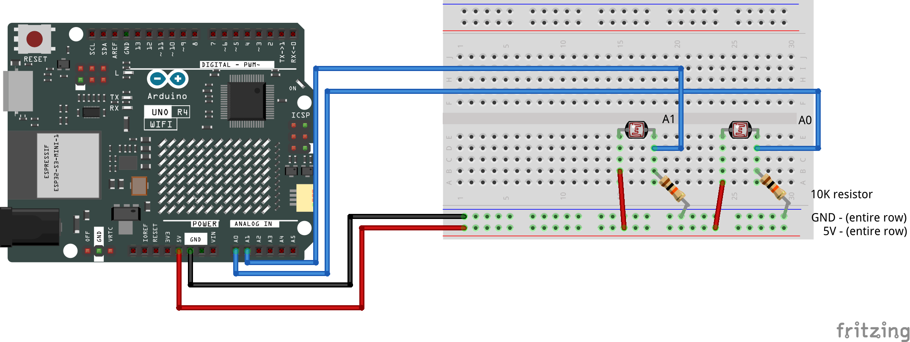

# Multiple Light Sensors — Step by Step

[← Back to Sensor + Servo Guide](../SensorServoGuide.md) · [← Back to Light & Lightness](../LightAndLightness.md)

---

This guide adds a second photoresistor to your circuit and shows how to read both simultaneously, compare them, and use the comparison to drive behavior. It assumes you have completed Part 1 and Part 2 of [Light Sensor to Servo](class10-LDR-to-Servo.md) and are comfortable with `analogRead()` and the Serial Monitor.

Three stages:

1. **Wire the second sensor** — add it to the breadboard and confirm both sensors report independently.
2. **Compare the readings** — calculate direction and magnitude from two values.
3. **Use the comparison to drive a threshold** — make decisions based on which sensor is brighter.

---

## Part 1 — Wire the Second Sensor

Your first photoresistor is connected to analog pin A0 with a 10kΩ resistor forming a voltage divider. The second sensor uses the same circuit pattern on a different analog pin.

| Component | Connection |
|-----------|------------|
| **Right photoresistor — Leg 1** | 5V power rail (shared) |
| **Right photoresistor — Leg 2** | Same row as the wire to **A1** and one leg of a second 10kΩ resistor |
| **Right 10kΩ resistor — other leg** | GND power rail (shared) |

Each sensor needs its own 10kΩ resistor. Both sensors share the same 5V and GND rails.

### Wiring Diagram



> **Check before moving on:** Each photoresistor has one leg at 5V and one leg connecting to both its analog pin wire and one leg of its own 10kΩ resistor. The other leg of each resistor goes to GND. The left sensor reads on A0, the right sensor reads on A1.

---

## Part 2 — Read Both Sensors

Start from your working single-sensor sketch, or create a new one.

### Step 1 — Rename and Add Sensor Variables

Above `setup()`, rename your existing sensor variables to reflect their physical orientation, then add matching variables for the second sensor:

```cpp
int leftLightPin   = A0;       // renamed from lightPin to match physical layout
int leftLightValue = 0;        // renamed from lightValue

int rightLightPin   = A1;      // NEW
int rightLightValue = 0;       // NEW
```

**What is happening here:**
- Each sensor gets its own pin variable and value variable.
- We renamed `lightPin` and `lightValue` to `leftLightPin` and `leftLightValue` so the names reflect the sensor's position in your design. Use whatever orientation fits — `topLightPin`/`bottomLightPin`, `insideLightPin`/`outsideLightPin`, etc.
- If you are adding to an existing sketch, rename the originals to match.

### Step 2 — Read and Print Both

In `loop()`, read both sensors and print them side by side:

```cpp
void loop() {
  leftLightValue = analogRead(leftLightPin);
  rightLightValue = analogRead(rightLightPin);

  Serial.print("Left: ");
  Serial.print(leftLightValue);
  Serial.print(" | Right: ");
  Serial.println(rightLightValue);
}
```

**What is happening here:**
- Each `analogRead()` call reads one sensor independently. The two calls happen one after the other — fast enough to be effectively simultaneous.
- Printing both on the same line makes it easy to compare them in the Serial Monitor as you move your hand or a light source.

### Upload and Test

Upload and open the Serial Monitor. Cover the left sensor — its value drops, the right stays the same. Cover the right sensor — the reverse. Cover both — both drop. Move a light source between them and watch the values shift.

Note the typical ranges each sensor produces. They may not be identical even in the same light — manufacturing variation is normal. What matters is the relative relationship between them.

> **Check your sketch:** Both values should update independently. Covering one sensor should not affect the other's reading.

---

## Part 3 — Compare the Readings

With two sensor values, you can ask relational questions: which side is brighter, how *much* brighter, and whether the difference is significant.

### Step 3 — Calculate the Difference

Add a variable above `setup()`:

```cpp
int leftLightPin    = A0;
int leftLightValue  = 0;

int rightLightPin   = A1;
int rightLightValue = 0;

int lightDifference = 0;       // NEW
```

In `loop()`, after reading both sensors:

```cpp
lightDifference = leftLightValue - rightLightValue;

Serial.print("Left: ");
Serial.print(leftLightValue);
Serial.print(" | Right: ");
Serial.print(rightLightValue);
Serial.print(" | Diff: ");
Serial.println(lightDifference);
```

**What is happening here:**
- A positive difference means the left sensor is brighter. A negative difference means the right sensor is brighter. Zero means they are equal.
- The magnitude tells you how *much* brighter one side is. A difference of 10 is a slight edge; a difference of 300 is a strong directional signal.
- This single number — the difference — collapses two sensor readings into one value that represents direction and intensity.

### Upload and Test

Watch the difference value as you move a hand or light source between the sensors. It should swing smoothly from positive to negative as the light shifts from one side to the other.

---

## Part 4 — Directional Threshold with Deadband

A direct comparison can flicker when both sensors read nearly the same value — noise in the readings causes the comparison to flip back and forth even when the light is not actually changing. A **deadband** creates a zone of tolerance around equality where neither directional condition is true.

### Step 4 — Add a Deadband Variable

Above `setup()`:

```cpp
int leftLightPin    = A0;
int leftLightValue  = 0;

int rightLightPin   = A1;
int rightLightValue = 0;

int lightDifference = 0;

int deadband = 30;             // NEW
```

**What is happening here:**
- `deadband` is a small positive number. It defines how much brighter one sensor must be than the other before we consider the difference meaningful.
- `30` is a reasonable starting point. Increase it if the output still flickers; decrease it if the response feels sluggish.

### Step 5 — Add an if/else Comparison

In `loop()`, after reading both sensors:

```cpp
if (leftLightValue > rightLightValue + deadband) {
  Serial.println("  → Left is brighter");
  // do something for the left-is-brighter state
} else if (rightLightValue > leftLightValue + deadband) {
  Serial.println("  → Right is brighter");
  // do something for the right-is-brighter state
} else {
  Serial.println("  → balanced");
  // do something for the neutral state
}
```

**What is happening here:**
- The first condition requires the left sensor to beat the right by *more than the deadband* — not just by 1 or 2 counts. This prevents noise from triggering the condition.
- The second condition is the mirror: the right must beat the left by the same margin.
- The `else` catches everything in between — the zone where both sensors are close enough to be considered equal. This is the stable, neutral state.

### Upload and Test

Cover the left sensor — the output should switch to “Right is brighter.” Cover the right sensor — “Left is brighter.” Even lighting — “balanced.” The deadband should prevent flickering when both sensors read similar values.

Adjust `deadband` up or down based on what you observe. There is no single correct value — it depends on the noise in your environment and how sensitive you want the comparison to be.

> **Check your sketch:** You should have pin and value variables for both sensors, a deadband variable, and an `if/else` comparison in `loop()` that categorizes the relationship into three states. The Serial Monitor should show stable state labels without flickering.

---

## Part 5 — Explore

You now have two light sensors producing a directional signal. The design work is in deciding what that signal drives.

### Things to try

- **Drive a servo to follow light** — map the difference value to a servo angle. The servo points toward whichever side is brighter. Use `map(lightDifference, -maxDiff, maxDiff, 0, 180)` where `maxDiff` is the largest difference you observe.
- **Three oscillation profiles** — use the directional threshold to select different `oscillate()` parameters: one profile when the left side is brighter, another when the right side is brighter, a third when balanced.
- **Smoothing** — apply `rollingAverage()` to each sensor before comparing. See the [Light Sensor Guide — Smoothing](LightSensorGuide.md#3-smoothing--rolling-average) section.
- **Calibration** — use `calibrateSensor()` at startup to establish baselines for both sensors. Thresholds become relative to the baseline rather than hardcoded. See the [Light Sensor Guide — Calibration](LightSensorGuide.md#4-calibration--measuring-ambient-light-at-startup) section.
- **Sensor placement** — where you mount the two sensors determines what the comparison means. On opposite sides of an object, it detects direction. At different heights, it reads vertical light distribution. Inside and outside an enclosure, it compares internal shadow to ambient room light.

### Next steps

- [Two LDRs + Two Servos](TwoLDRsTwoServos.md) — combinatory patterns for the full 2+2 setup
- [Physical Adjustments](PhysicalAdjustments.md) — extending sensor wires so you can mount them away from the breadboard
- [Sensor + Servo Guide](../SensorServoGuide.md) — overview of all patterns and techniques
