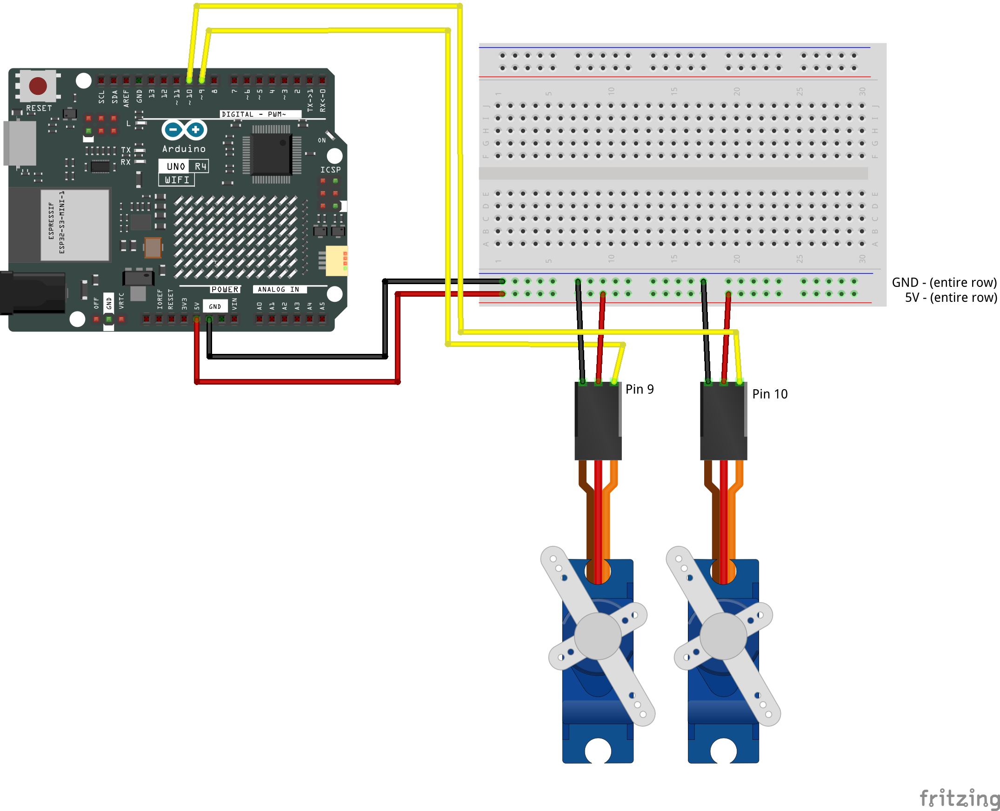

# Multiple Servos — Step by Step

[← Back to Sensor + Servo Guide](../SensorServoGuide.md) · [← Back to Light & Lightness](../LightAndLightness.md)

---

This guide adds a second servo to your circuit and shows how to run both independently at the same time. It assumes you have completed [Servo Basics](class09-ServoBasics.md) and are comfortable with `oscillate()` and `moveServoA()`.

Two stages:

1. **Wire the second servo** — add it to the breadboard and confirm it moves independently.
2. **Run both servos with independent behaviors** — oscillation, timed moves, mixed modes.

---

## Part 1 — Wire the Second Servo

Your first servo is already connected to pin 9. The second servo connects to a different signal pin but shares the same 5V and GND rails.

| Right Servo Wire | Purpose | Arduino Connection |
|------------|---------|-------------------|
| **Brown** | GND | GND power rail (shared) |
| **Red** | Power | 5V power rail (shared) |
| **Orange** | Signal | Pin 10 |

Use jumper cables to connect each wire, same as the first servo.

### Wiring Diagram



> **Check before moving on:** Both servos share the same 5V and GND rails. The left servo signal goes to pin 9, the right servo signal goes to pin 10.

---

## Part 2 — Set Up Both Servos in Code

Start from your working single-servo sketch. You need a second `Servo` object, a second pin variable, and a second angle variable.

### Step 1 — Rename and Add Servo Variables

Rename your existing servo variables to reflect their physical orientation (left/right, top/bottom — whatever matches your design). Then add matching variables for the second servo:

```cpp
#include <Servo.h>

Servo leftServo;              // renamed from myServo to match physical layout
int leftServoPin = 9;         // renamed from servoPin
int leftAngle    = 90;        // renamed from angle

Servo rightServo;             // NEW
int rightServoPin = 10;       // NEW
int rightAngle    = 90;       // NEW
```

**What is happening here:**
- The existing servo variables are renamed from `myServo`/`servoPin`/`angle` to `leftServo`/`leftServoPin`/`leftAngle`. The names now reflect where each servo sits in your physical design. Use whatever orientation fits — `topServo`/`bottomServo`, `frontServo`/`backServo`, etc.
- `rightServo` is a separate servo object. The Arduino talks to each servo through its own object.
- `rightAngle` tracks the right servo's position independently from `leftAngle`.
- If you have `moveServoA()` from [Servo Basics](class09-ServoBasics.md), rename it to `moveLeftServo()` and change `myServo.read()` to `leftServo.read()` inside it. This keeps the function name consistent with the servo it controls.

### Step 2 — Attach Both Servos in setup()

Add the attach call for Servo B:

```cpp
void setup() {
  Serial.begin(9600);
  leftServo.attach(leftServoPin);
  rightServo.attach(rightServoPin);
}
```

**What is happening here:**
- Each servo needs its own `attach()` call. Without it, `write()` calls for that servo have no effect.

### Step 3 — Write Both Angles in loop()

Make sure your `loop()` writes to both servos:

```cpp
leftServo.write(leftAngle);
rightServo.write(rightAngle);
```

**What is happening here:**
- Each servo receives its own angle value. They can be the same number or completely different — the servos are independent.

### Upload and Test

Upload. Both servos should move to 90° and hold. Try changing `rightAngle` to a different value and re-uploading to confirm the second servo responds independently.

> **Check your sketch:** You should have two `Servo` objects, two pin variables, and two angle variables. Both servos are attached in `setup()` and written in `loop()`.

---

## Part 3 — Independent Oscillations

Both servos can use the same `oscillate()` function simultaneously because it is stateless — it calculates everything from `millis()` with no memory between calls.

### Step 4 — Add Separate Parameters for Each Servo

Above `setup()`, create a set of sweep variables for each servo:

```cpp
#include <Servo.h>

Servo leftServo;
int leftServoPin = 9;
int leftAngle    = 90;

Servo rightServo;
int rightServoPin = 10;
int rightAngle    = 90;

// Left servo — slow, wide sweep
int leftSweepMin    = 30;     // NEW
int leftSweepMax    = 150;    // NEW
int leftSweepPeriod = 3000;   // NEW

// Right servo — fast, narrow tremor
int rightSweepMin    = 80;    // NEW
int rightSweepMax    = 100;   // NEW
int rightSweepPeriod = 400;   // NEW
```

### Step 5 — Call oscillate() Twice in loop()

```cpp
void loop() {
  leftAngle  = oscillate(leftSweepMin, leftSweepMax, leftSweepPeriod);
  rightAngle = oscillate(rightSweepMin, rightSweepMax, rightSweepPeriod);

  leftServo.write(leftAngle);
  rightServo.write(rightAngle);
}
```

**What is happening here:**
- Each call to `oscillate()` gets its own set of parameters. The function does not know or care which servo will receive the result — it just returns a number.
- The left servo sweeps slowly across a wide arc. The right servo trembles rapidly in a narrow range. Both run simultaneously in the same `loop()`.

Upload and observe. Two servos moving with completely different characters from the same function.

> **Check your sketch:** Both servos oscillate independently. Changing one servo's parameters does not affect the other.

---

## Part 4 — Independent Timed Moves

`moveServoA()` uses `static` variables to remember where a move started, where it is going, and when it began. Those static variables belong to the function — there is only one copy of them. If two servos try to share the same function, the second call overwrites the first servo's stored state.

The solution: give each servo its own copy of the function. The code inside is identical — only the function name and the `myServo.read()` call change.

### Step 6 — Add moveRightServo()

You already have `moveLeftServo()` in your sketch (renamed from `moveServoA()` in Step 1). Below it, add a second copy for the right servo:

```cpp
int moveRightServo(int angle, unsigned long durationMs) {

  static float startAngle        = 0.0;
  static int   targetAngle       = -1;
  static unsigned long startTime = 0;

  if (angle != targetAngle) {
    startAngle  = rightServo.read();  // reads the right servo's position
    targetAngle = angle;
    startTime   = millis();
  }

  unsigned long elapsed = millis() - startTime;
  float progress = (float)elapsed / (float)durationMs;

  if (progress >= 1.0) {
    targetAngle = -1;
    return angle;
  }

  float current = startAngle + (angle - startAngle) * progress;
  return (int)current;
}
```

**What is happening here:**
- This is an exact copy of `moveLeftServo()` with two changes: the function name is `moveRightServo` and the internal `read()` call uses `rightServo` instead of `leftServo`.
- The `static` variables inside `moveRightServo()` are entirely separate from those inside `moveLeftServo()`. Each function has its own private whiteboard. Neither can see or overwrite the other's state.

### Step 7 — Set Start Positions in setup()

Both servos need a known starting position so that `read()` returns a reliable value on the first move:

```cpp
void setup() {
  Serial.begin(9600);
  leftServo.attach(leftServoPin);
  rightServo.attach(rightServoPin);
  leftServo.write(leftHome);
  rightServo.write(rightHome);
}
```

Add `leftHome` and `rightHome` to your global variables if you want the two servos to start at different positions.

### Step 8 — Run Independent Sequences

Each servo can run its own `switch/case` sequence with its own step counter. In your global variables:

```cpp
#include <Servo.h>

Servo leftServo;
int leftServoPin = 9;
int leftAngle    = 90;

Servo rightServo;
int rightServoPin = 10;
int rightAngle    = 90;

int leftStep  = 0;            // NEW
int rightStep = 0;            // NEW
```

In `loop()`, the two sequences run side by side:

```cpp
void loop() {

  // Left servo sequence
  switch (leftStep) {
    case 0:
      leftAngle = moveLeftServo(10, 1500);
      if (leftAngle == 10) { leftStep = 1; }
      break;
    case 1:
      leftAngle = moveLeftServo(170, 2000);
      if (leftAngle == 170) { leftStep = 0; }
      break;
  }

  // Right servo sequence
  switch (rightStep) {
    case 0:
      rightAngle = moveRightServo(160, 800);
      if (rightAngle == 160) { rightStep = 1; }
      break;
    case 1:
      rightAngle = moveRightServo(20, 3000);
      if (rightAngle == 20) { rightStep = 0; }
      break;
  }

  leftServo.write(leftAngle);
  rightServo.write(rightAngle);
}
```

**What is happening here:**
- The two `switch/case` blocks are completely independent. Each advances its own step counter based on its own move function's return value.
- The left servo moves at its own pace with its own targets. The right servo does the same. They run in parallel — both are updated every loop, but each is on its own timeline.
- The sequences do not need the same number of steps or the same durations. One can be fast and simple, the other slow and complex.

---

## Part 5 — Mixed Modes

The two servos do not need to use the same movement approach. One can oscillate continuously while the other runs a timed sequence, or one can respond to a sensor threshold while the other follows a fixed pattern.

### Step 9 — One Oscillating, One Sequencing

```cpp
void loop() {
  // Left servo: continuous oscillation
  leftAngle = oscillate(leftSweepMin, leftSweepMax, leftSweepPeriod);

  // Right servo: timed move sequence
  switch (rightStep) {
    case 0:
      rightAngle = moveRightServo(30, 2000);
      if (rightAngle == 30) { rightStep = 1; }
      break;
    case 1:
      rightAngle = moveRightServo(150, 1000);
      if (rightAngle == 150) { rightStep = 0; }
      break;
  }

  leftServo.write(leftAngle);
  rightServo.write(rightAngle);
}
```

**What is happening here:**
- The left servo uses `oscillate()` — set-and-forget, runs forever.
- The right servo uses `moveRightServo()` with `switch/case` — a choreographed sequence that loops.
- Both run in the same `loop()` without interfering. The movement functions handle their own timing internally.

This is the core principle: each servo gets its own angle variable, its own movement function call, and its own parameters. You compose behaviors by deciding what drives each servo independently.

---

## Part 6 — Explore

You now have two servos running independently from two movement functions. The design work is in the combination.

### Things to try

- **Same function, different parameters** — both oscillating but with deliberately different speeds and ranges. What does the interplay feel like?
- **Opposing motion** — one moves left while the other moves right. Swap the min/max values or offset the ranges.
- **Call and response** — one servo finishes a move, then the other begins. Use the completion check from `moveServoA()`/`moveServoB()` to trigger the other.
- **Sensor-driven** — if you have a light sensor connected, use a threshold to change one servo's behavior while the other stays constant. See [Two LDRs + Two Servos](TwoLDRsTwoServos.md) for expanded patterns.

### Reference

- [Servo Movement Reference](../servo-movement-reference.md) — full function documentation for `oscillate()`, `moveServoA()`, and `moveServoB()`
- [Sensor + Servo Guide](../SensorServoGuide.md) — overview of all patterns and techniques
