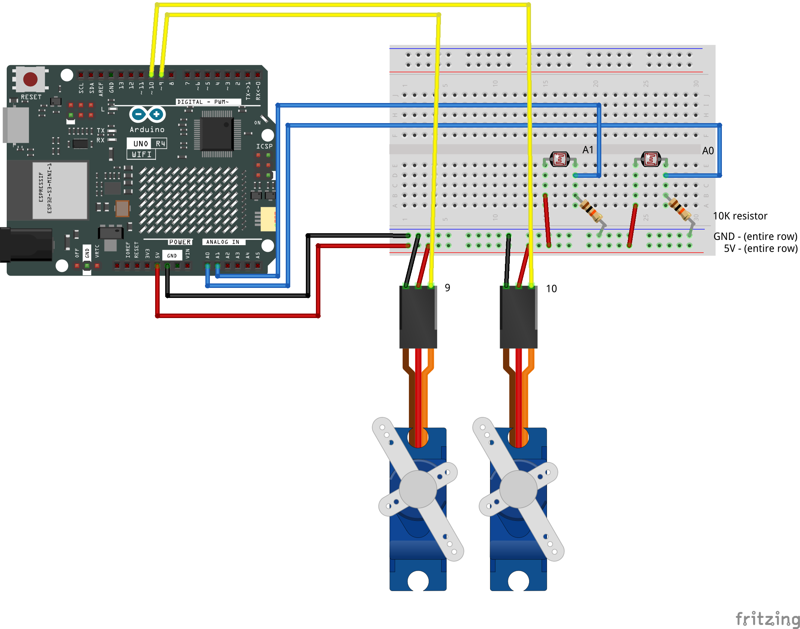

# Two LDRs + Two Servos — Combinatory Patterns

[← Back to Sensor + Servo Guide](../SensorServoGuide.md) · [← Back to Light & Lightness](../LightAndLightness.md)

---

This page describes the design space that opens when you combine two light sensors with two servos. It is **not a step-by-step walkthrough** — it assumes you have already completed [Multiple Servos](MultipleServos.md) and [Multiple Light Sensors](MultipleLDRs.md) and have a working circuit with all four components.

Each pattern below describes a way to connect sensor readings to servo behaviors. They are starting points — mix, modify, and combine them to find the behavior that fits your design.

### Wiring



Four components, one Arduino:

| Component | Pin |
|-----------|-----|
| LDR A | A0 |
| LDR B | A1 |
| Servo A | Pin 9 |
| Servo B | Pin 10 |

All share the same 5V and GND rails.

---

## Pattern 1 — Paired Mapping

Each sensor drives its own servo independently. LDR A controls Servo A. LDR B controls Servo B. Two parallel channels with no interaction between them.

```cpp
// In loop():
lightValueA = analogRead(lightPinA);
lightValueB = analogRead(lightPinB);

angle  = map(lightValueA, lightMinA, lightMaxA, angleMinA, angleMaxA);
angleB = map(lightValueB, lightMinB, lightMaxB, angleMinB, angleMaxB);

myServo.write(angle);
myServoB.write(angleB);
```

**What it feels like:** Two independent responsive elements. Each part of the object reacts to the light near it. Cover one sensor and only its servo responds — the other is unaffected.

**Variation:** Use different mapping ranges for each channel. Servo A might sweep 0–180° while Servo B only moves 80–100°. Same sensor pattern, different physical character on each side.

---

## Pattern 2 — Crossed Mapping

Swap the connections: LDR A drives Servo B, LDR B drives Servo A. The sensor on one side controls the movement on the opposite side.

```cpp
// In loop():
lightValueA = analogRead(lightPinA);
lightValueB = analogRead(lightPinB);

angle  = map(lightValueB, lightMinB, lightMaxB, angleMinA, angleMaxA);  // B drives A
angleB = map(lightValueA, lightMinA, lightMaxA, angleMinB, angleMaxB);  // A drives B

myServo.write(angle);
myServoB.write(angleB);
```

**What it feels like:** Indirect, counterintuitive response. Covering the left sensor moves the right side. The object seems to look away from whatever is happening to it — or to lean toward the opposite stimulus. This disconnect between cause and effect can produce surprisingly interesting behavior.

---

## Pattern 3 — Comparison-Driven

Both servos respond to the *relationship* between the two sensors rather than to the individual readings. The question is "which side is brighter?" — and both servos react to the answer.

```cpp
// In loop():
lightValueA = analogRead(lightPinA);
lightValueB = analogRead(lightPinB);

if (lightValueA > lightValueB + deadband) {
  // A is brighter — both servos use one oscillation profile
  angle  = oscillate(30, 150, 2000);
  angleB = oscillate(60, 120, 2000);
} else if (lightValueB > lightValueA + deadband) {
  // B is brighter — both servos change character
  angle  = oscillate(60, 120, 500);
  angleB = oscillate(30, 150, 500);
} else {
  // Balanced — neutral behavior
  angle  = oscillate(85, 95, 3000);
  angleB = oscillate(85, 95, 3000);
}

myServo.write(angle);
myServoB.write(angleB);
```

**What it feels like:** The object has a unified reaction to a directional stimulus. It doesn't just react to *how much* light there is — it reacts to *where the light is coming from*. Both servos shift character together, giving the object a sense of coordinated attention.

**Variation:** Instead of oscillating both, use timed moves. When A is brighter, both servos travel to one set of target angles. When B is brighter, both travel to a different set. The object slowly orients or reconfigures based on light direction.

---

## Pattern 4 — Mixed Modes

Each servo uses a *different type* of movement function, and each is driven by a different condition. One oscillates based on a threshold; the other runs a timed sequence based on a different trigger.

```cpp
// In loop():
lightValueA = analogRead(lightPinA);
lightValueB = analogRead(lightPinB);

// Servo A: oscillation controlled by LDR A threshold
if (lightValueA < thresholdA) {
  angle = oscillate(30, 150, 3000);   // dark: slow sweep
} else {
  angle = oscillate(80, 100, 300);    // bright: fast tremor
}

// Servo B: timed moves controlled by LDR B threshold
if (lightValueB < thresholdB) {
  angleB = moveServoB(20, 2000);      // dark: move to 20°
} else {
  angleB = moveServoB(160, 2000);     // bright: move to 160°
}

myServo.write(angle);
myServoB.write(angleB);
```

**What it feels like:** Two parts of the same object with different temperaments. One part breathes and responds fluidly; the other deliberates and repositions. The combination creates a layered behavior — the object is doing two things at once, each driven by a different aspect of the light environment.

**Variation:** One servo's behavior could be driven by a sensor threshold while the other runs a fixed pattern regardless of input — a constant oscillation that provides a baseline rhythm while the sensor-driven servo adds responsive variation on top.

---

## Pattern 5 — Asymmetric Control

One sensor controls a parameter that applies to *both* servos, while the other sensor selects *which behavior* they run. The two sensors have different roles.

```cpp
// In loop():
lightValueA = analogRead(lightPinA);
lightValueB = analogRead(lightPinB);

// LDR A controls speed for both servos
int period = map(lightValueA, lightMinA, lightMaxA, 300, 4000);

// LDR B selects the range for both servos
if (lightValueB < thresholdB) {
  angle  = oscillate(20, 160, period);   // wide sweep at mapped speed
  angleB = oscillate(20, 160, period);
} else {
  angle  = oscillate(80, 100, period);   // narrow tremor at mapped speed
  angleB = oscillate(80, 100, period);
}

myServo.write(angle);
myServoB.write(angleB);
```

**What it feels like:** One sensor acts as a continuous dial (speed), the other as a switch (character). The two inputs layer on top of each other — brightness on one side makes the movement faster or slower, brightness on the other side makes it dramatic or subtle. The object integrates two aspects of its light environment into a single coordinated behavior.

**Variation:** Invert which sensor controls what. Or have one sensor control speed while the other controls the *range offset* — how far from center the sweep extends. An asymmetric mapping where the two sensors do fundamentally different jobs is often more interesting than a symmetric one where both do the same thing.

---

## Designing Your Own Pattern

These five patterns are not exhaustive — they are starting points. The design decisions are:

1. **What does each sensor read?** — same light from different angles, different parts of the environment, inside vs. outside an enclosure
2. **What does each servo do?** — oscillate, timed move, hold still, sequence
3. **How are they connected?** — paired (A→A, B→B), crossed (A→B, B→A), merged (both sensors → both servos), asymmetric (different roles)
4. **What changes and what stays constant?** — which parameters are fixed, which are mapped, which are switched by thresholds

The most interesting behaviors often come from asymmetry — where the two sides of the system are not doing the same thing, or where the two sensors have different roles rather than mirrored ones.

### Reference

- [Servo Movement Reference](../servo-movement-reference.md) — function documentation for `oscillate()`, `moveServoA()`, `moveServoB()`
- [Light Sensor Guide](LightSensorGuide.md) — smoothing, calibration, and sensor patterns
- [Sensor + Servo Guide](../SensorServoGuide.md) — overview of all topics
