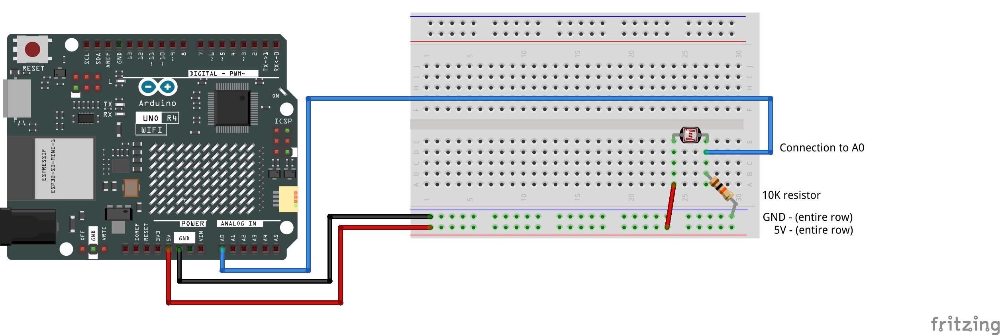
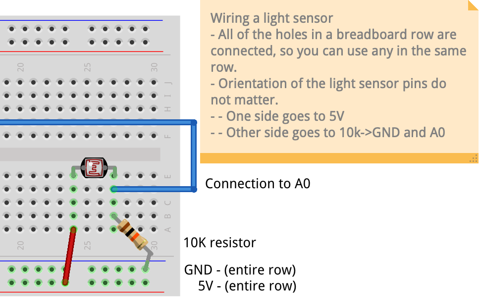
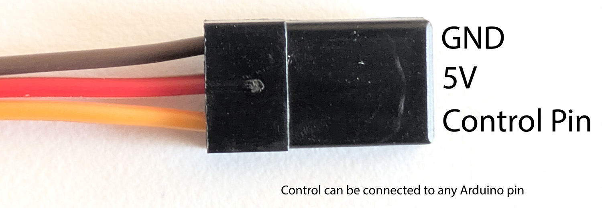
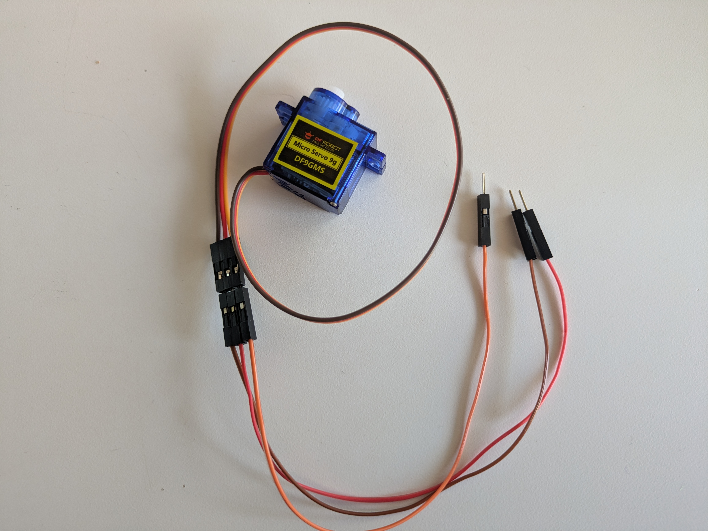
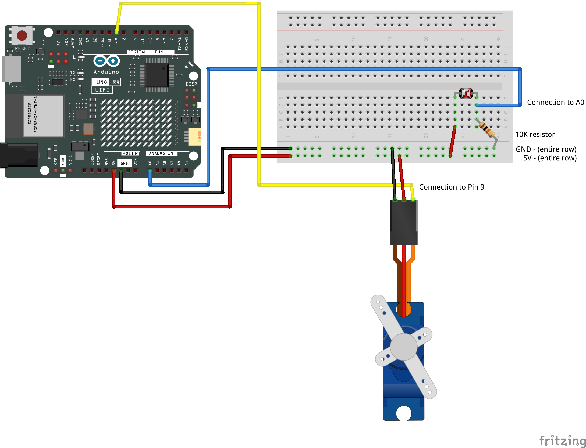

# Light Sensor to Servo — Step by Step

[← Back to Workshop 1](class09-Mar20.md) · [← Back to Light & Lightness](../LightAndLightness.md)

---

This guide walks through the full process in three stages:

1. **Wire and test the light sensor** — get the photoresistor on a breadboard and confirm it is reading values in the Serial Monitor.
2. **Wire and test the servo** — add a servo motor to the circuit and confirm it moves to a position you set in the code.
3. **Connect the two** — use `map()` to translate the light sensor value into a servo angle so one controls the other.

Each stage is self-contained. You will test and confirm that things work before moving on to the next.

---

## Part 1 — Wire the Light Sensor

A photoresistor (also called an LDR — Light Dependent Resistor) changes its resistance depending on how much light hits it. More light means lower resistance, less light means higher resistance. The Arduino cannot read resistance directly — it reads voltage. So we wire the photoresistor in a **voltage divider** circuit with a fixed resistor, which converts the changing resistance into a changing voltage.

### About the Breadboard

This is the first time we are using a breadboard. A breadboard lets you make temporary electrical connections without soldering.

- The **two long rows** along the top and bottom edges are called **power rails**. All the holes in one rail are connected to each other. We use these for **5V** and **GND**.
- The **short rows** in the middle are connected across each row (five holes per row), but **not** across the center gap.
- You push component legs and wires into the holes to connect them.

### Wiring

| Component | Connection |
|-----------|------------|
| **Photoresistor — Leg 1** | 5V (power rail) |
| **Photoresistor — Leg 2** | Row connecting to **A0** wire AND one leg of the 10kΩ resistor |
| **10kΩ Resistor — other leg** | GND (power rail) |
| **5V** on Arduino | 5V power rail on breadboard |
| **GND** on Arduino | GND power rail on breadboard |

### Wiring Diagram





> **Check before moving on:** The photoresistor should have one leg going to 5V and one leg going to the same row as both the wire to A0 and one leg of the 10kΩ resistor. The other leg of the 10kΩ resistor goes to GND.

---

## Part 2 — Read the Sensor in the Serial Monitor

We are going to build the code one piece at a time. Open a **new Arduino sketch** (File → New Sketch). It will have an empty `setup()` and `loop()`.

### Step 1 — Create Variables

Above `setup()`, create two variables. One to store which pin the sensor is connected to, and one to hold the value we read from it.

```cpp
int lightPin = A0;
int lightValue = 0;
```

**What is happening here:**
- `lightPin` stores the analog pin number. Writing `A0` once and referring to it by name means we only need to change one line if we move the wire later.
- `lightValue` will hold the number that comes back from the sensor each time we read it. We set it to `0` for now as a starting point.

> **Naming:** Choose names that describe what the value *means*, not what type it is. `lightValue` is clear. `val` or `data` is not. You can use your own names — just keep them descriptive.

### Step 2 — Turn On Serial Communication

Inside `setup()`, add one line to open the Serial connection:

```cpp
void setup() {
  Serial.begin(9600);
}
```

**What is happening here:**
- `Serial.begin(9600)` opens a communication channel between the Arduino and your computer at a speed of 9600 baud (bits per second). This lets us send text and numbers to the Serial Monitor so we can see what the sensor is doing.

### Step 3 — Read the Sensor

Inside `loop()`, add one line to read the sensor value:

```cpp
void loop() {
  lightValue = analogRead(lightPin);
}
```

**What is happening here:**
- `analogRead(lightPin)` reads the voltage on pin A0 and converts it to a number between **0** and **1023**.
- That number is stored in `lightValue`, replacing whatever was there before.
- Notice how we use the variable name `lightPin` instead of writing `A0` directly. This makes the code easier to read and easier to change later.

### Step 4 — Print the Value

Still inside `loop()`, add two lines below the read to print the value:

```cpp
void loop() {
  lightValue = analogRead(lightPin);

  Serial.print("Light: ");
  Serial.println(lightValue);
}
```

**What is happening here:**
- `Serial.print("Light: ")` sends the text **Light:** to the Serial Monitor. It stays on the same line.
- `Serial.println(lightValue)` sends the number stored in `lightValue` and then moves to a new line. The `ln` at the end of `println` stands for "line" — it adds a line break after the value.
- We use `.print()` for the label and `.println()` for the number so they appear together on one line, then the next reading starts on a new line.

### Step 5 — Upload and Test

1. Connect your Arduino with the USB cable.
2. Select your board and port in the Arduino IDE (Tools → Board → Arduino UNO R4 WiFi, Tools → Port).
3. Click **Upload** (the arrow button).
4. Open the **Serial Monitor** (Tools → Serial Monitor, or the magnifying glass icon in the top right).
5. Make sure the baud rate in the bottom right of the Serial Monitor is set to **9600**.

You should see numbers scrolling. Move your hand over the sensor to block the light — the numbers should drop. Move your hand away — they should rise.

> **What to look for:** Note the range of numbers you actually see. In your environment it probably will not go all the way from 0 to 1023. Write down the rough low value (sensor covered) and the rough high value (sensor uncovered). You will need these numbers in the next part.

### Check Your Sketch

At this point your sketch should have:

- **Two variables** declared above `setup()` — one for the pin, one for the sensor value
- **`setup()`** containing a single line that opens Serial communication at 9600 baud
- **`loop()`** containing three lines: one that reads the sensor into your value variable, one that prints a text label, and one that prints the value with a line break

If the Serial Monitor is showing changing numbers when you move your hand over the sensor, you are ready to move on.

---

## Part 3 — Wire the Servo

Now add a servo motor. A servo has three wires bundled into a single plug:



| Servo Wire | Purpose | Arduino Connection |
|------------|---------|-------------------|
| **Brown** | GND | GND (power rail on breadboard) |
| **Red** | Power | 5V (power rail on breadboard) |
| **Orange** | Signal | Pin 9 |

The servo shares the same 5V and GND power rails on the breadboard that the photoresistor is already using.

### Connecting with Jumper Cables

The servo plug does not fit directly into the breadboard. Use the pin-to-pin jumper cables from your kit to connect each servo wire to the breadboard and Arduino:



### Wiring Diagram

This diagram shows the full breadboard with both the photoresistor and the servo connected:



> **Check before moving on:** The servo's brown wire should reach GND on the power rail, the red wire should reach 5V on the power rail, and the orange wire should connect to pin 9 on the Arduino.

---

## Part 4 — Add the Servo to Your Sketch

Now we add the servo code to the sketch we already have. The goal for this section is just to get the servo moving and confirm the wiring — we will connect it to the sensor in the next part.

### Step 6 — Include the Servo Library

At the very top of your sketch, before your variables, add:

```cpp
#include <Servo.h>
```

**What is happening here:**
- `#include <Servo.h>` loads Arduino's built-in Servo library, which gives us commands to control a servo motor. Without this line, the Arduino does not know what a `Servo` is.

### Step 7 — Create the Servo Object and Variables

Below your existing variables, add:

```cpp
Servo myServo;
int servoPin = 9;
int angle = 90;
```

**What is happening here:**
- `Servo myServo;` creates a servo object. Think of it as giving the servo a name so we can talk to it in the code.
- `servoPin = 9` stores which pin the servo signal wire is connected to.
- `angle = 90` will hold the position we want the servo to move to. We start at 90, which is the midpoint of the servo's range.

### Step 8 — Attach the Servo in Setup

Inside `setup()`, after `Serial.begin(9600);`, add:

```cpp
void setup() {
  Serial.begin(9600);
  myServo.attach(servoPin);
}
```

**What is happening here:**
- `myServo.attach(servoPin)` tells the Arduino which pin to send servo signals on. This connects our servo object to the physical pin.

### Step 9 — Write the Angle to the Servo

Inside `loop()`, after the `Serial.println` line, add one line to send the angle to the servo:

```cpp
  myServo.write(angle);
```

**What is happening here:**
- `myServo.write(angle)` tells the servo to move to the position stored in `angle`. Right now that is 90, so the servo will go to its midpoint.

> **Servo horns:** Attach one of the servo horns (the small plastic arms that clip onto the shaft) so you can clearly see when the servo moves.

Upload and confirm the servo holds at 90. Then try changing `int angle = 90;` at the top to a different number — try `10`, then `170`. Upload each time and watch the servo move to the new position. This confirms the wiring is correct and the variable controls the position.

When you are done testing, set `angle` back to `90`.

### Step 10 — Print Both Values

Update the print statements in `loop()` so you can see both the light reading and the servo angle side by side. Replace your existing print lines with:

```cpp
  Serial.print("Light: ");
  Serial.print(lightValue);
  Serial.print(" | Angle: ");
  Serial.println(angle);
```

**What is happening here:**
- We now print four things on one line: a label, the light value, a separator, and the angle value.
- Only the last one uses `println` to end the line. The others use `print` to stay on the same line.
- This will be useful in the next section when the angle starts changing based on the sensor.

Upload and check the Serial Monitor. You should see both values. Right now the angle will always say 90 because we have not connected the sensor to the servo yet.

### Check Your Sketch

At this point your sketch should have:

- **Global variables:** Your two sensor variables, a Servo object, a servo pin variable, and an angle variable set to 90
- **`setup()`:** Serial at 9600, servo attached
- **`loop()`:** Read the sensor, print the light value and the angle, write the angle to the servo

The servo should be holding at 90 and the Serial Monitor should show both values updating. Now we are ready to connect them.

---

## Part 5 — Connect the Sensor to the Servo

Right now the sensor and the servo both work, but they do not talk to each other. The angle is always 90 no matter what the light does. In this section we connect them so the light value controls the servo position.

### Step 11 — Determine Your Input Range

The photoresistor does not use the full 0–1023 range in your environment. You need to find the actual range it produces so you can map it accurately.

Above `setup()`, add two new variables:

```cpp
int lightMin = 200;
int lightMax = 800;
```

**What is happening here:**
- `lightMin` and `lightMax` define the range of sensor values you expect to work with.
- The numbers `200` and `800` are placeholders. You will replace them with real values from your environment.

**How to find your range:**
1. Upload what you have and open the Serial Monitor.
2. Cover the sensor completely with your hand — note the lowest number you see. That is your `lightMin`.
3. Uncover the sensor and point it toward the brightest light around you — note the highest number. That is your `lightMax`.
4. Update the two variables with those numbers.

It does not need to be exact. Round numbers are fine — you are looking for the rough working range so the mapping has good numbers to work with.

### Step 12 — Decide Your Output Range

The servo can move between 0 and 180 degrees, but you do not have to use the full range. You might want the servo to sweep only a portion of its range depending on your design.

Above `setup()`, add two more variables:

```cpp
int angleMin = 0;
int angleMax = 180;
```

**What is happening here:**
- `angleMin` and `angleMax` define the output range for the servo.
- `0` to `180` uses the full range. If you want a smaller sweep — for example, just a gentle tilt — you could use something like `60` to `120`.
- Having these as variables means you can adjust the behavior later without digging through the code in `loop()`.

### Step 13 — Constrain and Map

Now we connect the input range to the output range. In `loop()`, add two lines **after** the `analogRead` line and **before** the print statements:

```cpp
  lightValue = analogRead(lightPin);

  lightValue = constrain(lightValue, lightMin, lightMax);
  angle = map(lightValue, lightMin, lightMax, angleMin, angleMax);

  Serial.print("Light: ");
```

**What is happening here:**

- `constrain(lightValue, lightMin, lightMax)` clamps the sensor reading so it never goes below `lightMin` or above `lightMax`. This prevents unexpected values outside your observed range from producing wild servo movements. The result is stored back into `lightValue`, replacing the raw reading.

- `map(lightValue, lightMin, lightMax, angleMin, angleMax)` takes the constrained light value and scales it proportionally into the servo angle range. For example, if your light range is 200–800 and your angle range is 0–180, then a reading of 500 (halfway through the input range) becomes 90 (halfway through the output range). The result is stored in `angle`.

Notice that we are writing the result into the same `angle` variable that `myServo.write(angle)` already uses. Because the variable name has not changed, the write line we added in Step 9 does not need to change — it already sends whatever is in `angle` to the servo.

The print statements also stay the same — they already print `lightValue` and `angle`, and now those values update every loop.

### Step 14 — Upload and Test

Upload the sketch. The servo should now respond to changes in light. Cover the sensor — the servo moves one way. Uncover it — it moves the other way. The Serial Monitor should show both values changing together.

**Tuning tips:**
- If the servo barely moves, your `lightMin` and `lightMax` are probably too far apart. Narrow them to match the actual values you see in the Serial Monitor.
- If the servo jumps around nervously, the light in the room may be flickering (fluorescent lights do this). We will look at smoothing techniques in a later workshop.
- If the servo moves in the wrong direction, swap the two output variables: `map(lightValue, lightMin, lightMax, angleMax, angleMin)`.

---

## Part 6 — Check Your Complete Sketch

If you followed each step, your sketch should now have all of the following:

- **Line 1:** The Servo library include
- **Global variables (above `setup()`):** Your sensor pin and value variables, a Servo object, a servo pin variable, an angle variable, and four range variables (lightMin, lightMax, angleMin, angleMax)
- **`setup()`:** Serial communication at 9600 baud, and the servo attached to its pin
- **`loop()`:** Read the sensor → constrain the value to your input range → map it to the angle range → print both values → write the angle to the servo

The servo should respond to changes in light. If it does, everything from this workshop is working. Open the Serial Monitor and watch both values — as you move your hand over the sensor, the light value and the angle value should change together.

---

## Part 7 — Play with the System

Now that everything works, spend some time experimenting. Small changes to the variables and the physical setup can dramatically change how the system feels.

### Give the Servo a Presence

Attach something to the servo horn — a pipe cleaner, a piece of wire, a strip of tape, a folded piece of paper. Anything that extends the movement so it is easier to see and gives the servo a sense of character. A bare servo rotating is hard to read. A sparkly line, a flag, or a curve makes the movement visible and expressive.

### Adjust the Ranges

Go back to your four range variables and try changing them:

- **Narrow the input range** — bring `lightMin` and `lightMax` closer together. This makes the sensor more sensitive to small changes in light, and the servo will respond to subtle shifts.
- **Widen the input range** — spread `lightMin` and `lightMax` further apart. This makes the sensor less reactive, requiring bigger light changes to move the servo.
- **Narrow the output range** — try something like `angleMin = 80` and `angleMax = 100`. The servo will only make small, subtle movements.
- **Widen the output range** — set `angleMin = 0` and `angleMax = 180` for full dramatic sweeps.
- **Offset the output range** — try `angleMin = 45` and `angleMax = 135` to keep the movement centered but not too extreme.

Each combination changes the character of the movement. Upload after each change and watch what happens. There is no right answer here — this is about developing a feel for how input ranges and output ranges shape behavior.

You can also adjust the physical range by removing the servo horn and reattaching it at a different angle on the shaft. The horn clips on with small splines, so you can pull it off and rotate it to change where the movement starts and ends in physical space — without changing any code.
