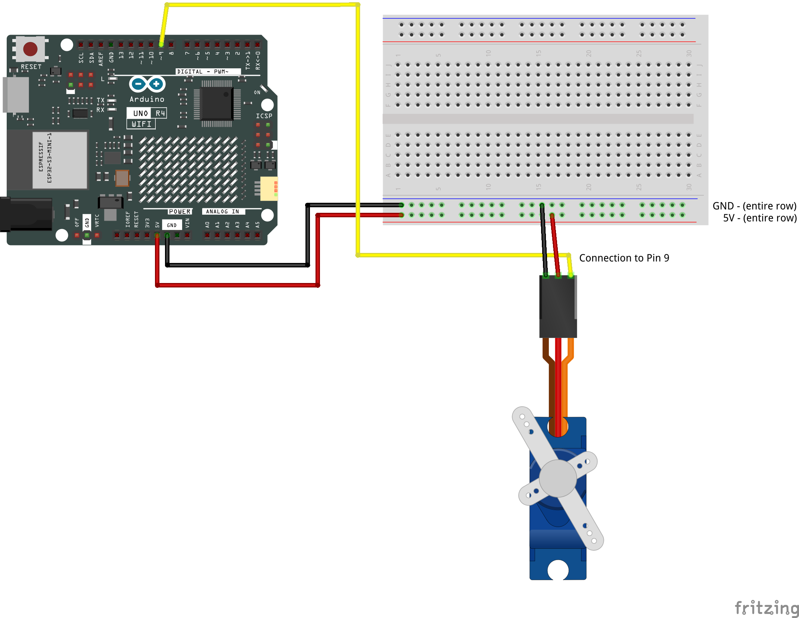

# Servo Motor — Step by Step

[← Back to Workshop 1](class09-Mar13.md)

---

Three stages today:

1. **Wire the servo and set a fixed angle** — confirm the hardware is working and the servo moves to a position you control in code.
2. **Add oscillation** — use a function to sweep the servo back and forth using a sine wave. You will add variables that let you tune the range and speed.
3. **Add a timed move** — use a function to move the servo to a target angle over a set duration, and chain multiple moves in sequence.

Each stage is self-contained. Test and confirm that things work before moving on to the next.

---

## Part 1 — Wire the Servo

A servo motor rotates to a specific angle (0–180°) and holds that position until it receives a new instruction. The servo has three wires bundled into a single plug:


| Servo Wire | Purpose | Arduino Connection |
|------------|---------|-------------------|
| **Brown** | GND | GND (power rail on breadboard) |
| **Red** | Power | 5V (power rail on breadboard) |
| **Orange** | Signal | Pin 9 |

### Using the Breadboard

Use the two long rails along the top and bottom edges for power distribution:

- Arduino **5V** → 5V power rail on breadboard
- Arduino **GND** → GND power rail on breadboard

The servo plug does not fit directly into the breadboard. Use the pin-to-pin jumper cables from your kit to connect each servo wire:


### Wiring Diagram



> **Check before moving on:** The servo's brown wire should go to GND on the power rail, the red wire to 5V on the power rail, and the orange wire to pin 9 on the Arduino.

---

## Part 2 — Move to a Fixed Angle

Open a **new Arduino sketch** (File → New Sketch). We will build the code one step at a time.

### Step 1 — Include the Servo Library

At the very top of your sketch, before everything else, add:

```cpp
#include <Servo.h>
```

**What is happening here:**
- `#include <Servo.h>` loads Arduino's built-in Servo library, which gives us the commands to control a servo motor. Without this line, the Arduino does not know what a `Servo` is or how to send it signals.

### Step 2 — Create the Servo Object and Variables

Below the include, add:

```cpp
Servo myServo;
int servoPin = 9;
int angle = 90;
```

**What is happening here:**
- `Servo myServo;` creates a servo object — a named thing we can send instructions to. Think of it as giving the servo a name so we can talk to it in the code.
- `servoPin = 9` stores which pin the signal wire is connected to. Using a variable here means we only need to change one line if we move the wire later.
- `angle = 90` is the target position. 90 is the midpoint of the servo's 0–180° range. We will use this variable to control where the servo goes.

### Step 3 — Attach the Servo in Setup

Inside `setup()`, add:

```cpp
void setup() {
  myServo.attach(servoPin);
}
```

**What is happening here:**
- `myServo.attach(servoPin)` connects the servo object to the physical pin. This tells the Servo library which pin to send signals on. Without this, the `write()` calls later will have no effect.

### Step 4 — Write the Angle in Loop

Inside `loop()`, add:

```cpp
void loop() {
  myServo.write(angle);
}
```

**What is happening here:**
- `myServo.write(angle)` tells the servo to move to the position stored in `angle`. Right now that is 90, so the servo will move to its midpoint and hold there.
- Every time `loop()` runs, this line runs again — but since `angle` is not changing, the servo just stays put.

### Upload and Test

Upload the sketch. The servo should move to 90° and hold.

Attach one of the servo horns (the small plastic arms that clip onto the shaft) so you can clearly see the position. Then try changing `int angle = 90;` at the top to a different value — try `10`, then `170`. Upload each time and watch the servo move to the new position.

> **Check your sketch:** You should have `#include <Servo.h>` at the top, three global variables, a `setup()` with one `attach` line, and a `loop()` with one `write` line. The servo should move to whatever angle you set in the variable.

---

## Part 3 — Smooth Oscillation

Right now the servo holds at a fixed angle. We want it to sweep back and forth continuously with smooth, natural-feeling motion. We will use the `oscillate()` function from the [Servo Movement Reference](../servo-movement-reference.md), which calculates a sine wave from the current time to produce that sweeping motion.

### Step 5 — Add Range and Speed Variables

Above `setup()`, replace `int angle = 90;` with four variables:

```cpp
int angle       = 0;
int sweepMin    = 30;
int sweepMax    = 150;
int sweepPeriod = 2000;
```

**What is happening here:**
- `angle` stays as a global — we keep it here because every part of the sketch needs it. We reset it to `0` as a neutral placeholder; the `oscillate()` call will set it immediately on the first loop.
- `sweepMin` and `sweepMax` define the two ends of the sweep. The servo will oscillate between these two positions.
- `sweepPeriod` is the time in milliseconds for one complete back-and-forth cycle. `2000` means the servo takes 2 seconds to sweep from one end to the other and back.
- Having all three as named variables at the top means you can tune the feel of the movement without touching the function itself.

### Step 6 — Update loop()

Replace the contents of `loop()` with:

```cpp
void loop() {
  angle = oscillate(sweepMin, sweepMax, sweepPeriod);
  myServo.write(angle);
  delay(20);
}
```

**What is happening here:**
- `oscillate(sweepMin, sweepMax, sweepPeriod)` calls the function we are about to add. It takes your three variables and returns a calculated angle based on the current time.
- We assign that result to the global `angle` and pass it to `myServo.write()`. Notice there is no `int` in front of `angle` — we are assigning to the variable we already declared, not creating a new one.
- `delay(20)` adds a 20ms pause between updates. Without it the loop runs thousands of times per second, which provides no benefit to the servo and wastes processing time.

### Step 7 — Add the oscillate() Function

Below the closing `}` of `loop()`, paste the `oscillate()` function:

```cpp
int oscillate(int minAngle, int maxAngle, int cycleMs) {

  // Current time as a fraction of the cycle (0.0 → 1.0, then repeats)
  float progress = (float)(millis() % cycleMs) / cycleMs;

  // Convert to a sine value (-1.0 to 1.0)
  float sineValue = sin(progress * TWO_PI);

  // Remap: shift from (-1 to 1) → (0 to 1)
  float normalized = (sineValue + 1.0) / 2.0;

  // Scale to our angle range
  float angle = minAngle + normalized * (maxAngle - minAngle);

  return (int)angle;
}
```

**What is happening here:**
- `millis()` gives the current time in milliseconds since the Arduino started.
- `millis() % cycleMs` gives how far into the current cycle we are as a number from 0 to `cycleMs − 1`. Dividing by `cycleMs` converts that into a fraction between 0.0 and 1.0.
- Multiplying by `TWO_PI` converts the fraction to radians for one full sine cycle.
- `sin()` returns a value from −1.0 to 1.0. The two lines that follow shift and scale that range into our specific min–max angle range.
- This function is **stateless** — it calculates everything fresh from `millis()` on every call, with no memory of previous calls. That is what makes it safe to call for multiple servos simultaneously — each call is independent.

### Upload and Test

Upload the sketch. The servo should now sweep smoothly back and forth between `minAngle` and `maxAngle`. Notice how the motion slows near the ends and speeds up in the middle — that is the sine wave at work.

Experiment with the three variables at the top:

- **Speed up** — try `sweepPeriod = 500` for a fast back-and-forth, or `sweepPeriod = 5000` for a slow drift.
- **Change the range** — try `sweepMin = 85` and `sweepMax = 95` for a subtle tremor. Try `sweepMin = 0` and `sweepMax = 180` for a full sweep.
- **Offset the range** — try `sweepMin = 60` and `sweepMax = 120` to keep movement centered without going to extremes.

Each combination gives the movement a different character. Upload after each change.

> **Check your sketch:** You should have four global variables including `angle`, a `loop()` that assigns the result of `oscillate()` to `angle` and writes it, and the `oscillate()` function defined below `loop()`. The servo should be sweeping continuously.

---

## Part 4 — Timed Moves

Oscillation sweeps forever. Sometimes you want the servo to move to a specific position over a set amount of time — and know when it has arrived so you can do something next. The `moveServoA()` function handles this.

### How It Is Different from Oscillation

| | `oscillate()` | `moveServoA()` |
|---|---|---|
| **Motion type** | Continuous back-and-forth | Point-to-point |
| **State** | Stateless — calculates from `millis()` | Stateful — remembers where it started |
| **Completion** | Never finishes | Returns the exact target angle when done |
| **Sequencing** | Set-and-forget | Use `switch`/`case` to chain moves |

Because `moveServoA()` uses `static` variables inside the function to remember the state of a move between calls, each servo needs its own copy of the function. Two servos sharing one copy would overwrite each other's state. Think of a static variable as a whiteboard in a private room — it survives between uses, but only one person at a time can write on it.

### Step 8 — Replace the Oscillation Variables

Above `setup()`, replace the three oscillation variables (`sweepMin`, `sweepMax`, `sweepPeriod`) with two new ones. Keep `angle`:

```cpp
int angle       = 0;
int homeAngle   = 90;
int goalAngle   = 170;
int moveDuration = 2000;
```

**What is happening here:**
- `angle` stays — same global we have been using.
- `homeAngle` is where the servo will be positioned when the sketch starts. This matters because `moveServoA()` uses `myServo.read()` to find the current position when a move begins — and `read()` only knows what you last wrote. Setting a known starting position in `setup()` means the first move always has a reliable start point.
- `goalAngle` is where we want the servo to go — any value from 0 to 180.
- `moveDuration` is how many milliseconds the move should take. `2000` means two seconds.

### Step 9 — Set the Start Position in setup()

Inside `setup()`, after `myServo.attach(servoPin)`, add one line:

```cpp
void setup() {
  myServo.attach(servoPin);
  myServo.write(homeAngle);
}
```

**What is happening here:**
- `myServo.write(homeAngle)` moves the servo to your chosen starting position before `loop()` runs for the first time.
- This is important because `moveServoA()` calls `myServo.read()` to find out where the servo currently is when a new move begins. `read()` returns the last value you wrote — so without this line, the first move would start from wherever the servo happened to be physically, which may not match what the code expects.
- Using the variable `homeAngle` here means you only need to change one number to shift the starting position.

### Step 10 — Update loop()

Replace the contents of `loop()` with:

```cpp
void loop() {
  angle = moveServoA(goalAngle, moveDuration);
  myServo.write(angle);
}
```

**What is happening here:**
- `moveServoA(goalAngle, moveDuration)` calls the function we are about to add. It receives your target and duration and returns the current position along the move.
- We assign that result to the global `angle` — no `int` in front, same variable as always — and write it to the servo.
- There is no `delay()` here — `moveServoA()` handles its own timing internally.

### Step 11 — Add the moveServoA() Function

Below the closing `}` of `loop()`, paste the function:

```cpp
int moveServoA(int angle, unsigned long durationMs) {

  static float startAngle        = 0.0;
  static int   targetAngle       = -1;
  static unsigned long startTime = 0;

  // New target? Start a fresh move.
  if (angle != targetAngle) {
    startAngle  = myServo.read();
    targetAngle = angle;
    startTime   = millis();
  }

  unsigned long elapsed = millis() - startTime;
  float progress = (float)elapsed / (float)durationMs;

  if (progress >= 1.0) {
    targetAngle = -1;
    return angle;
  }

  float current = startAngle + (angle - startAngle) * progress;
  return (int)current;
}
```

**What is happening here:**
- The three `static` variables persist between function calls — they are created once and never reset. `startAngle` remembers where the move began, `targetAngle` remembers where it is heading, and `startTime` remembers when it started.
- When a new target arrives (one that does not match the stored `targetAngle`), the function reads the servo's current position with `myServo.read()`, stores it as the new start, and records the current time as the new start time.
- Each call after that calculates how far through the duration we are (`progress`, from 0.0 to 1.0), interpolates between the start and target, and returns the current position.
- When `progress >= 1.0`, the move is complete. The function returns the exact target angle, then resets `targetAngle` to −1 so the next fresh call starts clean.

### Upload and Test

Upload the sketch. The servo should smoothly travel to `targetAngle` over `moveDuration` milliseconds, then hold there.

Try changing the variables at the top and re-uploading:

- A large `moveDuration` (like `5000`) makes the move feel like a slow drift.
- A small `moveDuration` (like `300`) makes it snap.
- Change `goalAngle` to `10`, upload, then change it to `170` and upload again — the servo travels from `homeAngle` to the new goal over the same duration.

> **Check your sketch:** You should have four global variables including `angle` and `homeAngle`, a `setup()` that attaches the servo and writes `homeAngle`, a `loop()` that assigns the result of `moveServoA()` to `angle` and writes it, and the function defined below `loop()`. The servo should snap to `homeAngle` when it powers on, then travel smoothly to `goalAngle` and hold.

---

### Step 12 — Build a Sequence with switch/case

Right now the servo moves to one target and stays. To chain multiple moves in order — and loop through them — we use `switch/case` to track which step we are on.

Above `setup()`, replace `goalAngle` and `moveDuration` with one new variable, keeping `angle` and `homeAngle`:

```cpp
int angle        = 0;
int homeAngle    = 90;
int sequenceStep = 0;
```

**What is happening here:**
- `angle` stays as the global we write to the servo.
- We keep `homeAngle` because `setup()` still needs to write a known position before the sequence begins.
- We no longer need `goalAngle` or `moveDuration` as globals — those values will live directly inside the `switch/case` so each step can have its own.
- `sequenceStep` tracks where we are in the sequence.

Keep `setup()` as it is — `myServo.write(homeAngle)` still runs before the first move.

Replace the contents of `loop()` with:

```cpp
void loop() {
  switch (sequenceStep) {
    case 0:
      angle = moveServoA(10, 1500);
      if (angle == 10) sequenceStep = 1;
      break;
    case 1:
      angle = moveServoA(170, 2000);
      if (angle == 170) sequenceStep = 2;
      break;
    case 2:
      angle = moveServoA(90, 500);
      if (angle == 90) sequenceStep = 0;
      break;
  }

  myServo.write(angle);
}
```

**What is happening here:**
- `switch (sequenceStep)` checks which step we are on and runs only that `case`.
- Each `case` calls `moveServoA()` with its own target and duration. The function returns the current position during the move, and returns the exact target angle when the move is complete.
- `if (angle == 10) sequenceStep = 1;` detects completion and advances to the next step.
- `case 2` loops back to `sequenceStep = 0`, so the sequence runs endlessly.
- `angle` is the same global variable we have used throughout — no redeclaration needed.

Upload and watch the servo move through the three-step sequence. Then try:

- Changing the target angles and durations in each `case`.
- Adding a `case 3` with another target, and updating `case 2` to step to `3` instead of `0`.

> **Check your sketch:** You should have `angle`, `homeAngle`, and `sequenceStep` at the top, a `loop()` with a `switch/case` that assigns to the global `angle`, and `moveServoA()` defined below `loop()`. The servo should cycle through a repeating sequence.

---

## Part 5 — Explore

You now have three ways to move a servo: a fixed angle, continuous oscillation, and timed point-to-point moves. Spend some time experimenting.

Attach something to the servo horn — a pipe cleaner, a strip of wire, a strip of tape, a folded piece of paper. Anything that extends the movement makes it visible and gives the servo character. A bare servo rotating is hard to read. A line or flag makes the motion expressive.

### Things to try

- **Tight oscillation** — set `sweepMin` and `sweepMax` only a few degrees apart with a short `sweepPeriod`. What does a small, rapid tremor feel like compared to a slow wide sweep?
- **Slow timed move** — try a duration of 5000ms or longer. At what point does the motion feel more like drift than movement?
- **Longer sequence** — build a five or six-step sequence using `switch/case`. Think about rhythm: some moves fast, some slow, some to the same position twice in a row.
- **Reattach the horn at a different angle** — the horn clips onto the shaft with small splines, so you can pull it off and rotate it. This changes the physical start and end positions of the movement without changing any code.
