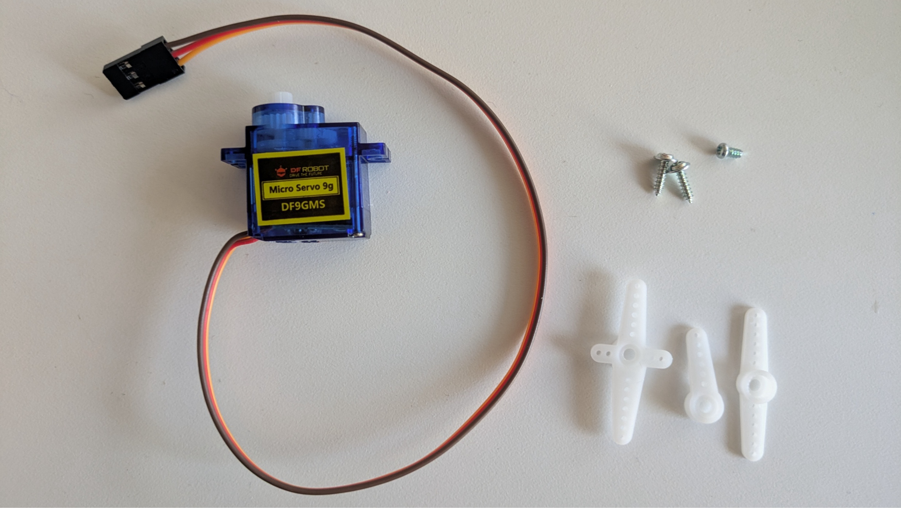

# Class 10 | March 20 | Workshop 2

[← Back to Light & Lightness](../LightAndLightness.md)

---

## Review — Class 09

Last week we introduced the **servo motor** — a motor that rotates to a specific angle (0–180°) and holds that position. Unlike a regular DC motor that just spins, a servo lets you control exactly where it points.

### The Servo Motor

The servo has three wires bundled into a single plug:

| Wire Colour | Connection |
|---|---|
| **Brown** | GND |
| **Red** | 5 V |
| **Orange** | Signal (pin 9) |

The plug does not fit directly into the breadboard — use the pin-to-pin jumper cables from your kit to connect each wire:

### Three Ways to Move

We explored three movement approaches:

1. **Fixed angle** — set a position with a variable, the servo moves there and holds
2. **Oscillation** — `oscillate()` sweeps the servo back and forth continuously using a sine wave
3. **Timed moves** — `moveServoA()` sends the servo to a target angle over a set duration; chain multiple moves with `switch/case` to build a movement sequence

### Links from Last Week

- [Class 09 — Workshop 1](class09-Mar13.md) — components, wiring, and reference links
- [Servo Basics — Step-by-Step Guide](class09-ServoBasics.md) — the walkthrough from last week
- [Workshop 1 Slides](https://ocaduniversity-my.sharepoint.com/:p:/g/personal/npuckett_ocadu_ca/IQCRdXq5WRVBRaCU5SAnemYhAdRAXyRIbA_zSgWEFeJ2jPI?e=NxrFij)

---

## Creating Mechanisms

Servo motors rotate. To turn that rotation into interesting movement — a flap opening, a wing tilting, a figure bowing — you need a **mechanism**: a physical structure that converts one kind of motion into another. Paper engineering is a fast, accessible way to prototype these structures before committing to other materials.

### Kinetic Joy — Georgia Tech

The [Kinetic Joy](https://paper.gatech.edu/kinetic-joy/welcome) project from the Robert C. Williams Museum of Papermaking at Georgia Institute of Technology covers:

- [Movable Mechanisms](https://paper.gatech.edu/kinetic-joy/welcome)
- [Physics of Paper Engineering](https://paper.gatech.edu/kinetic-joy/welcome)
- [Paper Mechatronics](https://paper.gatech.edu/kinetic-joy/welcome)
- [Origami](https://paper.gatech.edu/kinetic-joy/welcome)
- [Contemporary Paper Engineers](https://paper.gatech.edu/kinetic-joy/welcome)
- [History of Paper Engineering](https://paper.gatech.edu/kinetic-joy/welcome)

### Paper Mech

[papermech.net](https://www.papermech.net/) — templates and tutorials for paper mechanisms.

- [Video Tutorials](https://www.papermech.net/learn/) — short walkthroughs of specific mechanism types
- [Foldmecha Creator](https://www.papermech.net/modules/create.php) — interactive tool for designing foldable mechanisms

---

## Workshop Goal

Connect the light sensor to the servo so that light controls movement. Explore three ways to link them: continuous mapping with `map()`, threshold-triggered oscillation, and threshold-triggered timed moves. Throughout the workshop, keep something attached to the servo horn — it makes the motion readable.

### Today's Wiring

Today we combine the light sensor and the servo on one breadboard:

The servo stays wired to **pin 9** from last week. The photoresistor connects through a **10 kΩ resistor** to analog pin **A0**. The step-by-step guide walks you through building up to this circuit.

---

## Resources

- [Light Sensor to Servo — Step-by-Step Guide](class10-LDR-to-Servo.md) — core walkthrough for today
- [Sensor + Servo Guide](../SensorServoGuide.md) — overview of all patterns and techniques
- [Servo Movement Reference](../servo-movement-reference.md)
- [Light Sensor Guide](LightSensorGuide.md)
- [Code Patterns (from Project 2)](../../02-TinyScreens/classes/class06-CodePatterns.md)

---

## Part 1 — Working Prototype: Light controls the servo

Work through the [Light Sensor to Servo — Step by Step](class10-LDR-to-Servo.md) guide from beginning to end. The guide has seven parts across five stages:

1. **Wire and read the light sensor** — photoresistor + 10kΩ resistor, confirm values in the Serial Monitor
2. **Wire and test the servo** — add the servo to the circuit, confirm it moves to a fixed angle
3. **Connect the two with `map()`** — light level controls servo position, proportionally and continuously
4. **Threshold + oscillation** — a threshold divides the sensor range into two states, each with its own `oscillate()` profile
5. **Threshold + timed moves** — swapping `oscillate()` for `moveServoA()` sends the servo to specific angles when light crosses the threshold

Complete each part and confirm it works before moving on. Have something attached to the servo horn throughout — a pipe cleaner, a folded piece of paper, wire — anything that makes the motion visible.

### Going Further

Once the core walkthrough is working, pick one of the following based on your design direction:

- [Multiple Servos](MultipleServos.md) — add a second servo, run both independently
- [Multiple Light Sensors](MultipleLDRs.md) — add a second photoresistor, compare readings for directional sensing
- [Two LDRs + Two Servos](TwoLDRsTwoServos.md) — combinatory patterns for the full 2+2 setup
- [Physical Adjustments](PhysicalAdjustments.md) — extending wires to mount sensors and servos away from the breadboard
- [Light Sensor Guide — Smoothing](LightSensorGuide.md#3-smoothing--rolling-average) — stabilize noisy readings with a rolling average
- [Light Sensor Guide — Calibration](LightSensorGuide.md#4-calibration--measuring-ambient-light-at-startup) — adapt thresholds to any environment automatically

---

## Part 2 — Project Design V2

Now that you have felt the sensor controlling the servo, revise your design concept. V2 can develop V1 with more detail and specificity, or it can be a new direction entirely.

The drawing should show:

1. Which sensing method you plan to use — continuous mapping, threshold switching, or comparison between two sensors
2. Position and orientation of the sensor — what specific light condition will it be reading?
3. What the servo is attached to, and what that attachment does when it moves
4. How V2 develops or differs from V1 — what changed after working with the hardware?

**Tip:** You have now felt the difference between `map()` (fluid, continuous response) and a threshold (discrete state change). One of those is likely a better fit for your concept — let that inform the sketch.

---

## Submission

Post in the [Workshop 2 Discussion](https://canvascloud.ocadu.ca/courses/13538/discussion_topics/212720) on Canvas:

- A video of the servo responding to light changes, with something attached to the horn
- An image of your V2 design drawing
- 1–2 sentences on how your concept has developed since V1
