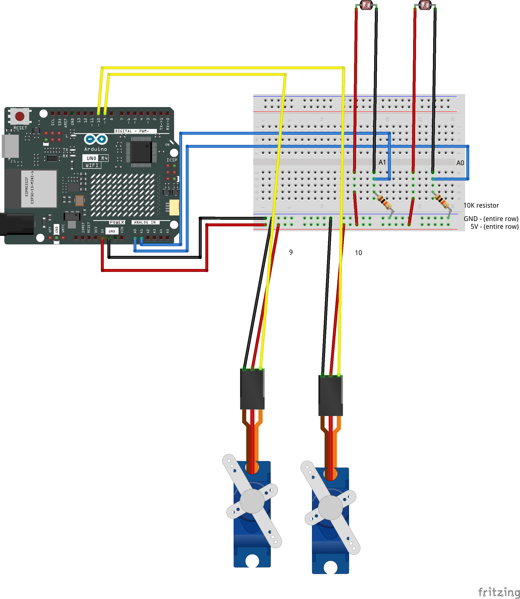

# Class 11 | March 27 | Workshop 3

[← Back to Light & Lightness](../LightAndLightness.md)

---

## Overview

This is the last full workshop before the exhibition. Today we introduce **soldering** — the practical skill you need to extend your sensor wires so your photoresistors can be mounted away from the breadboard, embedded in your design, and aimed at the light conditions that matter.

This page also covers wire extension and mounting options, auto-calibrating your light thresholds for the exhibition environment, and an organized set of reference guides you will rely on from here forward. After the soldering demo, the rest of the class is work time: solder your sensors, extend your wiring, refine your code, and build the physical form your piece will take.

### Building on Workshop 2

Last week you connected the light sensor to the servo and explored three ways to link them — continuous mapping, threshold-triggered oscillation, and threshold-triggered timed moves. This week the focus shifts to **physical integration**: getting the electronics out of the breadboard-on-the-desk configuration and into something that can stand on its own for the exhibition.

The coding patterns carry forward directly:

- `map()` and thresholds for connecting sensor input to servo output
- `oscillate()` and `moveServoA()` for movement control
- `millis()` for non-blocking timing

See [Code Patterns from Project 2](../../02-TinyScreens/classes/class06-CodePatterns.md) and [Servo Movement Reference](../servo-movement-reference.md) for a refresher.

---

## Introduction to Soldering

Soldering is the process of using heat and a metal alloy (solder) to create a permanent, electrically conductive bond between two metal surfaces. It is the fundamental skill behind almost all electronics assembly — every component on every circuit board you have ever seen is held in place with a solder joint. It is not difficult, but it rewards patience and practice.

### Mechanical vs. Electrical Connection

There is an important distinction between a **mechanical connection** and an **electrical connection**:

- A **mechanical connection** holds two things together physically — twisting wires, plugging a jumper cable into a breadboard, or pressing a component leg into a socket. The parts touch, and they stay in place through friction or pressure.
- An **electrical connection** ensures that current flows reliably between two conductors. A mechanical connection *can* also be electrical, but not always — a loose twist or a corroded surface may hold physically while conducting poorly or intermittently.

**Good soldering practice creates both, in sequence.** You first create the mechanical connection by bending or wrapping the wire around the component leg — this holds everything in place so your hands are free and nothing moves while you work. Then you solder on top to lock it in electrically. The solder flows into the joint and hardens, making the mechanical hold permanent and the electrical contact reliable. A twisted joint with no solder may hold for a while, but will eventually loosen — especially when mounted inside a moving design where vibration and flex will work on every connection.

### The Key Concept: Heat the Joint, Not the Solder

The most common beginner mistake is melting solder onto the iron and then trying to transfer it to the work. This creates a **cold joint** — the solder melted, but the surfaces underneath did not get hot enough to accept it. A cold joint looks dull and grainy, and it will not conduct reliably.

The correct approach: **heat the joint itself** (both surfaces simultaneously) for 2–3 seconds, then touch the solder to the *joint* and let it flow in. When you see the solder wick smoothly into the connection, remove the solder wire first, then the iron, and let it cool without moving it.

[Soldering a Light Sensor](https://ocadu.yuja.com/V/Video?v=1295165&a=143944658)

### What You Need

- **Soldering iron** — available in the XFab; a basic 25–40W temperature-controlled station is ideal
- **Solder** — lead-free rosin-core solder (available in the XFab)
- **Helping hands / third-hand tool** — holds your work so both hands are free
- **Tip cleaner** — brass wool or damp sponge; keeps the iron tip clean and effective
- **Wire strippers** — for preparing wire ends
- **Flush cutters** — for trimming excess wire
- **Solid core wire** — 22-gauge or 24-gauge, available in the XFab

### Today's Task: Soldering Wires to a Photoresistor

The photoresistor has two short metal legs designed to push into a breadboard. To mount it away from the board — facing a light source, inside an enclosure, on the opposite side of your object from the Arduino — you need to solder longer wires directly to those legs.


**Steps:**

1. **Slide heat shrink onto each wire before you solder** — once the joint is made you cannot get heat shrink past it. Cut two short pieces (about 2 cm each) and thread one onto each wire now.
2. **Cut two lengths of solid core wire** to the length you need. Strip about 1 cm of insulation from each end.
3. **Tin the tip** — melt a small amount of solder onto the clean iron tip before you start. This helps heat transfer.
4. **Create the mechanical connection** — wrap the stripped end of each wire around one leg of the photoresistor. One full wrap is enough to hold the wire firmly in place while you solder. This is the mechanical joint; the next steps make it electrical.
5. **Heat the joint** — hold the iron tip against both the wire and the leg simultaneously for 2–3 seconds.
6. **Feed solder into the joint** — touch solder to the joint (not the iron) and let it flow. A good joint is shiny and smooth.
7. **Remove solder, then iron** — pull the solder wire away first, then the iron. Let the joint cool undisturbed.
8. **Apply heat shrink** — slide the piece of heat shrink tubing over the joint and apply heat (a heat gun, or carefully hold it near the iron) until it shrinks snugly around the connection. Do each leg separately so the two connections are fully insulated from each other.
9. **Push the free ends** of the solid core wire into the breadboard in the same positions the photoresistor legs would have occupied.

The 10kΩ resistor stays on the breadboard. Only the photoresistor moves to a remote location. The voltage divider circuit is electrically identical — you have just made two of the wires longer.

> **Tip:** Solid core wire holds its shape when bent, so you can aim the sensor in a specific direction and it will stay. This is useful for pointing the sensor at a particular light source or mounting it at an angle inside an enclosure.

### Common Problems

| Problem | Likely Cause |
|---|---|
| Dull, grainy joint | Cold joint — didn't heat the surfaces enough |
| Solder won't stick | Dirty or oxidized surface, or iron tip not tinned |
| Solder bridges two connections | Too much solder, or iron dragged sideways |
| Component shifted | Moved before the joint fully cooled |
| Iron tip goes black | Tip needs cleaning and re-tinning |

### Further Resources

These are excellent references if you want to go deeper or revisit the fundamentals:

- [PACE Worldwide — Basic Soldering Lessons (9-part video series)](https://www.youtube.com/playlist?list=PL926EC0F1F93C1837) — the gold standard of soldering instruction
- [SparkFun — How to Solder: Through-Hole Soldering](https://learn.sparkfun.com/tutorials/how-to-solder-through-hole-soldering/all) — thorough written guide covering technique, tools, and rework
- [iFixit — Soldering 101](https://www.ifixit.com/News/6864/how-to-solder) — covers the bare minimum to get started, with good safety notes
- [EEVblog — Soldering Tutorial Part 1 (YouTube)](https://www.youtube.com/watch?v=J5Sb21qbpEQ) — practical walkthrough from electronics educator Dave Jones
- [Makerspaces — How to Solder: A Complete Beginners Guide](https://www.makerspaces.com/how-to-solder/) — includes a free 17-page PDF

---

## Physical Adjustments — Wiring and Mounting

Once the sensor wires are soldered, you need to extend the servo connections and start thinking about how everything mounts in your design. The full guide covers wire extension in detail:

**[Physical Adjustments — Extending Wires](PhysicalAdjustments.md)**

### Servo Wires

The servo connects to the breadboard through pin-to-pin jumper cables. To extend the reach, chain additional jumper cables end to end, or replace them with longer solid core wire. No soldering required for the servo — the connections are all plug-based.

### Wiring Diagram — Extended Setup

This diagram shows two LDRs with extended wires and two servos — the full configuration for this workshop:



The photoresistors are at the ends of their extended wires, away from the breadboard. The circuit is electrically identical to the standard setup — only the wire length has changed.

### 3D Printable Servo Parts

Servos come in standard sizes, which means there are thousands of downloadable parts designed to fit them exactly. Our servo is a **micro servo** — search for that term to find compatible horns, arms, brackets, mounts, and linkages that can be printed at the XFab and attached directly to the servo shaft.

- [Thingiverse — Micro Servo parts](https://www.thingiverse.com/search?q=Micro+Servo&page=1)
- [Printables — Micro Servo parts](https://www.printables.com/search/models?q=micro+servo)

Custom mounts let you attach the servo to a surface at a specific angle, orient it inside an enclosure, or create a bracket that positions it precisely within your design. Printed arms and linkages can extend the range of motion or convert rotation into a different kind of movement.

> **Tip:** When printing a servo horn or arm replacement, print a test piece first and check the fit before committing to the full part. The shaft fit is tight by design — it may need a brief press-fit or a small amount of sanding.

---

## Reference Guides

This is the last formal class. From here until the exhibition, these documents are your primary technical resources. When you have a question about how to wire something, how a function works, or how to get a specific behavior — start here before asking.

### The Main Index

**[Sensor + Servo Guide](../SensorServoGuide.md)** — the master index for everything in this project. Maps every document and every pattern. If you are not sure where to look, start here.

### Servo Movement

- **[Servo Movement Reference](../servo-movement-reference.md)** — complete documentation for `oscillate()` and `moveServoA()`: parameters, examples, combining with `map()` and thresholds, multi-servo patterns
- **[Multiple Servos](MultipleServos.md)** — wiring and code for running two servos independently, including mixed modes (one oscillating, one doing timed moves)

### Light Sensors

- **[Light Sensor Guide](LightSensorGuide.md)** — how the photoresistor works, reading with `analogRead()`, smoothing with a rolling average, auto-calibration at startup, and all sensor-to-behavior patterns
- **[Multiple Light Sensors](MultipleLDRs.md)** — wiring and code for two photoresistors, including comparison-based directional sensing with a deadband

### Combined Setups

- **[Two LDRs + Two Servos](TwoLDRsTwoServos.md)** — combinatory patterns for the full 2+2 setup: paired responses, crossed responses, asymmetric timing, mixed modes
- **[Physical Adjustments — Extending Wires](PhysicalAdjustments.md)** — extending servo and sensor wires for remote mounting

### Code Fundamentals

- **[Delay vs Millis](../../01-AltController/DelayVsMillis.md)** — non-blocking timing patterns
- **[Code Patterns (from Project 2)](../../02-TinyScreens/classes/class06-CodePatterns.md)** — `map()`, thresholds, state machines

---

## Calibration and Relative Thresholds

If your sketch uses thresholds to trigger different movements — and most of them do — this section shows you how to make those thresholds adapt to any room automatically. It is directly relevant to the exhibition, where the lighting will differ from the studio.

Hard-coded threshold values like `if (lightValue < 400)` describe a specific voltage on a 0–1023 scale. They work in one environment — the one you measured them in — and quietly stop working when the room changes. A different time of day, a lamp turned on, a different exhibition space: any of these can shift the sensor's resting level by hundreds of counts and break your thresholds entirely.

**Auto-calibration** solves this. Instead of measuring the sensor's absolute level, you measure its *ambient resting state* at startup and define thresholds as distances from that baseline. `shadowThreshold = baseline - 80` does not mean "below 340" — it means "80 counts darker than wherever the room currently sits." The sketch works in a dim studio and near a bright window because both thresholds move with the environment.

This is the same technique used for the pressure sensor in Project 2. The pressure calibration in [class07-pressure_calibration.md](../../02-TinyScreens/classes/class07-pressure_calibration.md) measured the resting state of the FSR (nobody pressing) and defined thresholds as offsets above it. Light calibration does the same thing in both directions — offsets above ambient for bright detection, offsets below for shadow detection. The pattern is identical; only what "resting" means changes.

See the full explanation in [Light Sensor Guide — Section 4](LightSensorGuide.md#4-calibration--measuring-ambient-light-at-startup).

### Step-by-Step: Adding Calibration and Two Relative Thresholds

**1. Observe your sensor's ambient range first**

Before writing any calibration code, open the Serial Monitor with your basic `analogRead()` sketch and watch the numbers for 30–60 seconds. Note:
- The value when the sensor is in its intended ambient position (no shadow, no direct lamp)
- How much it fluctuates at rest
- How far it drops when you cast a shadow over it
- How far it rises when you point a light directly at it

This tells you what offset values are meaningful. If your ambient reading is 500 and a hand shadow drops it to 420, an `dimOffset` of 60 is a reliable shadow trigger. One of 200 would never fire.

**2. Add the `calibrateSensor()` function**

Paste this function into your sketch, below your global variables and above `setup()`:

```cpp
/*
 * calibrateSensor()
 *
 * Reads the sensor `samples` times and returns the average.
 * Call this ONCE in setup() with the sensor in ambient conditions —
 * not covered, not pointed at a direct lamp.
 */
int calibrateSensor(int pin, int samples) {
  const int DELAY_MS = 20;
  long total = 0;
  for (int i = 0; i < samples; i++) {
    total += analogRead(pin);
    delay(DELAY_MS);
  }
  return total / samples;
}
```

`delay()` is used here intentionally — it is acceptable in `setup()` because `loop()` has not started yet. The pauses let the circuit settle between samples.

**3. Declare your variables at the top of the sketch**

```cpp
int lightPin     = A0;
int lightValue   = 0;
int baseline     = 0;    // measured at startup

int dimOffset    = 80;   // how far below baseline = shadow
int brightOffset = 150;  // how far above baseline = bright

int shadowThreshold = 0; // set in setup()
int brightThreshold = 0; // set in setup()
```

The `dimOffset` and `brightOffset` values are the only thing you tune. They describe the *size* of the change, not a specific number on the scale. Start with the values above and adjust based on what you observed in Step 1.

**4. Run calibration in `setup()` and derive the thresholds**

```cpp
void setup() {
  Serial.begin(9600);
  Serial.println("Calibrating — keep sensor in ambient light...");

  baseline         = calibrateSensor(lightPin, 50);
  shadowThreshold  = baseline - dimOffset;
  brightThreshold  = baseline + brightOffset;

  Serial.print("Baseline: ");         Serial.println(baseline);
  Serial.print("Shadow threshold: ");  Serial.println(shadowThreshold);
  Serial.print("Bright threshold: ");  Serial.println(brightThreshold);
  Serial.println("Ready.");
}
```

Every time the sketch starts, it prints the three values to the Serial Monitor. Read them before you start testing — they tell you immediately whether the calibration ran in the right conditions.

**5. Use the thresholds in `loop()` to drive three behaviors**

```cpp
void loop() {
  lightValue = analogRead(lightPin);

  if (lightValue < shadowThreshold) {
    // Shadow detected — darker than ambient by dimOffset
    // e.g. slow, wide oscillation
    servoAngle = oscillate(20, 160, 4000);

  } else if (lightValue > brightThreshold) {
    // Bright detected — brighter than ambient by brightOffset
    // e.g. fast, narrow tremor
    servoAngle = oscillate(80, 100, 300);

  } else {
    // Ambient — between the two thresholds
    // e.g. gentle resting motion
    servoAngle = oscillate(60, 120, 2500);
  }

  myServo.write(servoAngle);
}
```

The middle zone — ambient — is not just a fallback. It is a third distinct state. Think of the three zones as three moods your object has: resting (ambient), responding to shadow, responding to direct light.

**6. Tune the offsets until the transitions feel right**

With the Serial Monitor open, watch the `lightValue` output as you create shadows and light sources:
- If the shadow zone triggers too easily (rustling clothes sets it off), increase `dimOffset`
- If the shadow zone never triggers, decrease `dimOffset`
- Do the same for `brightOffset` with your light source

Change only one offset at a time. Re-upload, reset the board (so calibration runs again), and test. The baseline re-measures each time.

> **Tip:** The exhibition space will have different lighting than your studio. If you are using calibration, the thresholds will adapt automatically. If you are using hard-coded values, test them in the exhibition space before the show — or switch to calibration now.

---

## Workshop 3: Prototype V3 and Design V3

All workshops in Project 3 have two components: a **working prototype** and a **design sketch**. This is the final iteration before the exhibition.

### Part 1 — Working Prototype: Physical Integration

The goal this week is to get your sensors physically separated from the breadboard and your movement code working with the full circuit. By the end of class your prototype should be close to exhibition-ready.

1. **Solder wires to your photoresistor(s)** — follow the soldering steps above. Test the sensor by reading values in the Serial Monitor before building it into your design.
2. **Extend the servo wiring** — use chained jumper cables or solid core wire to position the servo(s) away from the breadboard. See [Physical Adjustments](PhysicalAdjustments.md).
3. **Wire a second servo** — if your design uses two servos, follow the [Multiple Servos](MultipleServos.md) guide to add it now.
4. **Connect sensor to servo(s)** — confirm your light reading reliably controls the servo movement at the new wire length. If readings are unstable, add smoothing — see [Light Sensor Guide — Smoothing](LightSensorGuide.md#3-smoothing--rolling-average).
5. **Refine your movement behavior** — adjust your `map()` ranges, threshold values, oscillation speeds, or movement sequences to match the character you want. Use the [Servo Movement Reference](../servo-movement-reference.md) to explore options.
6. **Begin building the physical form** — attach your mechanism and material to the servo. Test it under movement. The material should be light enough for the servo to move — paper, vellum, fabric, or thin wire.

#### Going Further

If your core prototype is working, explore:

- [Multiple Light Sensors](MultipleLDRs.md) — add a second photoresistor for directional sensing
- [Two LDRs + Two Servos](TwoLDRsTwoServos.md) — combinatory patterns for the full 2+2 setup
- [Calibration and Relative Thresholds](#calibration-and-relative-thresholds) — full step-by-step walkthrough earlier on this page; see also [Light Sensor Guide — Section 4](LightSensorGuide.md#4-calibration--measuring-ambient-light-at-startup) for the compact reference

### Part 2 — Project Design V3

This is the final design iteration. V3 should be a realistic plan for the exhibition — not aspirational, but achievable with the time and materials you have. Read the [project brief](../LightAndLightness.md) one more time.

The drawing should show:

1. The complete physical form — materials, structure, and how everything is mounted or supported
2. Exact sensor placement — where is the photoresistor, what direction is it facing, and what light condition is it reading?
3. Servo and mechanism — what is attached to the servo horn, and how does the movement translate into the behavior you want?
4. Wiring path — how do the extended wires route from the breadboard to the components? Where is the Arduino and breadboard housed?
5. How V3 differs from V2 — what changed now that you have soldered, extended wires, and felt the prototype in its physical form?

> **Tip:** Think about the full 30-minute exhibition span. Does your piece respond differently as the room gets brighter or darker? Can it adapt to the number of people nearby? A strong piece is not just a demo — it sustains interest over time.

---

## Submission

Post in the [Workshop 3 Discussion](https://canvascloud.ocadu.ca/courses/13538/discussion_topics/212721) on Canvas:

- A video (15–30 seconds) showing the current state of the prototype — circuit, extended wiring, mechanism, and material response to light
- An image of V3 of your design drawing
- Brief written note: what works, what still needs to be done before the exhibition
