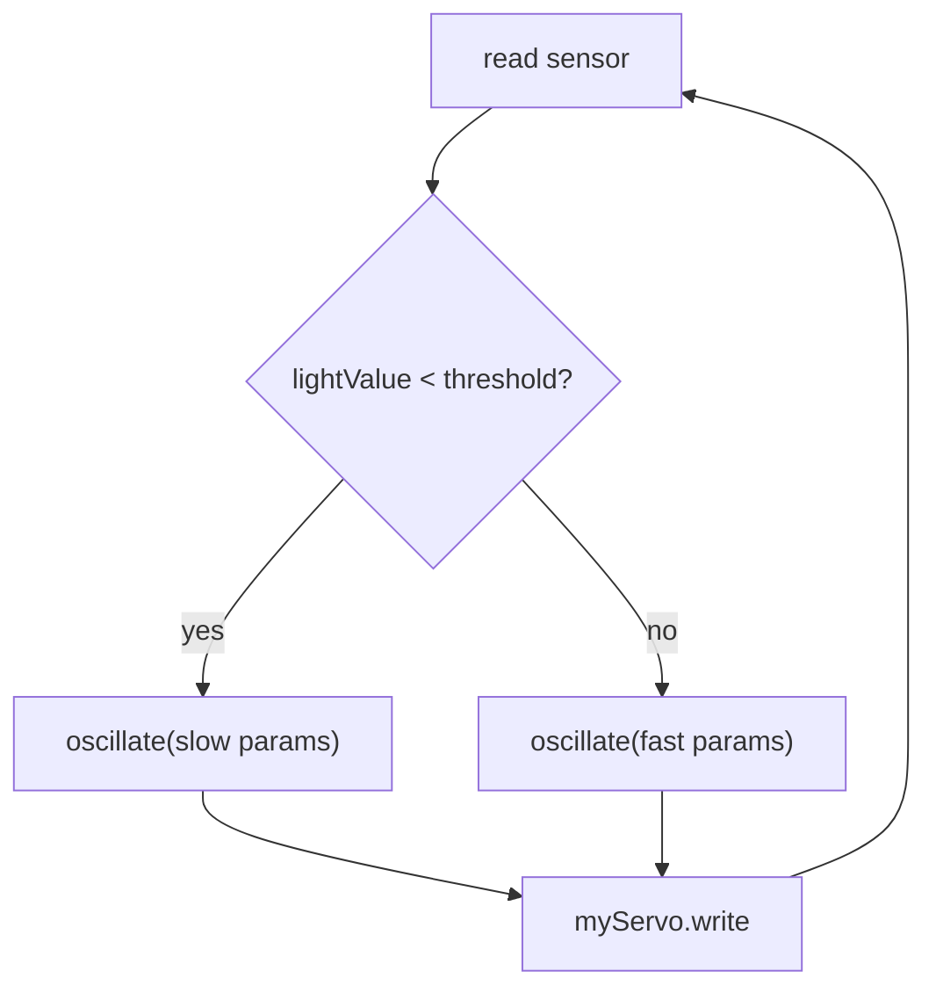
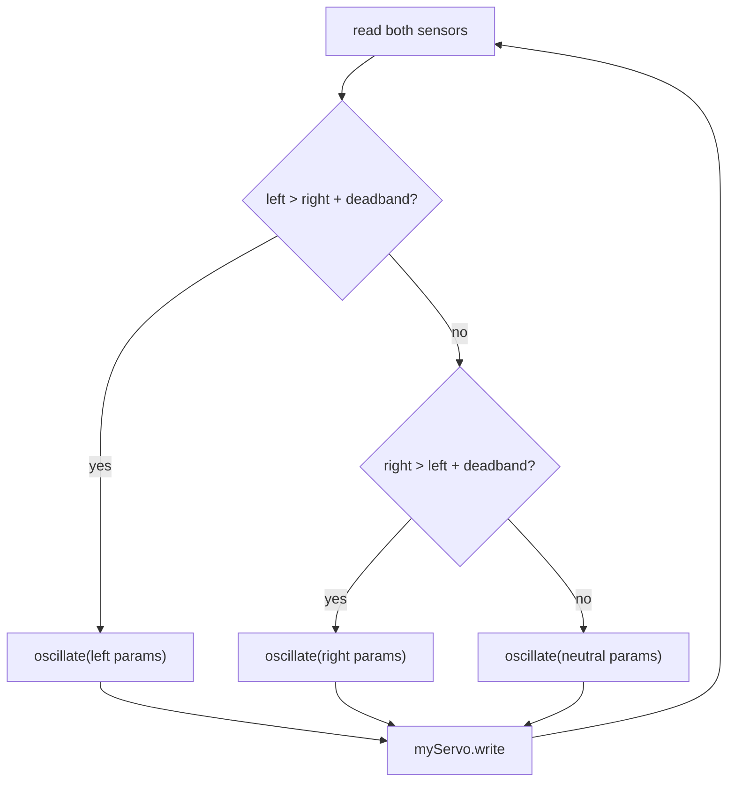
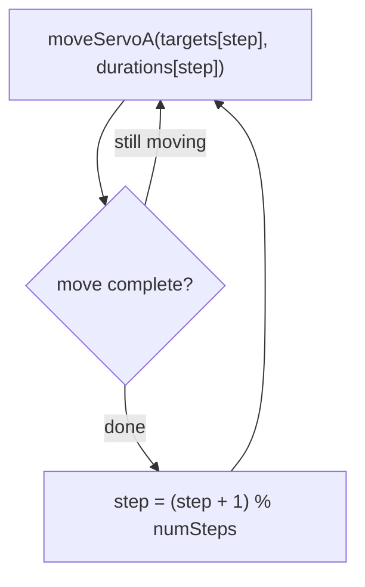

# Arduino Servo Movement Functions

Two reusable functions for controlling servo motors: one for continuous oscillation, one for timed point-to-point moves. Both are **non-blocking** — they track their own timing internally using `millis()`, so they can run alongside sensor reads and other logic in your main loop without freezing everything with `delay()`.

---

## 1. `oscillate()` — Sine Wave Oscillation

Smoothly sweeps a servo back and forth between two angles using a sine wave. The motion naturally slows near the extremes and speeds up through the middle — the same feel as a pendulum.

### The Function

```cpp
/*
 * oscillate()
 *
 * Returns an angle that smoothly sweeps between minAngle and maxAngle
 * over the given cycle duration, using a sine wave.
 *
 * This function is STATELESS — it calculates everything fresh from
 * millis() each call, so one function can safely be shared by
 * multiple servos with different settings.
 *
 *   minAngle — lowest angle in the sweep (0–180)
 *   maxAngle — highest angle in the sweep (0–180)
 *   cycleMs  — time for one full back-and-forth oscillation (ms)
 */
int oscillate(int minAngle, int maxAngle, int cycleMs) {

  // Current time as a fraction of the cycle (0.0 → 1.0, then repeats)
  float progress = (float)(millis() % cycleMs) / cycleMs;

  // Convert progress to a sine value (-1.0 to 1.0)
  float sineValue = sin(progress * TWO_PI);

  // Remap: shift sine from (-1 to 1) → (0 to 1)
  float normalized = (sineValue + 1.0) / 2.0;

  // Scale to our angle range
  float angle = minAngle + normalized * (maxAngle - minAngle);

  return (int)angle;
}
```

### How It Works

The function never stores anything between calls. Instead, it asks "what time is it right now?" and calculates the correct angle from scratch each time.

1. `millis()` gives elapsed time in milliseconds since the Arduino started.
2. `millis() % cycleMs` gives position within the current cycle — a number from 0 up to `cycleMs - 1`. Dividing by `cycleMs` converts that to a fraction between 0.0 and 1.0.
3. Multiplying by `TWO_PI` converts the fraction to radians for one full sine cycle.
4. `sin()` returns a value from −1.0 to 1.0, which rises and falls smoothly as time progresses.
5. Two lines of arithmetic shift and scale that −1 to 1 range into the specific min–max angle range you provided.

The return value is an `int` angle you pass straight to `myServo.write()`. Because the function calculates everything fresh from the current time, it has no memory of previous calls — it is **stateless**. This is what makes it safe to call the same function for multiple servos simultaneously, each time with different arguments.

### Calling the Function

In `loop()`, call `oscillate()` each iteration, assign the result to your angle variable, and write it to the servo. A `delay(20)` at the end of the loop is enough to limit update frequency without any visible impact on smoothness.

The three arguments — low end, high end, and cycle time — are the only things you adjust. Keep them as named variables at the top of your sketch so you can tune the movement without touching the function or `loop()`.

### Controlling the Feel

The relationship between the three arguments shapes the character of the movement:

- **Cycle time** is the strongest lever. A short cycle (a few hundred milliseconds) produces a rapid back-and-forth, almost mechanical. A long cycle (several seconds) produces a slow, breathing drift.
- **Range width** controls drama. A narrow range — say, ten degrees — gives a subtle tremor. A wide range produces decisive sweeps.
- **Range position** (where in the 0–180 space the range sits) has no effect on feel — only on physical position. Moving the range from 0–60 to 60–120 does not change the character of the oscillation.

### Using One Function for Multiple Servos

Because `oscillate()` is stateless, the same function can serve any number of servos. Call it once per servo per loop with different arguments:

```cpp
// Both calls use the same function — different feel for each servo
angle = oscillate(sweepMin, sweepMax, sweepPeriod);
```

For a second servo, just call it again with its own set of range and period variables. The function does not know or care which servo will receive the result.

---

## 2. `moveServoA()` — Timed Move to Target Angle

Moves a servo from its current position to a target angle over a specified duration. Returns the current interpolated position on every call, and returns the exact target angle when the move is complete. You check that return value to know when one move is done and the next can begin.

### The Function

```cpp
/*
 * moveServoA()
 *
 * Call this every loop() with your desired target angle and duration.
 *   - First call with a new target: reads the servo's current position
 *   - Subsequent calls: returns the interpolated position
 *   - When complete: returns the exact target angle
 *
 * Uses myServo.read() to grab the starting position automatically.
 *
 *   angle      — the target angle (0–180)
 *   durationMs — how long the move should take in milliseconds
 */
int moveServoA(int angle, unsigned long durationMs) {

  // These are static — they persist between calls.
  // This is servoA's private state — its own whiteboard.
  static float startAngle        = 0.0;
  static int   targetAngle       = -1;
  static unsigned long startTime = 0;

  // New target? Start a fresh move.
  if (angle != targetAngle) {
    startAngle  = myServo.read();
    targetAngle = angle;
    startTime   = millis();
  }

  unsigned long elapsed = millis() - startTime;
  float progress = (float)elapsed / (float)durationMs;

  if (progress >= 1.0) {
    targetAngle = -1;
    return angle;
  }

  float current = startAngle + (angle - startAngle) * progress;
  return (int)current;
}
```

### How It Works

Unlike `oscillate()`, this function needs memory. It has to know where the move started, where it is going, and when it began — and that information must survive between calls inside `loop()`.

This is done with **`static` variables**. A `static` variable inside a function behaves like a global in one specific way: its value persists between calls rather than being reset each time the function runs. The three static variables here act as the function's private notepad:

- `startAngle` — the servo's position at the moment a new target was first received
- `targetAngle` — the destination angle (initialized to −1, meaning "no move in progress")
- `startTime` — the value of `millis()` when the current move began

On the first call with a new target angle, all three are written. On every subsequent call with the same target, the function reads elapsed time, calculates `progress` (0.0 to 1.0), and interpolates between `startAngle` and the target. When `progress` reaches 1.0, the move is complete: the function returns the exact target angle and resets `targetAngle` to −1 so it is ready for the next move.

### Calling the Function

Call `moveServoA()` every loop with the same target and duration until the move is done. The function handles the timing internally — no `delay()` needed. Assign the return value to your angle variable and write it to the servo:

```cpp
angle = moveServoA(goalAngle, moveDuration);
myServo.write(angle);
```

The servo will travel smoothly from its starting position to `goalAngle` over `moveDuration` milliseconds, then hold. To detect completion, compare the return value to the target:

```cpp
if (angle == goalAngle) {
  // move is done — do something next
}
```

### Why Each Servo Needs Its Own Function

Because `moveServoA()` uses `static` variables, there is only **one copy of that state per function**. Two servos cannot share the same function — the second call would overwrite the first servo's stored start position, target, and start time.

Think of it as a private whiteboard. `static` variables are notes that survive between sessions but belong to one room. If two people use the same room, they erase each other's notes. Give each servo its own function — `moveServoA()`, `moveServoB()`, etc. — and each has its own whiteboard that no one else touches.

The logic inside each copy is identical. Only the name and the internal `read()` call (which references the correct servo object) differ.

### Knowing When a Move Is Done

`moveServoA()` returns the **exact** target angle — not a close approximation — when a move completes. This is intentional. It gives you a clean, reliable value to test against:

```cpp
if (angle == goalAngle) {
  // exactly true only when the move has finished
}
```

During the move, the return value is a rounded integer interpolation that almost never equals the exact target. Only when `progress >= 1.0` does the function return the target precisely and signal completion.

### Sequencing Moves with switch/case

A single `moveServoA()` call moves the servo to one target and holds. To chain multiple moves, use `switch/case` with a step counter variable. Each case calls `moveServoA()` with its own target and duration, and advances the counter when the completion condition is met.

The final case loops back to step 0 — or to any earlier step — to create a repeating cycle. Each case is independent: a slow deliberate move in one case, a fast snap in the next.

---

## Key Concepts Comparison

| | `oscillate()` | `moveServoA()` |
|---|---|---|
| **Motion type** | Continuous back-and-forth | Point-to-point |
| **State** | Stateless — calculates from `millis()` each call | Stateful — uses `static` variables to track progress |
| **Multi-servo** | One function works for all servos | Each servo needs its own copy of the function |
| **Completion** | Never "finishes" — loops forever | Returns exact target angle when done |
| **Sequencing** | Set-and-forget | Use `switch`/`case` to chain moves |

---

## Patterns — Connecting Sensors to Motion

The functions above produce movement from parameters. The design work is in deciding what feeds those parameters — fixed variables, mapped sensor values, or conditionals that choose between behaviours entirely.

---

### oscillate() + map() — Sensor Controls Speed or Range

`oscillate()` takes three numbers. Any of them can be a variable set by a sensor reading rather than a fixed value declared at the top of the sketch.

**Speed from light:** Read a light sensor with `analogRead()`, then use `map()` to translate the sensor's range (your measured min and max from the environment) into a period range. Assign the mapped value to `sweepPeriod` before calling `oscillate()`. The servo now speeds up or slows down in direct response to light level — bright light produces one extreme, dim light the other.

Decide which direction makes sense for your design. `map()` can invert the relationship by swapping the output arguments: mapping bright to fast (`sweepPeriod` small) or to slow (`sweepPeriod` large) produces opposite behaviour from the same sensor.

**Range from a sensor:** The same pattern applies to `sweepMin` and `sweepMax`. Mapping sensor value to range width — keeping the centre fixed but expanding or contracting the sweep around it — gives a very different quality of response than changing speed. The movement becomes more or less dramatic without changing its tempo.

```cpp
// Example structure — not a complete sketch
lightValue = analogRead(lightPin);
sweepPeriod = map(lightValue, lightMin, lightMax, slowPeriod, fastPeriod);
angle = oscillate(sweepMin, sweepMax, sweepPeriod);
myServo.write(angle);
```

The key is that `map()` runs every loop, so `sweepPeriod` is continuously updated. The oscillation responds in real time as the light changes.

---

### oscillate() + if() — Threshold Switches Between Behaviours

Instead of continuously modulating a parameter, a threshold test selects between entirely different motion profiles. The sensor reading does not smoothly scale anything — it flips the servo's behaviour at a boundary.

**Two modes divided by a threshold:** Test your sensor value against a threshold. If below, call `oscillate()` with one set of parameters — perhaps a slow, wide sweep. If above, call it with a completely different set — a fast, narrow tremor. The servo's character changes at the crossing point.

```cpp
// Example structure — not a complete sketch
lightValue = analogRead(lightPin);

if (lightValue < lightThreshold) {
  angle = oscillate(slowSweepMin, slowSweepMax, slowPeriod);
} else {
  angle = oscillate(fastSweepMin, fastSweepMax, fastPeriod);
}

myServo.write(angle);
```

**Multiple thresholds, multiple modes:** Chaining `if / else if` blocks divides the sensor range into zones, each with its own motion. Three zones — dim, medium, bright — can produce three distinct servo behaviours. Each zone is a separate `oscillate()` call with its own arguments. The servo's character is mapped to lighting conditions in discrete steps rather than a continuous gradient.

Note that switching between `oscillate()` calls mid-cycle does not cause a jerk — because the function calculates position purely from the current time, the angle it returns will be wherever the sine wave happens to be at that moment. There is no stored position to interrupt.



---

### oscillate() — Which of Two Sensors Is Brighter

With two light sensors, you can make the servo respond to the *relationship* between them rather than to an absolute level. The question is not "how bright is it?" but "which side is brighter?"

Compare the two readings directly. If sensor A is brighter, oscillate toward one range. If sensor B is brighter, use another. If they are close, you might use a third, neutral mode — or hold the current position.

```cpp
// Example structure — not a complete sketch
leftLight  = analogRead(leftPin);
rightLight = analogRead(rightPin);

if (leftLight > rightLight + deadband) {
  angle = oscillate(leftMin, leftMax, leftPeriod);
} else if (rightLight > leftLight + deadband) {
  angle = oscillate(rightMin, rightMax, rightPeriod);
} else {
  angle = oscillate(neutralMin, neutralMax, neutralPeriod);
}

myServo.write(angle);
```

The `deadband` variable (a small positive number) prevents the servo from flickering between modes when both sensors read nearly the same value. Without it, slight noise in the readings would cause the condition to flip back and forth thousands of times per second.



---

### moveServoA() + Arrays — Sequences Selected by Condition

`switch/case` hardcodes one sequence. Arrays let you store multiple sequences and choose between them at runtime based on a sensor value or threshold.

**Storing a sequence in arrays:** A sequence is a list of target angles and a list of durations — two parallel arrays of the same length. The step counter indexes into both simultaneously.

```cpp
// Example structure — not a complete sketch
int targets[]   = { 10, 170, 90, 45 };
int durations[] = { 1500, 2000, 500, 1000 };
int numSteps    = 4;
int step = 0;
```

In `loop()`, instead of a `switch/case`, index directly into both arrays using `step`:

```cpp
angle = moveServoA(targets[step], durations[step]);
if (angle == targets[step]) {
  step = (step + 1) % numSteps;  // advance, wrap back to 0 at the end
}
myServo.write(angle);
```

`% numSteps` is the modulo operator — it wraps `step` back to 0 after the last element, creating a loop automatically without explicitly checking for the final case.



> **More advanced:** The pattern below uses C++ pointers (`int*`) to switch between arrays at runtime. It builds directly on the array sequencing above, but introduces a concept not covered in the main guide. Skip it for now if you haven't encountered pointers before.

**Switching between sequences based on a threshold:** Define two (or more) sets of arrays. Each set describes a different character of movement. Test your sensor and point the index variables at the appropriate set.

```cpp
// Example structure — not a complete sketch
int calmTargets[]  = { 80, 100, 90 };
int calmDurations[] = { 3000, 3000, 1000 };

int agitTargets[]   = { 20, 160, 20, 160 };
int agitDurations[] = { 300, 300, 300, 300 };

int* activeTargets;
int* activeDurations;
int  numSteps;

// In loop(), before the move call:
if (lightValue < lightThreshold) {
  activeTargets    = calmTargets;
  activeDurations  = calmDurations;
  numSteps         = 3;
} else {
  activeTargets    = agitTargets;
  activeDurations  = agitDurations;
  numSteps         = 4;
}

angle = moveServoA(activeTargets[step], activeDurations[step]);
```

`int*` is a pointer — a variable that holds the address of an array rather than a value. Assigning `activeTargets = calmTargets` does not copy the array; it makes `activeTargets` point at the same data. This lets a single `moveServoA()` call work with whichever sequence the condition has selected.

When the threshold crossing changes which sequence is active mid-move, `moveServoA()` will detect the new target on the next call (because `activeTargets[step]` now resolves to a different value) and start a fresh move from the current position. The transition is not instant — the servo travels to the new target over the new duration — which is usually more natural than a sudden jump anyway.
